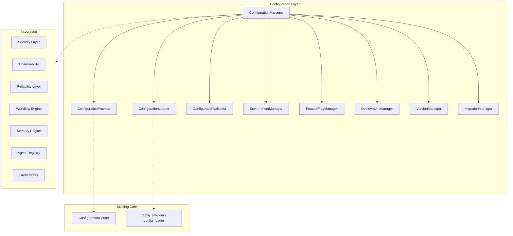
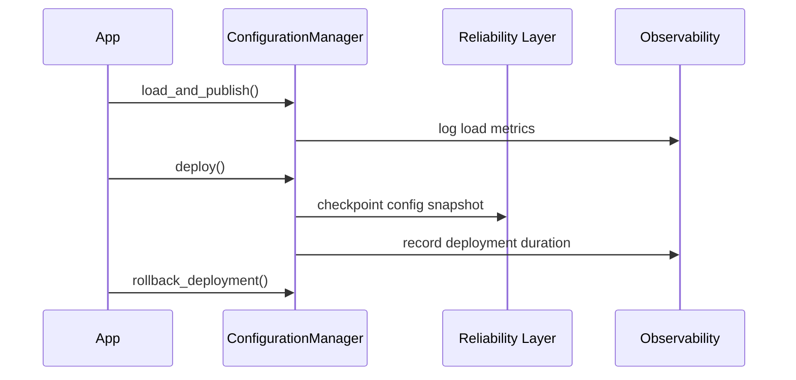

# Platform Configuration & Deployment Layer

> Sprint 5.4 — centralized configuration, environment profiles, deployment, and version management

## Overview

The Platform Configuration & Deployment Layer extends the existing **ConfigurationCenter** with enterprise-grade configuration management, environment profiles, feature flags, deployment abstraction, schema migrations, and version tracking.

**No modifications to Sprint 1–5.3 architecture.** New Sprint 5.4 components are added alongside existing `configuration_center`, `config_provider`, and `config_loader` modules.

---

## Architecture



---

## Core Components

| Component | Role |
|-----------|------|
| `ConfigurationManager` | Unified configuration and deployment entry point |
| `ConfigurationLoader` | Hierarchical loading with inheritance and overrides |
| `ConfigurationProvider` | Runtime read/write facade over config provider |
| `ConfigurationValidator` | Schema validation for keys, payloads, and snapshots |
| `ConfigurationSnapshot` | Point-in-time configuration state |
| `EnvironmentManager` | Development, testing, staging, production, custom profiles |
| `FeatureFlagManager` | Feature toggles, rollout, per-agent/workflow/user scoping |
| `DeploymentManager` | Local and Docker deployment with verification and rollback |
| `VersionManager` | Platform and component version tracking from manifest |
| `MigrationManager` | Schema migrations with history and rollback |

---

## Configuration Guide

### Hierarchical loading

Configuration is merged from layers (in order):

1. **Base defaults** — from `PLATFORM_CONFIG_SCHEMA`
2. **Environment profile** — development, testing, staging, production
3. **Custom profile** — registered via `register_custom_environment()`
4. **Runtime overrides** — passed at load time

```python
from platform_configuration import configuration_manager

snapshot = configuration_manager.load_configuration(
    environment="production",
    overrides={"sla.assignment_sec": 600},
)
```

### Runtime updates

```python
configuration_manager.update_runtime("sla.assignment_sec", 1200)
```

### Encrypted values

Sensitive values are stored via the Security Layer bridge:

```python
secret_id = configuration_manager.encrypt_config_value("api.secret", "value")
```

---

## Environment Profiles

| Profile | Log level | Experimental AI | Isolated |
|---------|-----------|-----------------|----------|
| development | DEBUG | enabled | no |
| testing | INFO | enabled | yes |
| staging | INFO | disabled | yes |
| production | WARNING | disabled | yes |

```python
await configuration_manager.activate_and_publish("staging")
```

Custom environments:

```python
configuration_manager.register_custom_environment("preview", {"general.log_level": "DEBUG"})
```

---

## Feature Flags

```python
from platform_configuration import FeatureFlag, configuration_manager

await configuration_manager.set_feature_flag(
    FeatureFlag(key="new_ui", enabled=True, rollout_percent=25.0)
)

configuration_manager.is_feature_enabled(
    "new_ui",
    user_id="user-42",
    agent_id="agent-a",
    workflow_id="wf-1",
)
```

Supports gradual rollout (deterministic hash bucketing), experimental flags, and scoped targeting.

---

## Deployment Guide

### Local deployment

```python
from platform_configuration import DeploymentTarget, configuration_manager

record = await configuration_manager.deploy(
    target=DeploymentTarget.LOCAL,
    environment="production",
)
```

### Docker deployment

When Docker CLI is available, the deployment manager inspects the configured image. If Docker is unavailable, deployment is simulated for development workflows.

### Verification and rollback

```python
verification = await deployment_manager.verify(record)
rolled_back = await configuration_manager.rollback_deployment()
```

Deployment history is retained in `deployment_manager.history()`.

---

## Migration Guide

Built-in migration `config_1_0_to_1_1` adds deployment metadata keys.

```python
migrated, record = configuration_manager.apply_migration(
    "config_1_0_to_1_1",
    config_dict,
)

rolled, rollback = configuration_manager.apply_migration(
    "config_1_0_to_1_1",
    migrated,
    direction=MigrationDirection.DOWN,
)
```

Register custom migrations via `MigrationManager.register(up=..., down=..., version_to=...)`.

---

## Version Management

```python
info = configuration_manager.get_version_info()
configuration_manager.validate_platform()  # raises on missing components
```

Reads from `platform_manifest.json`:

- `platform_version`
- `configuration_layer`
- `deployment_framework`
- `feature_flags`
- Component versions (workflow, tools, security, observability, reliability)

---

## Recovery Flow



---

## Metrics

| Metric | Description |
|--------|-------------|
| `configuration_load_count` | Total configuration loads |
| `configuration_load_time_avg_ms` | Average load latency |
| `configuration_errors` | Validation failures |
| `deployment_count` | Total deployments |
| `deployment_duration_avg_ms` | Average deployment time |
| `migration_count` | Migrations applied |
| `rollback_count` | Deployment rollbacks |
| `environment_status` | Per-environment status map |

```python
configuration_manager.metrics_summary()
```

---

## Developer Guide

### Quick start

```python
from platform_configuration import configuration_manager, EnvironmentProfile

# Load production config
snapshot = configuration_manager.load_configuration(
    environment=EnvironmentProfile.PRODUCTION.value,
)

# Check feature flag
if configuration_manager.is_feature_enabled("experimental.ai"):
    ...

# Deploy
await configuration_manager.deploy(version=snapshot.values.get("platform_version", ""))
```

### Integration bridges

`platform_configuration/integrations.py` connects to:

- **Security** — encrypt/decrypt configuration values
- **Observability** — load and deployment metrics
- **Reliability** — configuration checkpoints
- **Workflow** — per-workflow config injection
- **Memory** — environment profile storage
- **Agent Registry** — per-agent metadata
- **Orchestrator** — deployment status

### Events

| Event | When |
|-------|------|
| `ConfigurationLoadedEvent` | Configuration loaded |
| `EnvironmentActivatedEvent` | Environment profile activated |
| `FeatureFlagChangedEvent` | Feature flag updated |
| `DeploymentCompletedEvent` | Deployment finished |
| `MigrationAppliedEvent` | Migration applied |

---

## Manifest

Sprint 5.4 updates `platform_manifest.json`:

```json
{
  "platform_version": "2.8.0-alpha",
  "configuration_layer": "1.0",
  "deployment_framework": "1.0",
  "feature_flags": "1.0"
}
```

---

## Tests

```bash
pytest tests/test_configuration_layer.py -q
```

Covers configuration loading, validation, deployment, migration, feature flags, and version management.
