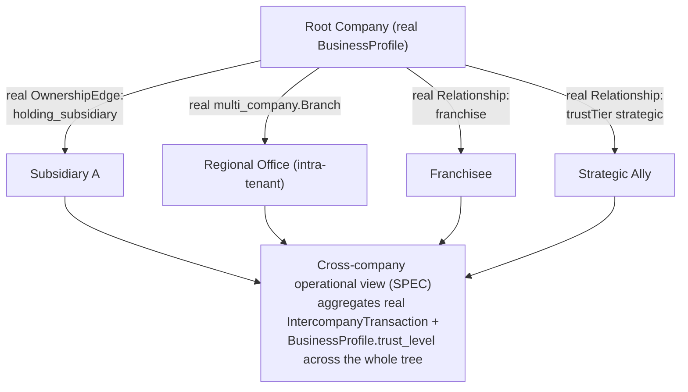

# Enterprise City — Cross-Company Operations

**Sprint:** CQ-15 — Architecture Research. Documentation only, `src` not modified.

**Do not duplicate:** `EBN_BUSINESS_GRAPH.md` §2 (CQ-10) already designed `OwnershipEdge`
(`holding_subsidiary`/`internal_department`) as a structurally distinct edge type from `Partnership`.
`database/models/multi_company.py`'s real `Company`/`Branch`/`IntercompanyTransaction` (found during
CQ-10's research, previously under-cited) is the strongest real foundation for this entire section.

## 0. A real intercompany accounting model already exists

`database/models/multi_company.py` — real `Company` (`code`, `legal_name`, `tax_id`, `currency`,
`country`), `Branch`, `IntercompanyTransaction` (`from_company_id`/`to_company_id`,
`transaction_type`), `ConsolidatedReport`. This is real, DB-backed **intercompany accounting** — the
correct real foundation for Holdings/Business Groups/Regional Offices/Branches, distinct from
`BusinessProfile` (Sprint 29.0, the *relationship/trust* layer). This document explicitly does not
conflate the two: `multi_company.Company` answers "which legal entities does one tenant own and how do
they transact," `BusinessProfile` answers "how does this company relate to other, independent
companies." Cross-Company Operations is designed as consuming **both**, for the two different brief
concerns they each actually answer.

## 1. Per-item mapping (brief's seven)

| Brief item | Real/SPEC source |
|---|---|
| Holdings | Real `OwnershipEdge.kind: "holding_subsidiary"` (`EBN_BUSINESS_GRAPH.md` §2, CQ-10) between two `BusinessProfile`s, **or** real `multi_company.Company`/`Branch` (§0) if the holding is intra-tenant — this document proposes the edge type as the discriminator: cross-tenant holding uses `OwnershipEdge`, intra-tenant uses the real `multi_company` model directly, never a third representation |
| Business Groups | Same as Holdings, generalized (a group is one or more `OwnershipEdge`s sharing a common root company) |
| Partner Networks | Real `Relationship.type: "partner"` graph (`EBN_BUSINESS_GRAPH.md` §1, Sprint 29.0) |
| Regional Offices | Real `multi_company.Branch` (§0) — already the correct real entity; no new "regional office" concept needed |
| Branches | Real `multi_company.Branch` directly |
| Franchises | Real `Relationship.type: "franchise"` (`EBN_PARTNERSHIP_SYSTEM.md` §2, Sprint 29.0) |
| Strategic Alliances | Real `Relationship` at `trustTier: "strategic"` (`EBN_PARTNERSHIP_SYSTEM.md` §3, now real via `Relationship.state`) |

## 2. Cross-company operational view (SPEC)

**Design constraint**: the consolidated view must respect real `Visibility` scoping per edge
(`ENTERPRISE_BUSINESS_NETWORK.md` §3.5) — an executive at the root company sees full detail on real
`multi_company` subsidiaries/branches (same tenant, full access), but only whatever a `Relationship`'s
own visibility allows for franchise/alliance partners (different tenants, partnership-gated access).
This is the one place in this Bible where two different real access models (intra-tenant ownership vs.
inter-tenant partnership) must be composed in a single view without conflating their very different
trust assumptions.

## 3. Non-goals

- No new intercompany data model — `multi_company.Company`/`Branch`/`IntercompanyTransaction` is real
  and sufficient for the intra-tenant half of this section.
- No merging of `OwnershipEdge` and real `Relationship` into one edge type — kept distinct per
  `EBN_BUSINESS_GRAPH.md` §2's original reasoning, restated.
- No new visibility model — §2's consolidated view composes two real, already-distinct access models
  rather than inventing a third.

## Related documents

`database/models/multi_company.py` (real, previously under-cited), `EBN_BUSINESS_GRAPH.md` §1–2
(CQ-10, `Partnership`/`OwnershipEdge`), `EBN_PARTNERSHIP_SYSTEM.md` (Sprint 29.0, real franchise/
strategic relationship types), `ENTERPRISE_BUSINESS_NETWORK.md` §3.5 (CQ-10, real `Visibility`),
`EXECUTIVE_OPERATING_SYSTEM.md` (CQ-15 sibling).
