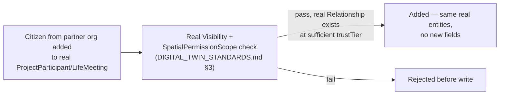

# Enterprise Operations — Cross-Organization Daily Cooperation

**Sprint:** CQ-17 — Architecture Research. Documentation only, `src` not modified.

**Do not duplicate:** `docs/CROSS_COMPANY_OPERATIONS.md` (CQ-15) already designed ownership/holdings/
branch/franchise structure between related companies — a **structural** relationship question. This
document is the **everyday-activity** question for any two companies with a real `Relationship`
(related or merely partnered): what do they actually do together, day to day. `docs/ENTERPRISE_WAR_
ROOM.md` (CQ-15) already found the Live Meetings/Live Documents gaps this document restates rather than
re-derives.

## 1. Per-item mapping (brief's six)

| Brief item | Real/SPEC source |
|---|---|
| Shared Projects | **Structurally real already** — `ProjectParticipant` (`lifeTypes.ts`, Sprint 29.2) has no company gate on `citizenId`; a citizen from a partner org can join a project's participant list today. **Gap**: no real permission check stops this from being *misused* — enforcement should route through the real `spatialPermissions`/`Visibility` composition (`DIGITAL_TWIN_STANDARDS.md` §3, CQ-16), not a new gate |
| Shared Meetings | Same structural reality as Shared Projects — `LifeMeeting.attendeeIds` is company-agnostic. **Blocked on the same real gap** `ENTERPRISE_WAR_ROOM.md` §1 (CQ-15) already found: no real video/meeting-room infrastructure exists, only the scheduling/state record |
| Shared Documents | **Blocked on the same real gap** `EBN_VERIFIED_DOCUMENTS.md` (CQ-10) already found: real document storage exists, real concurrent co-editing does not |
| Shared AI | Reuses `ENTERPRISE_WAR_ROOM.md` §1's (CQ-15) real design: one real `PersonalAiAssistant` (`PERSONAL_AI.md`, CQ-12) instance visible to every session participant, not a new shared-AI concept |
| Shared Assets | **Real, already modeled** — `AssetOwnership`'s real `OwnershipKind` includes `"shared" \| "partner" \| "rental" \| "lease"` (`DIGITAL_TWIN_STANDARDS.md`, CQ-16, `assetTypes.ts:58-66`) — cross-org asset sharing is already a first-class ownership kind, not a gap |
| Partner Operations | Real `Relationship`/Partnership state machine (`EBN_PARTNERSHIP_SYSTEM.md`, CQ-10) + real `businessInteractions.record("partnership_discussion", …)` (`DAILY_OPERATIONS_MODEL.md`, Sprint 29.2) — already real and event-logged |

## 2. The pattern across all six: data model ahead of enforcement

The recurring shape in §1 is not "missing entity," it's **missing permission enforcement on an
already-permissive real data model** — `ProjectParticipant`/`LifeMeeting` don't check company boundaries
at all today, which is *more* open than the brief's "shared, by arrangement" framing implies. This
document recommends the enforcement point be the same composed Public/Private Layer
`DIGITAL_TWIN_STANDARDS.md` §3 (CQ-16) already designed, applied at the moment a citizen from another
`BusinessProfile` is added to a project/meeting — not a new invite/approval flow.

## Non-goals

- No new shared-project/shared-meeting entity — both are the real existing entities, missing only an
  enforcement check.
- No second Shared-AI design — reuses `ENTERPRISE_WAR_ROOM.md` §1's real precedent exactly.
- No new asset-sharing ownership kind — `AssetOwnership.OwnershipKind` already covers this.

## Related documents

`docs/CROSS_COMPANY_OPERATIONS.md` (CQ-15, the structural-relationship counterpart to this document),
`docs/ENTERPRISE_WAR_ROOM.md` §1 (CQ-15, Shared AI design + the Meetings/Documents gaps restated),
`docs/EBN_PARTNERSHIP_SYSTEM.md`/`docs/EBN_VERIFIED_DOCUMENTS.md` (CQ-10), `docs/PERSONAL_AI.md`
(CQ-12), `docs/DIGITAL_TWIN_STANDARDS.md` §3 (CQ-16, the enforcement point reused in §2).
