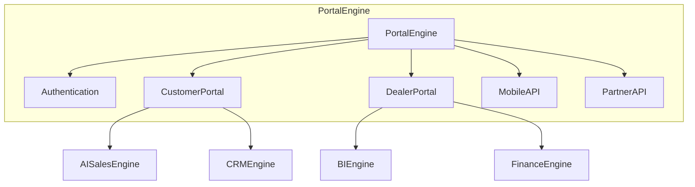

# Customer Portal, Dealer Portal & Mobile API

> Sprint 6.7 — secure web and mobile access for customers, dealers, and partners

## Overview

Sprint 6.7 delivers the **Portal Engine** with Customer Portal, Dealer Portal, Mobile API, Public API, and Partner API — integrated with CRM, AI Sales, Finance, and Platform Core via bridges only.

---

## Architecture



---

## Modules

| Module | Role |
|--------|------|
| `authentication/` | Registration, login, JWT/OAuth abstraction, RBAC |
| `customer_portal/` | Search, favorites, bookings, offers, AI assistant |
| `dealer_portal/` | Dashboard, inventory, leads, sales, analytics |
| `mobile_api/` | PortalEngine facade, rate limiting, offline sync |
| `profiles/` | Profile management |
| `favorites/` | Favorites and saved searches |
| `garage/` | Garage vehicles and service history |
| `notifications/portal_service.py` | Push/in-app notifications |
| `public_api/` | Public catalog search |
| `partner_api/` | Insurance, financing, inspection, logistics |

---

## Portal Guide — Customer

```python
from applications.auto_marketplace import auto_marketplace

# Register & login
user, token = await auto_marketplace.portal_engine.auth.register_customer(
    email="user@example.com", password="secret", first_name="Jane"
)

# Search & favorites
vehicles = await auto_marketplace.portal_engine.customer.search_vehicles({"brand": "Toyota"})
await auto_marketplace.portal_engine.favorites.add_favorite(user.user_id, "v1")

# Book test drive & request offer
await auto_marketplace.portal_engine.customer.book_test_drive(...)
await auto_marketplace.portal_engine.customer.request_offer(...)

# AI assistant & recommendations
await auto_marketplace.portal_engine.customer.ai_assistant(user.user_id, "SUV under $40k")
await auto_marketplace.portal_engine.customer.recommendations(user.customer_id)
```

---

## Portal Guide — Dealer

```python
dash = auto_marketplace.portal_engine.dealer.dashboard("dealer-1")
inventory = auto_marketplace.portal_engine.dealer.list_inventory("dealer-1")
leads = auto_marketplace.portal_engine.dealer.manage_leads("dealer-1")
finance = auto_marketplace.portal_engine.dealer.financial_overview("dealer-1")
```

---

## Mobile API Guide

Base path: `/api/auto/mobile/v1`

| Feature | Description |
|---------|-------------|
| Versioned endpoints | API v1 with version info at `/info` |
| Authentication | Bearer JWT tokens |
| Rate limiting | 100 req/min per client ID |
| Push notifications | Device registration at `/push/register` |
| Offline sync | Delta manifest at `/sync` |
| Mobile feed | Featured vehicles at `/feed` |

```python
auto_marketplace.portal_engine.mobile.api_info()
auto_marketplace.portal_engine.mobile.offline_sync_manifest(user_id, last_sync=0)
```

---

## Partner API Guide

Base path: `/api/auto/partner/v1`

| Integration | Endpoint |
|-------------|----------|
| Connect | `POST /connect` |
| Insurance quote | `POST /insurance/quote` |
| Financing quote | `POST /financing/quote` |
| Inspection | `POST /inspection/schedule` |
| Logistics | `POST /logistics/schedule` |
| Webhooks | `POST /webhooks` |

Authentication via `X-API-Key` header.

---

## AI Features

- AI customer assistant (CustomerAssistant agent)
- Smart search with natural language
- Personalized recommendations
- Offer generation via negotiation engine
- Conversation continuity via AI Sales engine

---

## Security — Portal Roles

| Role | Access |
|------|--------|
| Customer | Profile, search, favorites, garage, bookings, offers |
| Dealer | Dashboard, inventory, leads, sales, analytics, finance |
| Partner | Integration APIs and webhooks |
| Administrator | Full portal management |
| Owner | Full access |
| AI Agent | Smart search, recommendations, assistant |

OAuth/JWT integration via `authentication/service.py` with Platform Security bridge.

---

## Events

`CustomerRegistered`, `DealerLoggedIn`, `FavoriteAdded`, `VehicleViewed`, `OfferRequested`, `TestDriveBooked`, `NotificationSent`, `PartnerConnected`

---

## API Routes

### Portal — `/api/auto/v1/portal`

| Method | Path | Description |
|--------|------|-------------|
| POST | `/auth/register` | Customer registration |
| POST | `/auth/login` | Login |
| POST | `/auth/oauth` | OAuth login |
| GET/POST | `/customer/profile` | Profile management |
| GET/POST | `/customer/search` | Vehicle search |
| POST | `/customer/search/smart` | AI smart search |
| GET/POST | `/customer/favorites` | Favorites |
| POST | `/customer/test-drive` | Book test drive |
| POST | `/customer/offers` | Request offer |
| GET | `/dealer/dashboard` | Dealer dashboard |
| GET/POST | `/dealer/inventory` | Inventory management |

### Mobile — `/api/auto/mobile/v1`

| Method | Path | Description |
|--------|------|-------------|
| GET | `/info` | API documentation info |
| GET | `/feed` | Mobile feed |
| GET | `/sync` | Offline sync manifest |
| POST | `/push/register` | Push device registration |

### Public — `/api/auto/v1/public`

| Method | Path | Description |
|--------|------|-------------|
| GET | `/search` | Public vehicle search |
| GET | `/vehicles/{id}` | Public vehicle detail |
| GET | `/stats` | Catalog statistics |

### Partner — `/api/auto/partner/v1`

Partner integration endpoints (see Partner API Guide above).

---

## Manifest

`application_version: "1.6.0-alpha"`

---

## Tests

```bash
pytest tests/test_portal_engine.py -q
```

---

## Developer Guide

Access via `auto_marketplace.portal_engine`. Legacy routes remain unchanged.

```python
auto_marketplace.portal_engine.metrics()
auto_marketplace.portal_engine.auth.validate_token(access_token)
auto_marketplace.portal_engine.security.authorize("customer", "favorites.manage")
```
