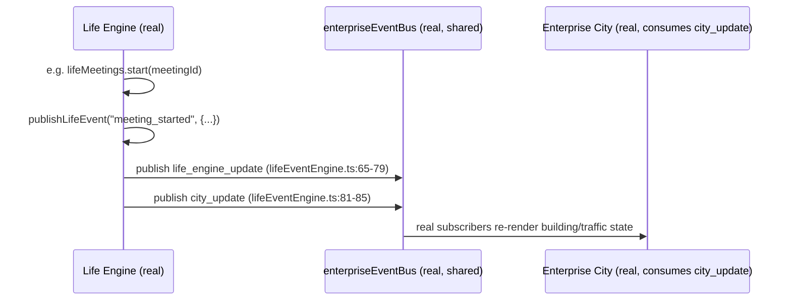

# Enterprise Operations — Daily Operations Model, Daily City Life & City Synchronization

**Sprint:** CQ-17 — Architecture Research + UX Research + Operational Architecture. Documentation only,
`src` not modified.

**Do not duplicate:** `docs/LIFE_ENGINE.md` (real, Sprint 29.2, package `src/web/src/runtime/lifeEngine`)
already implements almost exactly the brief's §1 Daily Operations Model, §4 Daily City Life, and §9
City-to-Business Synchronization — a real event-driven runtime that turns Citizen/Business
Network/Workflow/Automation activity into `LifeEvent`s, publishes them on the real shared EventBus as
both `life_engine_update` and `city_update`, and is the thing Enterprise City's live indicators actually
consume. This document's job is to map the brief's vocabulary onto this real runtime precisely and name
the handful of genuine gaps — it does not propose a second "daily life" engine.

## 0. What is real today (verified, Sprint 29.2)

| Real symbol | Shape | File |
|---|---|---|
| `LifeEventKind` | 26 real event kinds — `citizen_enters_office/leaves_office/starts_work/finishes_work`, `meeting_started/ended/created`, `project_started/completed/updated`, `document_signed/shared`, `partner_visited`, `vehicle_departed/arrived/assigned`, `ai_activated`, `workflow_executed/completed`, `citizen_moved`, `company_visited`, `business_visit`, `meeting_invitation`, `partnership_discussion`, `shared_workspace`, `project_collaboration` | `lifeTypes.ts:10-36` |
| `LifePresence` | `working \| in_meeting \| travelling \| busy \| available \| remote \| vacation \| offline` | `lifeTypes.ts:40-48` |
| `MovementKind` | `office_to_office \| office_to_meeting \| warehouse_to_client \| construction_to_supplier \| remote_worker \| ai_movement \| vehicle` | `lifeTypes.ts:50-57` |
| `lifeEngine.startWork()`/`.finishWork()` | real start/end-of-workday functions, publish `citizen_starts_work`/`citizen_finishes_work` | `lifeEngine.ts:268-280` |
| `lifeEngine.createMeeting()`/`.startMeeting()`/`.endMeeting()` | real meeting lifecycle, moves attendee presence to `in_meeting` on start, `available` on end | `lifeEngine.ts:321-346`, `lifeMeetings.ts` |
| `lifeEngine.move()`/`.arrive()` | real movement/transit lifecycle, sets presence to `travelling` then resolves to `working`/`in_meeting` on arrival | `lifeEngine.ts:283-318` |
| `businessInteractions` | real visit/document/partnership/collaboration log, auto-publishes `partner_visited`+`company_visited` on a business visit | `businessInteractions.ts` |
| `buildingOccupancy` | real per-building occupant tracking (`employeeCount`/`visitorCount`/`meetingCount`) | referenced `lifeEngine.ts:387-391`, `lifeTypes.ts:103-111` |
| Sync | every `publishLifeEvent()` call fires **both** `life_engine_update` and `city_update` on the real `enterpriseEventBus` | `lifeEventEngine.ts:64-85` |

## 1. Daily Operations Model — brief's ten items mapped

| Brief item | Real/SPEC mapping |
|---|---|
| Start of workday | **Real** — `lifeEngine.startWork()` → `citizen_starts_work` (`lifeEngine.ts:268-273`) |
| Office opening | **Real** — `lifeEngine.enterOffice()` → `citizen_enters_office`, real `buildingOccupancy.enter()` | 
| Remote work | **Real** — `LifePresence: "remote"`, sets `locationLabel: "Remote"` (`lifeEngine.ts:235`) |
| Shift changes | **New — genuinely absent.** No real "shift" concept anywhere in `LifePresence`/`LifeEventKind`. SPEC: a shift change is a same-building `citizen_leaves_office` immediately followed by a different citizen's `citizen_enters_office` for the same `buildingId` — a **read-model correlation** over two existing real events, not a new event kind or entity |
| Meetings | **Real** — full lifecycle, `lifeMeetings.create/start/end()` |
| Production | **Partial** — `workflow_executed`/`workflow_completed` (real, bridged from `AUTOMATION_ENGINE.md`'s Sprint 28.9 automation) cover *process* execution; there is no real "units produced" concept — a Manufacturing scenario (`ENTERPRISE_SCENARIO_LIBRARY.md`, this sprint) would attach production counts as workflow `payload` data, not a new field |
| Deliveries | **Real** — `vehicle_assigned/departed/arrived` + `MovementKind: "warehouse_to_client"` already model exactly this |
| Customer visits | **Partial** — `business_visit`/`partner_visited`/`company_visited` exist, but always through the lens of a *partner company* (`BusinessInteraction.partnerCompanyId`, Sprint 29.0 EBN). A pure walk-in customer with no `BusinessProfile` has no real modeling path — flagged, not solved, consistent with `EBN_COMMUNICATION.md`'s (CQ-10) prior finding that non-partner external contact is thin |
| Financial operations | **Absent from Life Engine** — real financial events live in `finance_enterprise`/`DIGITAL_ASSET_TREASURY.md` (Sprint 18.4); this document does not pull them into Life Engine's event stream, since financial system-of-record events and City-visualization events are different concerns (`ENTERPRISE_HEALTH.md` §1, CQ-15, already drew the same non-integration line for Financial Health) |
| End of workday | **Real** — `lifeEngine.finishWork()` → `citizen_finishes_work` |

## 2. Daily City Life — brief's eight examples, same real mechanism

Every one of the brief's eight "Daily City Life" examples is the **same real mechanism** (§0's
`publishLifeEvent` → `city_update`) observed from Enterprise City's side rather than the Life Engine's
side — this section exists to state that plainly, not to design a second visualization pipeline:

| Brief example | Real event(s) already driving it |
|---|---|
| Employees arriving | `citizen_enters_office` |
| Vehicles leaving | `vehicle_assigned` (status `departed`) |
| Warehouses loading | `MovementKind: "warehouse_to_client"` movement start |
| Construction beginning | `MovementKind: "construction_to_supplier"` movement start, or `project_started` scoped to a construction-site `LocationAssignment` (`REGIONAL_DIGITAL_TWIN.md` §1, CQ-16's real `construction_site` `LocationAssignmentKind`) |
| Meetings starting | `meeting_started` |
| Projects progressing | `project_updated`/`project_completed` |
| Business traffic | `business_visit`/`company_visited` volume, same real trigger `CITY_LIVING_ECONOMY.md` §1.2 (CQ-10) already wired to the traffic-flow visual |
| Partner visits | `partner_visited` |

## 3. City-to-Business Synchronization (brief §9) — already real, documented precisely

The brief's five examples are answered by the exact same real bridge, cited with precision so a future
sprint knows exactly which line of code to extend rather than reinvent:

| Brief example | Real path |
|---|---|
| Meeting starts → office activity | `meeting_started` → `city_update` → real building occupancy visual |
| Vehicle departs → traffic update | `vehicle_assigned` (status `departed`) → `city_update` |
| Project begins → construction visualization | `project_started` → `city_update`; construction-specific rendering is `CITY_VISUAL_STATES.md`'s (CG-9) job, unchanged by this document |
| Asset assigned → building status | **Not yet bridged** — real `assetRuntime.move()` (`DIGITAL_TWIN_STANDARDS.md`, CQ-16) does not currently call `publishLifeEvent`; recommend a thin bridge call, mirroring the existing Workflow/Digital-Citizen bridges in `attachPlatformBridges()` (`lifeEngine.ts:87-152`), not a new sync mechanism |
| Citizen changes role → organization update | **Not yet bridged** — real `Membership.role` changes (`CITIZEN_ORGANIZATION_MEMBERSHIP.md`, CQ-12) do not currently publish a `LifeEvent`; recommend the same bridge pattern, publishing a new `LifeEventKind: "citizen_role_changed"` (additive, non-breaking) |

## Non-goals

- No second "daily life"/event runtime — every mechanism here is the real Life Engine, observed from
  two angles (Operations Model, City visualization).
- No merge of financial system-of-record events into the Life Engine's stream — kept separate per
  `ENTERPRISE_HEALTH.md`'s precedent.
- No new customer/CRM entity for non-partner visits — flagged as a real gap, not solved here.

## Related documents

`docs/LIFE_ENGINE.md`/`docs/LIFE_ENGINE_API.md`/`docs/SPRINT_29_2_RESULT.md` (real, Sprint 29.2, the
foundation this document extends), `docs/REGIONAL_DIGITAL_TWIN.md`/`docs/DIGITAL_TWIN_STANDARDS.md`
(CQ-16, `LocationAssignment`/`assetRuntime`), `docs/CITY_LIVING_ECONOMY.md` (CQ-10, real traffic
trigger), `docs/AUTOMATION_ENGINE.md` (real Sprint 28.9, workflow bridge), `docs/EBN_COMMUNICATION.md`
(CQ-10, the non-partner-contact gap restated), `docs/COMPANY_OPERATING_MODES.md`,
`docs/ENTERPRISE_SCENARIO_LIBRARY.md` (CQ-17 siblings).
