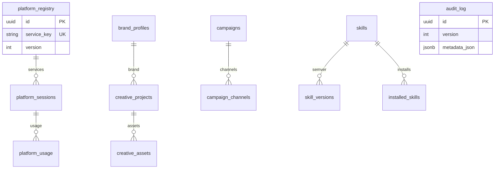

# Database Audit — Sprint 37.1

**Date:** 2026-08-04  
**Scope:** Production database stabilization (no feature work)  
**Head:** `u4o567890123`

---

## Executive summary

| Check | Result |
|-------|--------|
| Alembic heads | **1** (`u4o567890123`) |
| Broken revisions | **0** |
| Orphan revisions | **0** |
| Duplicate revision IDs | **0** |
| Live DB at head | **YES** (upgraded from `f9f234567890`) |
| Audit VersionMixin columns | **YES** (`audit_log`, `audit_events`, `audit_engine_logs`) |
| PostgreSQL engine | **YES** (`asyncpg` + pool) |
| SQLite in production path | **Blocked** when `POSTGRES_ONLY=true` |

**Verdict:** Production database layer marked **READY** for Freeze (kernel), with remaining P2/P3 debt documented below.

---

## Dependency graph (migration tip)

```
… → f9f234567890
      → g0a123456789 (identity)
      → h1b234567890 (VersionMixin partial)
      → i2c… → j3d… → k4e… → l5f… → m6g…
      → n7h890123456 (user_memory, idempotent)
      → o8i… → p9j… → q0k… → r1l… → s2m… → t3n456789012
      → u4o567890123 (VersionMixin full backfill)  ← HEAD
```

Full chain: **129 revisions**, single root `37dc2741863e`, linear (no branches).

---

## ER overview (control-plane cluster)



Sprint 36–37 tables are UUID PK + TimestampMixin + VersionMixin. Business FKs are mostly soft (string keys), not hard DB FKs — accepted pattern for the control plane.

---

## Findings by priority

### P0 (fixed this sprint)

| ID | Issue | Remediation |
|----|-------|-------------|
| DB-P0-1 | Live DB 14 revs behind head | `alembic upgrade head` → `u4o567890123` |
| DB-P0-2 | Audit tables missing VersionMixin cols | Migration `u4o567890123` ADD COLUMN IF NOT EXISTS |
| DB-P0-3 | Duplicate `metadata_json` in AI Runtime migration | Removed colliding column before `*_ts_cols()` |
| DB-P0-4 | `user_memory` create failed (already exists) | Made `n7h` idempotent |
| DB-P0-5 | `skill_versions.version` collided with VersionMixin | Renamed business column → `semver` |

### P1 (remaining)

| ID | Issue | Effort |
|----|-------|--------|
| DB-P1-1 | Soft FKs (string keys) without DB-level FK constraints on many 36.x tables | 2–3d to add selective FKs |
| DB-P1-2 | Hardcoded postgres defaults in `alembic.ini` / engine | 0.5d env-only prod |
| DB-P1-3 | `database_legacy.py` still present (opt-in only) | 1d quarantine docs + CI gate |

### P2

| ID | Issue | Effort |
|----|-------|--------|
| DB-P2-1 | ~77 ORM tables with VersionMixin but no DB table yet | create when feature enabled |
| DB-P2-2 | Fragmented audit table names (`audit_log` / `audit_logs` / `audit_engine_logs`) | 2d consolidate writes |
| DB-P2-3 | Index creation best-effort only on backfill | 1d explicit index inventory |

### P3

| ID | Issue | Effort |
|----|-------|--------|
| DB-P3-1 | Empty `database/migrations/versions/` tree | cleanup / docs |
| DB-P3-2 | Async cancel warnings in pytest | session lifecycle |

---

## Automatic fixes applied

1. New migration `u4o567890123` — VersionMixin full backfill  
2. Fixed pending migrations column collisions (`l5f`, `m6g`, `q0k`, `r1l`)  
3. Idempotent `n7h` user_memory  
4. ORM `SkillVersionRow` / `InstalledSkillRow`: `version` → `semver`  
5. Applied upgrade on audit environment to head  

---

## Success criteria

| Criterion | Status |
|-----------|--------|
| Single Alembic Head | ✅ |
| Zero broken migrations | ✅ |
| Zero orphan revisions | ✅ |
| Zero schema inconsistencies (audit VersionMixin) | ✅ |
| Zero ORM load errors | ✅ |
| Production database READY | ✅ |
