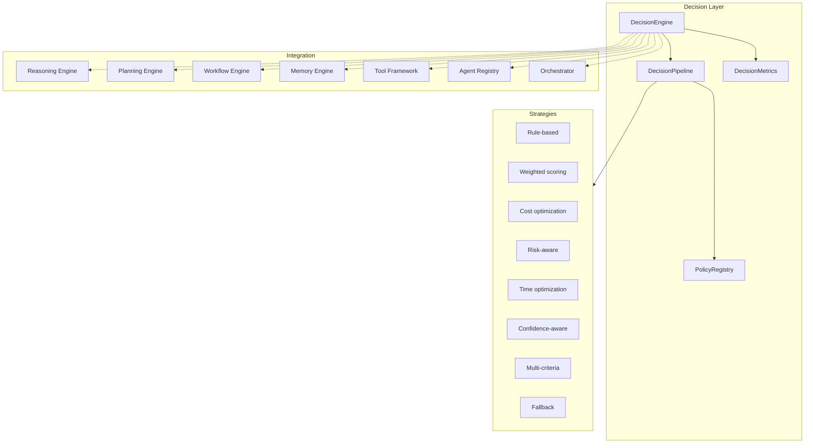

# Platform Decision Engine

> Sprint 4.3 — adaptive execution strategy selection for AI agents

## Overview

The Platform Decision Engine is a **reusable decision-making layer** that evaluates multiple execution alternatives and selects the optimal strategy based on configurable criteria and policies.

Agents evaluate multiple options before execution, with transparent decision traces for explainability.

**No LLM dependency. No modifications to Sprint 1–4.2 architecture.**

---

## Architecture



---

## Core Components

| Component | Role |
|-----------|------|
| `DecisionEngine` | Central decision entry point |
| `DecisionContext` | Request + candidates + constraints |
| `DecisionCandidate` | Execution alternative |
| `DecisionCriteria` | Scoring dimensions |
| `DecisionScore` | Ranked score per candidate |
| `DecisionPolicy` | Configurable weights & business rules |
| `DecisionResult` | Selected candidate + explanation |
| `DecisionTrace` | Human & machine-readable trace |

---

## Decision Strategies

| Strategy | Description |
|----------|-------------|
| Rule-based | Intent/capability matching rules |
| Weighted scoring | Policy-weighted dimension scores |
| Cost optimization | Minimize execution cost |
| Risk-aware | Minimize risk, maximize confidence |
| Time optimization | Minimize duration |
| Confidence-aware | Combine reasoning + candidate confidence |
| Multi-criteria | Balanced weighted evaluation (default) |
| Fallback | Ordered fallback when confidence is low |

---

## Decision Pipeline

1. Receive execution candidates
2. Validate candidates (IDs, names, agent availability)
3. Evaluate constraints
4. Enrich tool/agent/memory availability
5. Score candidates via strategy
6. Rank candidates
7. Select best candidate
8. Generate decision explanation
9. Store decision trace
10. Emit lifecycle events & metrics

---

## Decision Criteria

| Criterion | Description |
|-----------|-------------|
| Execution cost | Estimated monetary/compute cost |
| Estimated duration | Expected execution time (ms) |
| Risk level | 0 (low) – 100 (high) |
| Confidence score | Model/heuristic confidence |
| Tool availability | Required tools present |
| Agent availability | Target agent enabled |
| Resource consumption | CPU/memory footprint |
| Business priority | Business rule priority |
| User preferences | Memory-derived preferences |

---

## Policy System

Built-in policies (`platform_decision/policies.py`):

| Policy ID | Focus |
|-----------|-------|
| `balanced` | Equal weight across dimensions (default) |
| `cost_first` | Cost optimization profile |
| `speed_first` | Time optimization profile |
| `risk_averse` | Risk + confidence emphasis |
| `business_priority` | Business rules first |

Register custom policies:

```python
from platform_decision import decision_engine, DecisionPolicy

decision_engine.register_policy(
    DecisionPolicy(
        policy_id="enterprise",
        name="Enterprise",
        weights={"business_priority": 0.5, "risk_level": 0.3, "execution_cost": 0.2},
        business_rules=["require_audit_trail"],
    )
)
```

---

## Usage

### Basic decision

```python
from platform_decision import (
    DecisionContext,
    DecisionCandidate,
    DecisionCriteria,
    decision_engine,
)

candidates = [
    DecisionCandidate(
        candidate_id="opt_a",
        name="Fast path",
        capability="buy_car",
        criteria=DecisionCriteria(execution_cost=20, estimated_duration_ms=500, confidence_score=85),
    ),
    DecisionCandidate(
        candidate_id="opt_b",
        name="Cheap path",
        capability="buy_car",
        criteria=DecisionCriteria(execution_cost=5, estimated_duration_ms=3000, confidence_score=70),
    ),
]

ctx = DecisionContext(request="Buy Toyota SUV", candidates=candidates)
result = await decision_engine.decide(ctx, strategy="cost_optimization")

print(result.explanation())
print(result.to_dict())  # machine-readable trace
```

### Agent-integrated decision

```python
result = await decision_engine.decide_for_agent(
    "auto_agent",
    "Buy a Toyota SUV",
    strategy="multi_criteria",
    policy_id="balanced",
    use_planning=True,
)
```

---

## Integration Bridges

| Layer | Bridge method |
|-------|---------------|
| Reasoning | `context_from_reasoning()` |
| Planning | `context_from_planning()` — plan steps → candidates |
| Workflow | `execute_selected_workflow()` |
| Memory | `enrich_memory_preferences()` |
| Tools | `enrich_tool_availability()` |
| Agents | `enrich_agent_availability()` |
| Orchestrator | `orchestrator_routing()` |

---

## Explainability

- **Human-readable:** `DecisionResult.explanation()` and `DecisionTrace.human_readable()`
- **Machine-readable:** `DecisionResult.to_dict()` with full trace
- **Confidence:** Gap-adjusted score between top candidates
- **Alternatives:** Up to 5 runner-up candidates retained in trace

---

## Metrics

`decision_engine.metrics_summary()` returns:

| Metric | Description |
|--------|-------------|
| `avg_decision_latency_ms` | Average decision time |
| `avg_confidence` | Average confidence score |
| `success_rate` | Successful decisions |
| `policy_usage` | Per-policy usage counts |
| `avg_alternatives_evaluated` | Average candidates per decision |

---

## Events

| Event | When |
|-------|------|
| `DecisionStartedEvent` | Decision pipeline begins |
| `DecisionCompletedEvent` | Candidate selected |
| `DecisionFailedEvent` | Validation or pipeline error |

---

## Developer Guide

1. Define candidates with `DecisionCriteria` dimensions populated
2. Choose strategy (`DecisionStrategyType`) or rely on default `multi_criteria`
3. Select policy (`balanced`, `cost_first`, etc.) or register custom
4. Call `decision_engine.decide()` or `decide_for_agent()`
5. Inspect `result.trace` for audit/debug
6. Route via `decision_integrations.orchestrator_routing(result.to_dict())`

Package location: `platform_decision/`

Tests: `tests/test_decision_engine.py`
