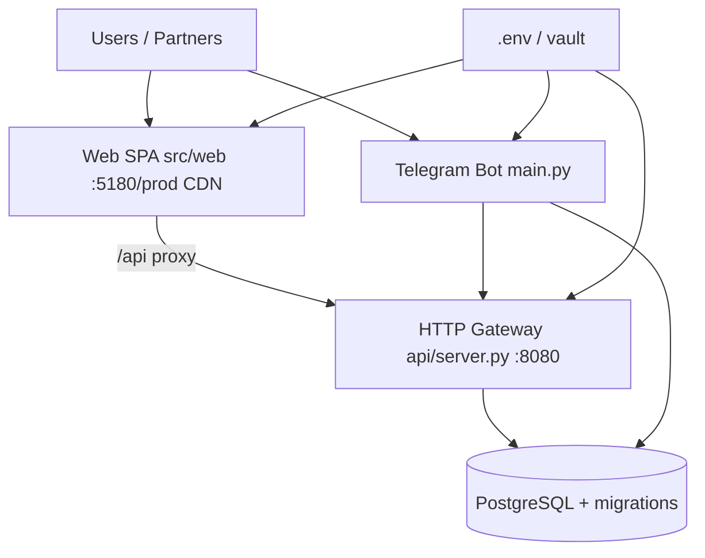

# Deploy Topology — Sprint 30.3

Staging/production compose for the Enterprise AI Platform. Dual entrypoints remain; orchestrate explicitly.

## Processes

| Process | Entry | Depends on |
|---------|-------|------------|
| API | `api/server.py` / startup | DB, secrets |
| Web | `src/web` build/serve | API reachable |
| Bot | `main.py` polling | API optional-with-warn; DB |

## Minimum staging checklist

1. Apply Alembic migrations  
2. Seed RBAC (`database/seeds/rbac_v2.py` as applicable)  
3. Start API; verify `/health` `/readiness`  
4. Serve web with API base URL  
5. Start bot only if Telegram channel required for pilot  

## Non-goals

- Collapsing bot and API into one process  
- Replacing Telegram with web in this sprint  
