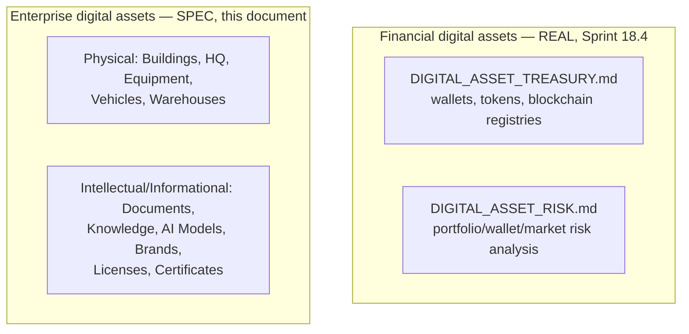

# Enterprise City — Digital Assets Architecture

**Sprint:** CQ-13 — Architecture Research + Product Research. Documentation only, `src` not modified.

**Do not duplicate:** `DIGITAL_ASSET_TREASURY.md`/`DIGITAL_ASSET_RISK.md` (real, Sprint 18.4,
`applications/finance_enterprise/digital_assets/`) already implement a substantial real financial
digital-asset system — cited, not re-designed. `VISUAL_ASSET_REGISTRY.md` (real, Sprint 29.6,
Platform Builder) already implements a real visual-asset versioning/distribution system — a different
domain (design files, not business assets), cited only to prevent confusion.

## 0. The headline finding — "Digital Assets" already means something specific and real; the brief means something broader

`DIGITAL_ASSET_TREASURY.md` is real and substantial: Digital Asset Registry, Token Registry,
Blockchain Registry, Wallet Registry, Exchange Account Registry, Custody Registry, hot/cold/multi-sig/
HD wallets, real network support (Bitcoin/Ethereum/TRON/BNB/Polygon/Solana), cost basis, PnL,
portfolio valuation. **This is a crypto/fiat financial-instrument system.** The brief's §8 list
(Buildings, Headquarters, Equipment, Vehicles, Warehouses, Documents, Knowledge, AI Models, Brands,
Licenses, Certificates) is a **completely different asset category** — physical and intellectual
property, not financial instruments. This document does not conflate the two; it designs the latter
as its own model, explicitly distinct from the real Treasury system's scope.

## 1. Two asset families, not one



## 2. Enterprise asset entity model (SPEC)

```ts
type EnterpriseAssetKind =
  | "building" | "headquarters" | "equipment" | "vehicle" | "warehouse"
  | "document" | "knowledge" | "ai_model" | "brand" | "license" | "certificate";

interface EnterpriseAsset {
  id: string;
  kind: EnterpriseAssetKind;
  ownerCompanyId: string;          // real BusinessProfile.id (Sprint 29.0)
  linkedCityBuildingId?: string;   // for building/headquarters/warehouse kinds — real CityBuildingId
  linkedVehicleId?: string;        // for vehicle kind — CITY_OBJECT_MODEL.md §3 VehicleInstance (CQ-11)
  linkedDocumentRef?: string;      // for document/license/certificate kinds — real services/storage
  tokenizationReady: boolean;      // §3 — compatibility flag only, no real tokenization implemented
}
```

### 2.1 Per-kind grounding

| Kind | Real foundation |
|---|---|
| Building / Headquarters / Warehouse | Real `CityBuilding` (`cityCatalog.ts`) + `CITY_OBJECT_MODEL.md` §2.1's real subtype fields (CQ-11) — an asset record is a new *ownership wrapper* around the existing real building, not a new geometry |
| Equipment | New — closest real precedent is `CITY_OBJECT_MODEL.md` §3's `construction_equipment` `VehicleKind` (CQ-11), but that models the *visual marker*, not ownership — this asset kind is the ownership record behind it |
| Vehicle | Real `VehicleInstance` (`CITY_RUNTIME_ARCHITECTURE.md` §1.3, CQ-11) — same relationship as Equipment |
| Warehouse | Real `CityBuilding` warehouse subtype (`CITY_OBJECT_MODEL.md` §2.1) |
| Documents / Licenses / Certificates | Real `services/storage` + real `VerifiedDocument` (`EBN_VERIFIED_DOCUMENTS.md`, CQ-10) — an asset record here is a thin pointer, not a new document store |
| Knowledge | `AI_MEMORY.md`'s real (fragmented) knowledge layers (CG-8) — same "pointer, not new store" pattern |
| AI Models | New — no real per-model ownership record exists; closest real analog is `PERSONAL_AI.md`'s `PersonalAiAssistant.underlyingAgentId` (CQ-12), itself pointing at an unconsolidated registry (`AI_OS.md` §0, CG-8) |
| Brands | New — closest real precedent is `EBN_GAMIFICATION_MONETIZATION.md`'s real `BrandOverrides` mechanism (CQ-10, extending `graphicsTheme.ts`, CG-2) — a Brand asset is the ownership record behind an applied `BrandOverrides` |

## 3. Future tokenization compatibility only

Per the brief's explicit constraint, `tokenizationReady` is a **boolean compatibility flag, nothing
more** — no token standard, no blockchain network, no smart contract is specified. Its only design
implication: `EnterpriseAsset.id` should be a stable, globally-unique identifier from day one (a UUID,
not an auto-increment integer), since a future tokenization layer would need a stable off-chain
reference — a cheap, forward-compatible decision, not a tokenization design.

**If tokenization is ever built**, `DIGITAL_ASSET_TREASURY.md`'s real Token Registry/Blockchain
Registry (§0) is the natural real infrastructure to extend — restated as the same "don't build a
second treasury" guidance `ENTERPRISE_ECONOMY.md` §7 and `INVESTMENT_LAYER.md` §4 already give.

## 4. Non-goals

- No extension of or integration with `DIGITAL_ASSET_TREASURY.md`/`DIGITAL_ASSET_RISK.md` — named as
  future infrastructure only.
- No real tokenization, smart contract, or blockchain design — `tokenizationReady` is a flag, not an
  implementation.
- No new geometry/rendering system — every physical asset kind wraps a real existing `CityBuilding` or
  `VehicleInstance`.

## Related documents

`DIGITAL_ASSET_TREASURY.md`/`DIGITAL_ASSET_RISK.md` (real, Sprint 18.4), `VISUAL_ASSET_REGISTRY.md`
(real, Sprint 29.6, a different domain), `CITY_OBJECT_MODEL.md` (CQ-11, Building/Vehicle real
foundations), `EBN_VERIFIED_DOCUMENTS.md`/`EBN_GAMIFICATION_MONETIZATION.md` (CQ-10, Document/Brand
foundations), `AI_MEMORY.md`/`PERSONAL_AI.md` (CG-8/CQ-12, Knowledge/AI Model foundations),
`INVESTMENT_LAYER.md` (CQ-13 sibling, the same "don't build a second treasury" guidance).
