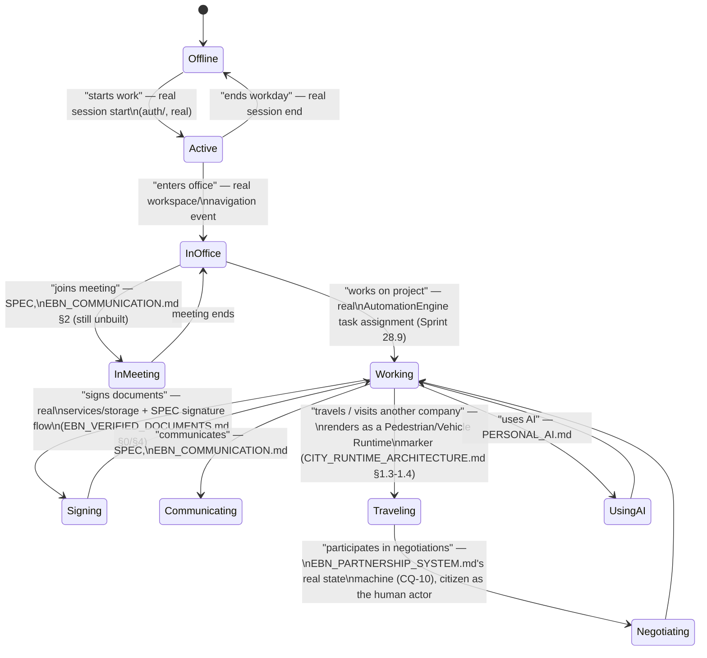

# Enterprise Digital Citizens — Digital Workplace, Daily Life & City Visualization

**Sprint:** CQ-12 — Architecture Research + UX Research + Game Design Research. Documentation only,
`src` not modified. Covers the brief's §3 (Digital Workplace), §4 (Digital Life), and §9 (City
Visualization) together — all three answer the same underlying question ("what does a citizen's day
look like, and how does it render"), so this document treats them as one continuous specification
rather than three artificially separated ones.

**Do not duplicate:** `CITY_RUNTIME_ARCHITECTURE.md` §1.3–1.4 (CQ-11) already specifies the Vehicle
and Pedestrian Runtimes this document's every visual example rides on — restated as citations, not
re-designed. `EBN_COMMUNICATION.md` (CQ-10) already found Enterprise Communication (chat/meetings/
video/shared calendar) genuinely absent — this document does not re-litigate that finding.

## 1. Digital Workplace (brief §3)

### 1.1 What exists today (verified, extending prior research)

The real `workspace/` module (`ARCHITECTURE_MAP.md` §3.1 — "primary post-login entry point," dashboard
engine, widgets, layout) is the closest real precedent for a per-citizen workplace surface — it already
exists, is already the landing surface most personas hit after login (`CITY_USER_JOURNEYS.md` §0, CG-5).
This document does not propose a second workspace; a citizen's "Office" and "Desk" (brief) are proposed
as **the same real `workspace/` surface**, reframed with the citizen's `Membership` (`CITIZEN_ORGANIZATION_
MEMBERSHIP.md`) as its scoping context.

### 1.2 Per-item mapping

| Brief item | Real foundation | Status |
|---|---|---|
| Office | Real `workspace/` module | Real — a citizen's primary Membership determines which company's workspace context loads |
| Desk | Same real `workspace/` surface, personal view | Real, reframed |
| Current Tasks | Real `jobManager`/`AutomationEngine` (Sprint 28.9, CG-7/CQ-11) | Real, once bound to a citizen ID rather than only a company/workflow ID |
| Calendar | **Absent** — `EBN_COMMUNICATION.md` §4 (CQ-10) already confirmed no real shared-calendar feature exists | Genuinely SPEC |
| Notifications | Real `useNotificationStore` | Real, already per-user scoped |
| Meetings | **Absent** — `EBN_COMMUNICATION.md` §2 (CQ-10) | Genuinely SPEC |
| Documents | Real `services/storage` (`EBN_VERIFIED_DOCUMENTS.md` §0, CQ-10) | Real foundation, citizen-scoped view is new |
| Projects | Real Automation Engine (Sprint 28.9) | Real, once citizen-scoped |
| Business Relationships | `CITIZEN_REPUTATION_GROWTH.md` §1 (this sprint's Social Business Layer) | See sibling document |
| AI Assistant | `PERSONAL_AI.md` (this sprint) | See sibling document |
| Workspace | Real `workspace/` module | Real — the umbrella surface all of the above render inside |

## 2. Digital Life — the daily lifecycle (brief §4)

### 2.1 Every action must become a real event — the one rule

Restated from `ENTERPRISE_BUSINESS_NETWORK.md` §0 and `CITY_VISUAL_STATES.md` §0 (CG-9), applied to
individual citizens: **a citizen's visible action in the City must trace to a real, timestamped fact**
— a login, a document signature, a meeting join — never a decorative animation loop implying activity
that isn't happening. This is the same discipline this whole multi-sprint engagement has applied to
technical events (CG-4), business events (CQ-10), and now personal ones.

### 2.2 Lifecycle diagram (brief's ten examples, one state machine)

Every transition above cites either a real mechanism or an already-SPEC'd sibling document — this
document introduces no new backend concept, only the citizen-level state machine tying them together.

## 3. City Visualization (brief §9)

### 3.1 Every example maps onto the real Pedestrian/Vehicle Runtime — no third mechanism

| Brief example | Runtime | Real trigger |
|---|---|---|
| Walking between buildings | Pedestrian Runtime (`CITY_RUNTIME_ARCHITECTURE.md` §1.4) | Real presence + a `Membership`-scoped destination building |
| Driving vehicles | Vehicle Runtime, `car`/`delivery_van` kind (`CITY_OBJECT_MODEL.md` §3) | A Driver `Membership` role (`CITIZEN_ORGANIZATION_MEMBERSHIP.md` §1) actively assigned to a real handoff event |
| Working inside offices | Building Runtime's real `aiActive`/`tasks` fields, citizen-attributed | Real, once a task carries a citizen ID |
| Joining meetings | SPEC — depends on `EBN_COMMUNICATION.md`'s Meeting Room existing first | Genuinely blocked |
| Construction supervision | `CITY_OBJECT_MODEL.md` §2.1 Construction Site state, Builder role attributed | Real building-state mechanism, new citizen attribution |
| Warehouse operations | `CITY_OBJECT_MODEL.md` §2.1 Warehouse subtype, once ERP live-binds (`CITY_ERP.md` §1, CG-6) | Blocked on the same ERP gap CG-6 already found |
| Visiting partners | Pedestrian/Vehicle Runtime, triggered by a real `EBN_PARTNERSHIP_SYSTEM.md` interaction | Real mechanism, new citizen-level trigger |
| Attending conferences | **Not recommended as a new mechanism** — no real conference/event concept exists anywhere in this survey; would need its own product definition before a visual is designed | Explicitly deferred, not filled in speculatively |
| Using public transport | **Not recommended** — no real signal distinct from "traveling" (already covered by Pedestrian/Vehicle Runtime); a separate "public transport" visual would be decoration without a distinct real trigger, failing §2.1's test | Rejected on the same grounds `CITY_VISUAL_STATES.md` §6/§9 (CG-9) rejected Smoke/literal Weather |
| Working remotely | Real — a citizen whose primary `Membership` company shows activity but whose Pedestrian marker is absent (not physically "in" any building) | Already expressible with the real presence model, no new mechanism needed — "remote" is simply the absence of a location marker, not a new state |

### 3.2 Explicit rejections, restated as a pattern

Two brief-requested visualization examples (Attending conferences, Using public transport) are
declined for the identical reason CG-9 declined Smoke and literal Weather: **no real, distinct signal
to represent.** This is not this document being overly conservative — it is the same test, applied
consistently, that has kept this engagement's game-design contributions disciplined across four
sprints now (CG-9, CQ-10, CQ-11, CQ-12).

## 4. Non-goals

- No new calendar, meeting, or conference system — all explicitly deferred to `EBN_COMMUNICATION.md`
  or rejected outright (§3.2).
- No third movement mechanism — every City Visualization example reuses Pedestrian or Vehicle Runtime.
- No new workspace surface — Office/Desk are the real `workspace/` module, reframed.

## Related documents

`CITY_RUNTIME_ARCHITECTURE.md` §1.3–1.4 (CQ-11, Vehicle/Pedestrian Runtime), `EBN_COMMUNICATION.md`
(CQ-10, the Meeting/Calendar gap), `EBN_VERIFIED_DOCUMENTS.md` (CQ-10, document signing),
`CITIZEN_ORGANIZATION_MEMBERSHIP.md` (this sprint, `Membership` roles referenced throughout),
`PERSONAL_AI.md`/`CITIZEN_REPUTATION_GROWTH.md` (this sprint's sibling documents), `CITY_ERP.md`
(CG-6, the Warehouse-operations blocking gap).
