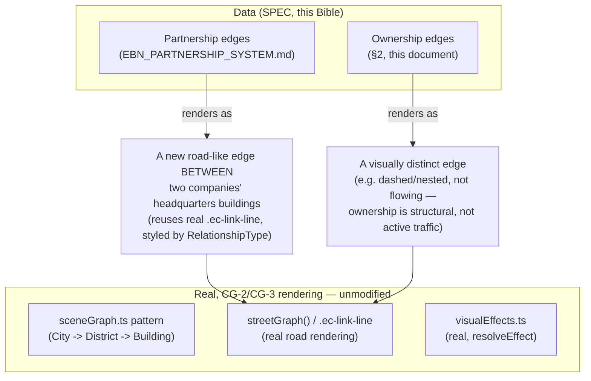

# Enterprise Business Network — Business Graph

**Sprint:** CQ-10 — Architecture Research + UI Research + Product Research. Documentation only, `src`
not modified.

**Do not duplicate:** CG-2's real scene graph (`sceneGraph.ts`), layer system (`layerSystem.ts`), and
road-rendering (`.ec-link-line`, CG-3) already provide every rendering primitive this document needs —
this is a **data model + visualization mapping** document, not a new rendering spec. `CITY_SIMULATION.md`
§1.3 (CG-4) already specified how a cross-district workflow handoff renders as a traveling road-flow
effect between two buildings — the Business Graph reuses that exact mechanism for partnership edges,
never a new visual primitive.

## 1. Relationship types (brief's nine, reconciled against `EBN_PARTNERSHIP_SYSTEM.md`'s two-axis model)

`EBN_PARTNERSHIP_SYSTEM.md` §1 already models Partner/Supplier/Customer/Dealer/Franchise/Internal Group
as `RelationshipType` values on a `Partnership` edge. This document's brief adds four more relationship
concepts (Client, Investor, Contractor, Holding) not yet in that enum — reconciled below rather than
creating a second relationship taxonomy:

| Brief relationship | Maps to |
|---|---|
| Partner | `RelationshipType: "partner"` (real enum, `EBN_PARTNERSHIP_SYSTEM.md` §2) |
| Client | `RelationshipType: "customer"` — same real-world relationship, brief's preferred naming noted here for the graph's own label vocabulary |
| Supplier | `RelationshipType: "supplier"` (real enum) |
| Investor | **New value needed** — `RelationshipType: "investor"`, added to the enum; structurally identical to Partner but with an implied financial-stake direction (asymmetric, always initiator→recipient in equity terms) |
| Contractor | **New value needed** — `RelationshipType: "contractor"`, a time-boxed variant of Supplier (same shape, adds an implied engagement end date) |
| Dealer | `RelationshipType: "dealer"` (real enum) |
| Franchise | `RelationshipType: "franchise"` (real enum) |
| Holding | **Structurally different, not a `Partnership` at all** — see §2 |
| Internal Department | `RelationshipType: "internal_group"` (real enum) — but see §2's distinction |

## 2. Holding and Internal Department are ownership, not partnership — a third, separate edge type

A `Partnership` (§1's table, `EBN_PARTNERSHIP_SYSTEM.md`) models a relationship **between two
independent companies**. A Holding structure and an Internal Department are **ownership/hierarchy**
relationships — one company legally *contains* another, or one building represents an org-unit within
the same company, not a separate legal entity. Modeling these as a `Partnership` (which has a real,
symmetric-participants, mutual-consent lifecycle — `EBN_PARTNERSHIP_SYSTEM.md` §3) would be wrong: a
subsidiary doesn't "accept a partnership request" from its own parent. **SPEC — a second, simpler edge
type:**

```ts
type OwnershipEdge = {
  parentCompanyId: string;
  childCompanyId: string;
  kind: "holding_subsidiary" | "internal_department";
  ownershipPct?: number; // only meaningful for holding_subsidiary
};
```

This keeps `Partnership`'s real state machine (§3, `EBN_PARTNERSHIP_SYSTEM.md`) uncontaminated by a
structurally different relationship that has no request/accept/trust-tier concept at all — a
subsidiary just *is* a subsidiary from the moment the ownership record exists.

## 3. Visualization — reusing the real City rendering stack entirely



**Visual distinction by relationship type (SPEC)**, styled entirely through real, existing CSS
mechanisms (`color-mix()` tokens, real `stroke`/`stroke-dasharray` already used by `.ec-link-line`/
`.ec-wf-route`, CG-2/CG-3) — no new rendering technology:

| Edge | Visual treatment | Real mechanism reused |
|---|---|---|
| Partnership (any `RelationshipType`) | Solid line, color-coded by type (a token-driven palette, not a new one) | `.ec-link-line`, real |
| Partnership at `trustTier: "strategic"` | The line gets the real `is-flowing` treatment (`CITY_VISUAL_STATES.md` §1, CG-9) — representing the real, ongoing activity a Strategic partnership implies | Real, CG-3 |
| Ownership (holding/internal) | Dashed, matching the real `cityPath`/workflow-route dash pattern (`.ec-wf-route`, real) already used for a different "this is structural, not literal traffic" signal | Real, reused for a new but visually consistent meaning |

## 4. Cross-building vs. cross-city edges

A Business Graph edge between two companies' `headquartersBuildingId` (`ENTERPRISE_BUSINESS_NETWORK.md`
§3) is straightforward when both companies have claimed a building in the *same* City instance. Once
`CITY_LIVING_ECONOMY.md` §7's multi-city future exists, a cross-city partnership edge has no real
rendering precedent (City's camera/scene graph is single-instance today) — flagged explicitly as an
open question for whichever sprint builds multi-city support, not designed here.

## 5. Non-goals

- No new graph rendering technology — every edge type in §3 is a styled variant of the real,
  already-shipped road-line mechanism.
- No merging of Ownership and Partnership into one edge type — §2 argues precisely why they must stay
  separate.
- No cross-city edge design — §4 explicitly defers this.

## Related documents

`EBN_PARTNERSHIP_SYSTEM.md` (the `Partnership` edges this graph visualizes),
`ENTERPRISE_BUSINESS_NETWORK.md` §3 (`Company.headquartersBuildingId`), `CITY_VISUAL_STATES.md` §1/§10
(CG-9, road-flow and district-highlighting reuse), `CITY_LIVING_ECONOMY.md` (the multi-city question
in §4).
