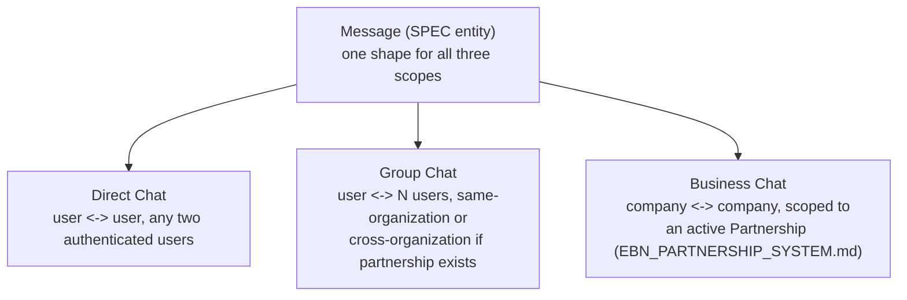

# Enterprise Business Network — Enterprise Communication

**Sprint:** CQ-10 — Architecture Research + Product Research. Documentation only, `src` not modified.

**Do not duplicate:** `docs/CORPORATE_CHAT.md` is a real, pre-existing thin stub (`GET/POST
/api/enterprise-comms/v1/chat`, "internal messaging between employees, AI agents, services, and
platform modules") — preserved and cited, not overwritten. This document is the deep specification the
stub points toward, scoped specifically to inter-*company* (not just intra-tenant) communication.

## 0. The headline finding — this subsystem is almost entirely absent, and two real things are false friends

Targeted research this sprint found **no real chat, meeting-room, or video-call implementation
anywhere in this codebase**, backend or frontend, beyond the Telegram bot's own messaging (a different
domain — Telegram is the product's existing channel to end-users, not a business-to-business
communication layer). Two adjacent-sounding real systems are **false friends**, worth naming precisely
so a future implementation sprint doesn't mistake either for existing infrastructure:

| Looks related | What it actually is |
|---|---|
| `src/chat_bridge/` (`ChatBridge.ts`, `ChatBridgeService.ts`) | Dev-tooling middleware between ChatGPT/Cursor and the TS kernel's orchestrator, per its own README — unrelated to business users, part of the disconnected ADOS TS kernel ecosystem |
| `platform_communications_hub/models.py` | An **outbound notification/messaging gateway** (`CHANNELS = sms, email, push, telegram, whatsapp, viber, voice_call`) — a one-way broadcast system, not peer-to-peer chat or a meeting room |
| `docs/CORPORATE_CHAT.md`'s `/api/enterprise-comms/v1/chat` | A real, named, but **unimplemented** API prefix — a placeholder string reused across ~60 test files and `applications/enterprise_hub/config.py`, no actual chat-room or message model behind it |

**Every one of this brief's ten requested capabilities (Direct Chat, Group Chat, Business Chat,
Meeting Rooms, Video Rooms, AI Meeting Assistant, AI Meeting Summary, AI Task Extraction, Shared
Workspace, Shared Calendar) is genuinely new, greenfield work.** This document does not try to dress
that up as an extension of something real that isn't — it specifies the target architecture honestly,
citing only the two real things that *are* legitimately reusable: the real event bus (for
notifications about messages/meetings) and the real Task Orchestrator (for AI Task Extraction).

## 1. Chat tiers (SPEC) — three scopes, one message model



**Business Chat is the one tier this Bible actually needs new governance for**: it should only be
openable between two companies with an `active` (or better) `Partnership` status
(`EBN_PARTNERSHIP_SYSTEM.md` §2–3) — a company should not be able to message another it has no real
relationship with, consistent with §0's "nothing is decoration" discipline applied to communication
access itself, not just visuals. Direct and Group Chat are proposed as standard, non-EBN-specific
messaging (any authenticated user, any group) — this Bible does not redesign general messaging, only
the Business Chat gate.

## 2. Meeting Rooms and Video Rooms (SPEC)

No real WebRTC, video SDK, or meeting-room data model exists anywhere in this survey. **SPEC,
minimum-viable shape**:

```ts
interface MeetingRoom {
  id: string;
  partnershipId?: string;      // if scoped to a specific Partnership — optional, a meeting can be internal-only
  participantCompanyIds: string[];
  scheduledAt: string;
  status: "scheduled" | "live" | "ended" | "cancelled";
  recordingRef?: string;        // SPEC — links to the real services/storage abstraction (EBN_VERIFIED_DOCUMENTS.md §1)
}
```

This document does not select a video-call technology (WebRTC vs. a third-party SDK) — that is an
infrastructure decision outside a documentation-only sprint's scope, flagged for
`SPRINT_CQ_10_RESULT.md`'s "Future API recommendations."

## 3. AI Meeting Assistant, Summary, and Task Extraction (SPEC, reuses real AI infrastructure)

These three should **not** be a new AI pipeline — they are proposed as consumers of infrastructure
already specified elsewhere in this engagement:

| Capability | Reuses |
|---|---|
| AI Meeting Assistant (real-time, in-meeting) | The real, single wired LLM provider (OpenRouter, `AI_PROVIDER_LAYER.md` §0, CG-8) — a meeting transcript stream fed to the same real `ask_openrouter()` call path already used elsewhere |
| AI Meeting Summary | Same real provider; output stored as a `CompanyTimelineEvent` (`ENTERPRISE_BUSINESS_NETWORK.md` §3.4) on both participant companies' timelines — one shared record, not a separate summary store |
| AI Task Extraction | Real `platform_ai_os` Task Orchestrator (`AI_OS.md` §0, CG-8) or the real, more-complete `platform_workflow` engine (`AUTOMATION_ENGINE.md`, CG-7 — **now real, Sprint 28.9**, per this repo's own recently-updated documentation) — an extracted task becomes a real workflow task, not a new to-do data model |

## 4. Shared Workspace and Shared Calendar (SPEC)

No real shared-workspace or shared-calendar feature was found for cross-company use. **SPEC**: scope
both to an active Partnership, same gate as Business Chat (§1) — a Shared Workspace is proposed as a
constrained view over each company's own real document store (`EBN_VERIFIED_DOCUMENTS.md`), filtered
to documents both companies have access to via their shared `Partnership.documentRefs`
(`EBN_PARTNERSHIP_SYSTEM.md` §2), not a new document store. A Shared Calendar is proposed similarly —
each company keeps its own calendar; a "shared" view is a merge/overlay of both companies' meetings
that reference the same `Partnership.id`, not a jointly-owned calendar object.

## 5. Notifications — no new channel

Every message/meeting/task-extraction event publishes through the real `enterpriseEventBus`/
`PlatformEventBus` (`CITY_EVENTS.md`, CG-4), following the same `communication_update` event-type
convention this Bible's other documents already establish for their own domains — restated, not
duplicated.

## 6. Non-goals

- No video technology is selected (§2) — an infrastructure decision, not an architecture one.
- No new AI pipeline (§3) — every capability reuses a real, already-documented AI or workflow
  mechanism.
- No new document or calendar store (§4) — both are proposed as filtered views over each company's
  existing real data once it exists.
- No redesign of Direct/Group Chat as general concepts — only Business Chat's partnership gate is
  this Bible's actual scope.

## Related documents

`CORPORATE_CHAT.md` (the real, preserved stub this document expands), `EBN_PARTNERSHIP_SYSTEM.md`
(the Partnership gate §1/§4 depend on), `ENTERPRISE_BUSINESS_NETWORK.md` §3.4 (shared Timeline model),
`AI_PROVIDER_LAYER.md` (CG-8, the one real LLM provider §3 reuses), `AUTOMATION_ENGINE.md`/`AI_OS.md`
§0 (CG-7/CG-8, the real workflow/task orchestrators §3 reuses), `EBN_VERIFIED_DOCUMENTS.md` (the real
storage abstraction §2/§4 reuse).
