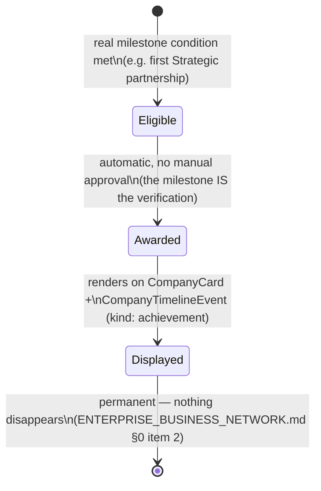

# Enterprise Business Network — Business Gamification & Future Monetization

**Sprint:** CQ-10 — Architecture Research + Game Design Research + Product Research. Documentation
only, `src` not modified.

**Do not duplicate:** `ENTERPRISE_BUSINESS_NETWORK.md` §0 items 3 ("business motivation, not
entertainment") already sets this document's one hard constraint — every element below is checked
against it. `CITY_LIVING_ECONOMY.md` §1.3's `BusinessTier` mechanism is the primary reuse target for
gamification's visual rewards; this document does not invent a second progression system.

## 1. The one test every gamification element must pass

Restated from `ENTERPRISE_BUSINESS_NETWORK.md` §0, applied literally here: **a badge, level, or visual
upgrade must be earned through verifiable business activity, and must remain legible as a business
signal to a third party** — a Trust badge should tell a prospective partner something true about
verification status; a "Level 5 company" indicator, if built at all, must decompose into the same real
inputs (`TrustScore`, `ReputationScore`, `BusinessTier`) a serious business decision-maker would want
to see broken out, never an opaque points total.

## 2. Per-element mapping (brief's list)

| Brief element | Real/proposed mechanism |
|---|---|
| Reputation | Real precursor found (`Partner.rating`, `PartnerKpi.avg_rating`, CG-10 research) — see `ENTERPRISE_BUSINESS_NETWORK.md` §3.2 |
| Trust | Real precursor found (`RiskProfile.risk_score`/`ComplianceRiskProfile.risk_score`, inverted) — see `ENTERPRISE_BUSINESS_NETWORK.md` §3.1 |
| Verified partner badges | Directly renders `VerificationLevel` (`ENTERPRISE_BUSINESS_NETWORK.md` §3.3) on `CompanyCard.trustBadge` (real field, already in the entity model) — not a separate badge system |
| Company levels | Proposed as a direct rendering of `BusinessTier` (`CITY_LIVING_ECONOMY.md` §1.3), not a new leveling mechanic — "level" is this document's game-design vocabulary for the same real, already-specified tier |
| Business achievements | **SPEC, new**: an achievement is a `CompanyTimelineEvent` (`kind: "achievement"`, already in the real entity model, `ENTERPRISE_BUSINESS_NETWORK.md` §3) triggered by a real milestone — first Strategic partnership, first fully-verified document, N successful partnerships — never a manually-awarded or purchasable badge |
| Project achievements | Same mechanism as Business achievements, scoped to a specific workflow/project completion (`AUTOMATION_ENGINE.md`, now real per Sprint 28.9) rather than company-wide activity |
| Visual headquarters upgrades | Directly `BusinessTier`'s real size-multiplier mechanism (`CITY_LIVING_ECONOMY.md` §1.3) — not a separate cosmetic-upgrade system |
| Branded transportation | **SPEC**: the real agent/job-movement marker (`CITY_SIMULATION.md` §2.2, CG-4; `CITY_VISUAL_STATES.md` §3–4, CG-9) could carry a company's real logo/color once that marker represents a business handoff (`CITY_LIVING_ECONOMY.md` §1.2's "transportation increases" row) — a skin on a real marker, not a new vehicle system |
| Premium building appearance | Same mechanism as Visual headquarters upgrades — `BusinessTier`, real theme tokens (`graphicsTheme.ts`, CG-2) applied per-company rather than platform-wide, an additive brand-override use of the exact mechanism `BrandOverrides` (real, CG-2) already supports for tenants |
| Advertising locations | **SPEC**: a small number of real, fixed City locations (e.g., near Plaza, `CITY_DISTRICTS.md` D1) designated as billboard slots | See §3 — this is also §9's clearest monetization surface |
| Digital billboards | Directly reuses `CITY_VISUAL_STATES.md` §8's real-data-bound billboard spec (CG-9) — content must be a real, current business signal (an achievement, a verified milestone), never arbitrary marketing copy, restated as a hard constraint here too |

## 3. Business achievements — state model (SPEC)

Achievements are **automatic**, not manually awarded — the real milestone condition (verified in the
underlying data: a partnership genuinely reached Strategic, a document genuinely got signed) is itself
the proof, consistent with Trust Score's own "verification-driven" design (`ENTERPRISE_BUSINESS_NETWORK.md`
§3.1). This avoids the single biggest risk in any gamification system: a human-awarded badge is a
relationship/favoritism risk; an automatically-computed one is not.

## 4. Future monetization (SPEC — brief §9)

**Constraint, stated first per the brief's own requirement**: monetization "must remain optional and
must never reduce enterprise usability" — every item below is designed as additive/cosmetic, never
gating a core business function (a company that pays nothing must still be able to form partnerships,
verify documents, and appear correctly in the Business Graph).

| Monetization surface | Mechanism | Usability-neutral design |
|---|---|---|
| Branded headquarters | `BrandOverrides` per-company (real mechanism, §2) | A company's real `BusinessTier`-driven size/prominence is unaffected by paying — branding changes color/skin only, never trust/visibility standing |
| Branded transport | Marker skin (§2) | Same principle — cosmetic only, the marker's real trigger (an actual handoff) is unaffected |
| Premium districts | **SPEC, most speculative item in this Bible** — a district-level visual tier (proposed, not designed in depth) | Would need to guarantee no premium district is more *functionally* capable (faster load, better search rank) than a non-premium one — flagged as the item most likely to violate the usability-neutral constraint if built carelessly, and therefore the one requiring the most scrutiny before implementation |
| Business advertising | Billboards (§2) | Content must still pass the real-data-bound test (§2's Digital billboards row) even if paid — a paid billboard shows a real achievement/milestone, not arbitrary ad copy; this is a real constraint on the monetization design, not a suggestion |
| Digital real estate | **SPEC, requires Business Graph maturity first** — a company "owning" a building slot | Depends on `CITY_LIVING_ECONOMY.md` §2.2's `headquartersBuildingId` model maturing into a claimable-slot system — not designed in this pass, flagged as downstream of core EBN work |
| City branding | Same as Premium districts — speculative, same scrutiny required |
| Corporate visual themes | Directly `graphicsTheme.ts`'s real `BrandOverrides` mechanism (CG-2) — the least speculative item in this whole table, since the underlying real mechanism already exists for a different purpose (tenant branding) |

### 4a. Sprint CQ-11 additions (corporate lighting, premium landscaping, animated headquarters)

Three more brief-requested premium visuals, reconciled against the same real mechanisms rather than
treated as new:

- **Corporate lighting** — the same building-lighting-density mechanism (`CITY_VISUAL_STATES.md` §5,
  CG-9) that already scales with real `tasks`/`aiActive` fields; "corporate lighting" is a paid
  *palette* on top of that real, activity-driven density, never a way to look "lit up" without real
  activity behind it — the paid part is color, the real part (how much lights up) stays tied to data.
- **Premium landscaping** — proposed as a `BusinessTier`-adjacent decorative surround (real mechanism,
  `CITY_LIVING_ECONOMY.md` §1.3) — cosmetic only, explicitly not a `BusinessTier` shortcut (a company
  cannot buy its way to a higher tier, only decorate around its real, earned one).
- **Animated headquarters** — reuses the real `resolveEffect`/`visualEffects.ts` mechanism (CG-2) for
  a company's HQ specifically; must still pass §1's test (a real signal, e.g. a genuine Strategic
  partnership or achievement) — a paid "always-animated" headquarters with no underlying activity
  would fail this Bible's own §1 rule and is explicitly **not recommended**, regardless of willingness
  to pay.

## 5. Non-goals

- No points/currency system — every reward in §2 decomposes into a real, named business signal.
- No manually-awarded badges — §3's achievements are automatic, verification-driven.
- No monetization design that gates core partnership/verification/graph functionality — §4's
  constraint applies to every row, not just the ones flagged as risky.
- Premium Districts / Digital Real Estate / City Branding are explicitly named as the most speculative,
  least-designed items in this Bible — not recommended for near-term construction.

## Related documents

`ENTERPRISE_BUSINESS_NETWORK.md` §0/§3.1–3.3 (the philosophy and real Trust/Reputation/Verification
precursors this document's badges render), `CITY_LIVING_ECONOMY.md` §1.3 (`BusinessTier`, the core
reuse target), `CITY_VISUAL_STATES.md` §8 (CG-9, real-data-bound billboards), `SPRINT_CQ_10_RESULT.md`
(risk ranking of the speculative monetization items).
