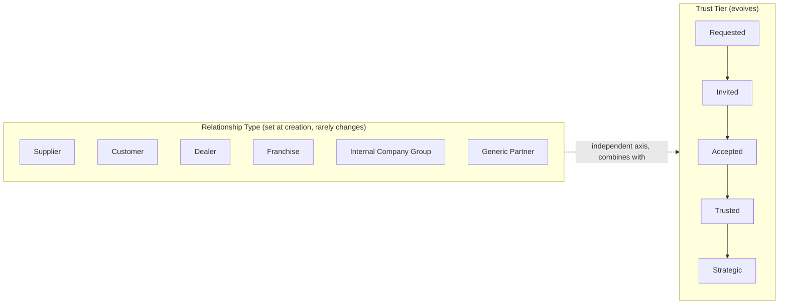
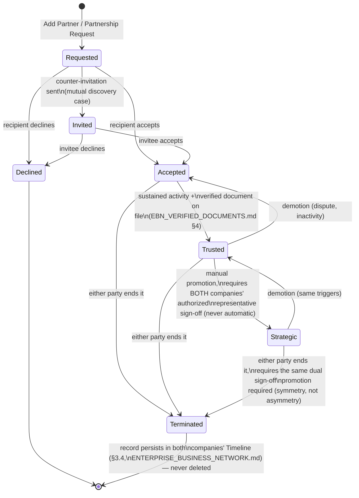
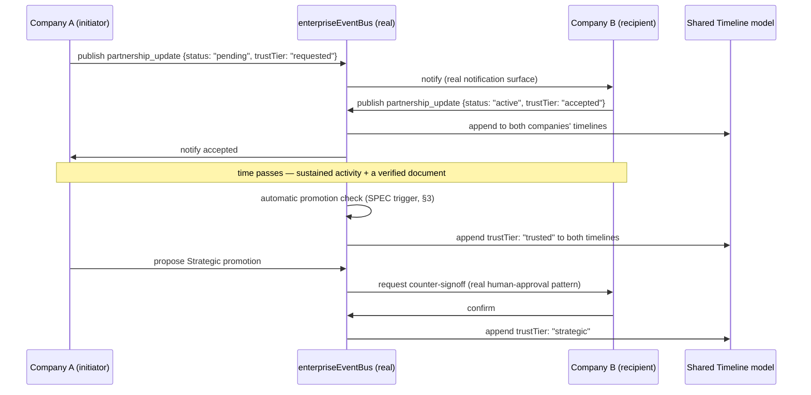

# Enterprise Business Network — Digital Partnership System

**Sprint:** CQ-10 — Architecture Research + Product Research. Documentation only, `src` not modified.

**Do not duplicate:** `ENTERPRISE_BUSINESS_NETWORK.md` owns the `Company` entity this document's
partnerships connect. `WORKFLOW_RUNTIME.md` §1 (CG-7) already specifies the real human-approval pause
mechanism this document's Accept/Reject actions reuse. This document owns only the partnership entity
itself and its lifecycle.

## 1. Two independent axes, not one flat status (same discipline as `CITY_BUILDING_STATES.md`)

The brief's eleven partnership concepts split cleanly into **two independent axes** — exactly the
multi-axis model `CITY_BUILDING_STATES.md` §1 (CG-4) already established for buildings (Lifecycle /
Health / Interaction, never one flat enum). Conflating "what kind of relationship" with "how deep the
relationship is" into one status field would make a Strategic Supplier and a newly-Accepted Franchise
indistinguishable in state, which they clearly aren't.

- **Relationship Type** (what kind of business relationship — set once, rarely changes): Supplier,
  Customer, Dealer, Franchise, Internal Company Group, or generic Partner.
- **Trust Tier** (how deep the relationship is — evolves over time): Requested → Invited → Accepted →
  Trusted → Strategic.



Any combination is valid and meaningful: a "Requested Supplier" and a "Strategic Supplier" are the
same relationship type at different depths; a "Trusted Customer" and a "Trusted Dealer" are different
types at the same depth.

## 2. Entity model (SPEC)

```ts
type RelationshipType = "supplier" | "customer" | "dealer" | "franchise" | "internal_group" | "partner";
type TrustTier = "requested" | "invited" | "accepted" | "trusted" | "strategic";
type PartnershipStatus = "pending" | "active" | "declined" | "terminated";
// PartnershipStatus is the lifecycle wrapper around Trust Tier — a partnership can be `active` at any
// Trust Tier, or `terminated`/`declined` from any Tier — nothing disappears (ENTERPRISE_BUSINESS_NETWORK.md §0
// item 2): a terminated partnership stays in history, visible per its own Visibility, not deleted.

interface Partnership {
  id: string;
  initiatorCompanyId: string;   // real Company.id (ENTERPRISE_BUSINESS_NETWORK.md §3)
  recipientCompanyId: string;
  relationshipType: RelationshipType;
  trustTier: TrustTier;
  status: PartnershipStatus;
  requestedAt: string;
  respondedAt?: string;
  terminatedAt?: string;
  terminationReason?: string;   // required if status = "terminated" — never a silent disappearance
  documentRefs: string[];       // SPEC — links into EBN_VERIFIED_DOCUMENTS.md; a Trusted/Strategic
                                 // tier should require at least one verified document (§4)
}
```

## 3. State transitions (the eleven brief concepts as one diagram)



**Design decision worth stating explicitly**: promoting to Strategic requires dual sign-off (both
companies), but *demoting* from Strategic can be unilateral (one party downgrading their own posture
toward the other) — this asymmetry is deliberate: forming a strategic relationship is a joint claim,
ending one is each party's own prerogative, mirroring how the same asymmetry exists in real commercial
relationships (a contract renewal needs both signatures; either party can still choose not to renew).

## 4. Permissions (SPEC, reusing the real permission chain)

| Action | Who can perform it |
|---|---|
| Send a Partnership Request | Any authorized representative of the initiating company (real `roleManager`/`permissionManager` chain, `ENTERPRISE_BUSINESS_NETWORK.md` §3.5) |
| Accept / Decline | The recipient company's authorized representative only |
| Promote to Trusted | Automatic, per §3's activity+document trigger — no manual action required, but logged to Timeline as if it were one |
| Promote to Strategic | Requires an explicit action from an authorized representative on **both** sides — the one partnership action this document proposes as structurally dual-approval, reusing the real human-task pause pattern (`WORKFLOW_RUNTIME.md` §1) twice, once per side |
| Terminate | Either party's authorized representative, unilaterally, with a required `terminationReason` |

## 5. Notifications (reuses the real event bus, no new channel)

Every transition in §3 publishes through the real `enterpriseEventBus`/`PlatformEventBus`
(`CITY_EVENTS.md`, CG-4; `TRIGGER_SYSTEM.md` §4, CG-7) — a `partnership_update` event type, following
the exact convention `CITY_EVENTS.md` §3 already established for payload shape
(`{initiatorCompanyId, recipientCompanyId, trustTier, status}`), not a new notification mechanism.
Both real notification surfaces already documented in this engagement (`useNotificationStore`,
real; the header unread badge, real) are the correct, already-real delivery surface — no new
notification channel is proposed.

## 6. Audit trail and history

The real `CompanyTimelineEvent` model (`ENTERPRISE_BUSINESS_NETWORK.md` §3.4) is the single audit
record for every partnership transition — a `partnership_formed`/`partnership_ended` timeline entry on
**both** companies' timelines for every state change, cross-referencing the same `Partnership.id`. This
is deliberately the same "one shared timeline, not a separate history mechanism per subsystem" decision
`ENTERPRISE_BUSINESS_NETWORK.md` §3.4 already made — a partnership's history is not a second audit log.

## 7. Sequence diagram — full lifecycle, one flow



## 8. Non-goals

- No new event bus or notification channel — §5 reuses the real ones exclusively.
- No new audit/history mechanism — §6 reuses the real shared Timeline model.
- No automatic Strategic promotion — deliberately dual-approval, never triggered by activity alone.
- No deletion path for a partnership — only `terminated`, permanently visible per its own visibility
  scope.

## Related documents

`ENTERPRISE_BUSINESS_NETWORK.md` §3–§3.5 (`Company`, Timeline, permission chain),
`WORKFLOW_RUNTIME.md` §1 (CG-7, the human-approval pause pattern), `CITY_EVENTS.md`/`TRIGGER_SYSTEM.md`
§4 (CG-4/CG-7, the real event bus and payload convention), `EBN_VERIFIED_DOCUMENTS.md` (the document
requirement gating Trusted-tier promotion), `EBN_BUSINESS_GRAPH.md` (how a partnership renders as a
road/edge in the City).
