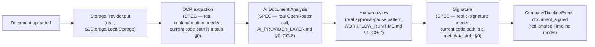

# Enterprise Business Network — Verified Business Documents

**Sprint:** CQ-10 — Architecture Research + Product Research. Documentation only, `src` not modified.

**Do not duplicate:** `ENTERPRISE_BUSINESS_NETWORK.md` §3.4 owns the shared Timeline model this
document's signing/verification events publish to. This document owns the document entity itself,
its storage, and its (currently simulated) OCR/AI-analysis pipeline.

## 0. The headline finding — `platform_contracts` is a false friend; two real foundations exist elsewhere

**`platform_contracts/` is not a legal-document system — do not build on it for this purpose.** It is a
real, working **data-contract/schema-registry** library for internal microservice API compatibility
(`DtoRegistry`/`SchemaRegistry`, schema publish/version/rollback, `VersionCompatibility.migrate()`) —
"contract" here means "API shape agreement between services," not "legal agreement between companies."
Its "versioning" is schema-version compatibility checking, not document revision history. It is not
wired into any real API route (confirmed by repo-wide grep) and has a duplicate copy at
`applications/enterprise_hub/data_contracts/`. This document names it explicitly so no future
implementation sprint mistakes the name match for a real foundation.

**Two genuinely real, reusable foundations do exist**, at different layers:

1. **Document storage** — `services/storage/`/`src/platform/storage/`'s real `StorageProvider`
   abstract base class, with real `LocalStorage` (filesystem, sha256-named files), real `S3Storage`
   (genuine `boto3.client("s3")`, `put_object`/`delete_object`), and `TelegramStorage`, selected via a
   real `get_storage_provider()` factory (`MEDIA_STORAGE_PROVIDER` env var) — **actually wired**,
   confirmed called from `container.py` and `services/media_service.py`. Scoped to Telegram bot media
   today, but the correct real storage layer to extend for business documents, not a new one.
2. **OCR and e-signature are real *code paths*, but simulated, not functional** —
   `applications/legal_enterprise/document_intelligence/ingest.py`'s `DocumentIngest.run_ocr()` claims
   `engine="tesseract"` but **just echoes the input content back** with a hardcoded
   `confidence: 0.92` — no real Tesseract/OCR library call. `applications/legal_enterprise/
   case_management/documents.py`'s `DocumentManagement.digital_signature()` similarly just records
   `{signer, signature_ref, at}` into an in-memory store — no PKI/cryptographic signing, no DocuSign/
   HelloSign-style integration. Both are the correct **shape** to extend (the call sites and data
   records already exist) but currently do no real verification work.

## 1. Document entity model (SPEC, extending the real `StorageProvider`)

```ts
type DocumentType = "contract" | "agreement" | "certificate" | "license" | "act" | "power_of_attorney" | "signed_scan";

interface VerifiedDocument {
  id: string;
  type: DocumentType;
  partnershipId?: string;         // EBN_PARTNERSHIP_SYSTEM.md — the document proving a real-world connection
  ownerCompanyId: string;
  counterpartyCompanyId?: string;
  storageRef: string;             // SPEC — a real StorageProvider key (services/storage, real)
  version: number;                 // §3
  ocrText?: string;                 // SPEC — populated once OCR is made real, §0 item 2
  aiAnalysis?: DocumentAiAnalysis;  // §4
  signatures: DocumentSignature[];
  status: "draft" | "pending_signature" | "signed" | "expired" | "revoked";
}

interface DocumentSignature {
  signerCompanyId: string;
  signerUserId: string;
  signedAt: string;
  signatureRef: string;            // SPEC — once real, a cryptographic signature reference, not a metadata stub
}

interface DocumentAiAnalysis {
  summary: string;
  extractedTerms: Record<string, unknown>;  // e.g. dates, obligations, parties — schema not designed in this pass
  riskFlags: string[];
  analyzedAt: string;
}
```

## 2. Documents prove real-world partnership — the platform's own stated requirement

The brief is explicit: *"the platform must support proving that two companies are officially connected
through real-world documents."* Concretely, this means `VerifiedDocument.partnershipId` is not
optional metadata — it is the mechanism that upgrades a `Partnership` from `accepted` to `trusted`
(`EBN_PARTNERSHIP_SYSTEM.md` §3's real state diagram already requires "a verified document on file" for
that transition). A partnership with no linked, fully-signed document can reach `accepted` but not
`trusted` — this is the concrete, load-bearing tie between this document and the partnership lifecycle,
not a soft suggestion.

## 3. Versioning (SPEC)

A `VerifiedDocument`'s `version` field increments on any re-upload/amendment; prior versions are
retained (never overwritten in the real `StorageProvider`, which already writes content-addressed —
sha256-named — files, meaning **version retention is close to free with the real storage layer as-is**:
a new version is simply a new content hash, the old one still resolvable). Version history renders on
both companies' shared Timeline (`ENTERPRISE_BUSINESS_NETWORK.md` §3.4), consistent with this whole
Bible's "one shared history mechanism" rule.

## 4. Validation and AI Document Analysis (SPEC, honest about the OCR/signature gap)



**Two boxes in this diagram are the real net-new backend work this document identifies**: real OCR
(swap the stub for an actual library/service call) and real e-signature (swap the metadata-recording
stub for a genuine cryptographic signing flow, or a licensed e-signature provider integration) — both
named explicitly rather than assumed solved because a same-shaped code path already exists.

## 5. Permissions and audit history

Document visibility follows the same `Visibility` enum (`ENTERPRISE_BUSINESS_NETWORK.md` §3) as every
other EBN entity — a document's default visibility is `partners_only`, scoped to the specific
`partnershipId` it's linked to, never automatically `public`. Every state transition (`draft` →
`pending_signature` → `signed`/`expired`/`revoked`) publishes to the real event bus and the shared
Timeline, identical mechanism to `EBN_PARTNERSHIP_SYSTEM.md` §5–6 — no second audit trail for documents
specifically.

## 6. Non-goals

- `platform_contracts` is explicitly not extended or reused for this purpose (§0) — a different domain
  entirely, named to prevent confusion, not adopted.
- No new document storage system — `services/storage`'s real `StorageProvider` is extended, not
  replaced.
- No OCR or e-signature technology is selected — both are named as real gaps needing a real
  implementation decision, not designed in this documentation-only pass.

## Related documents

`ENTERPRISE_BUSINESS_NETWORK.md` §3/§3.4 (`Visibility`, shared Timeline), `EBN_PARTNERSHIP_SYSTEM.md`
§3 (the `trusted`-tier document requirement), `AI_PROVIDER_LAYER.md` §0 (CG-8, the real LLM provider
for AI analysis), `WORKFLOW_RUNTIME.md` §1 (CG-7, the real human-approval pattern for document review).
