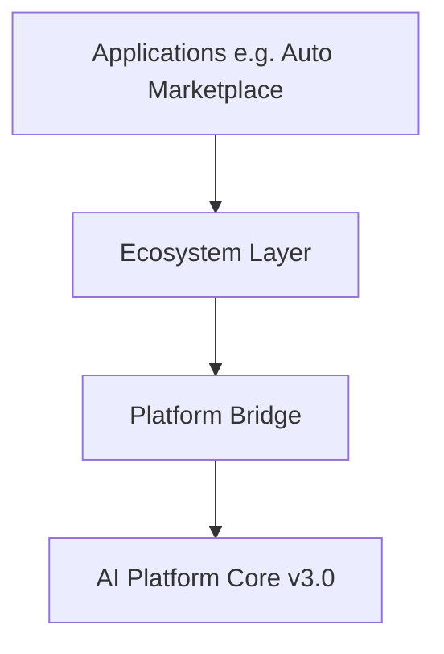

# Unified Ecosystem — Identity & Workspace (Sprint 7.1)

> Single identity, workspace, and navigation layer across the AI Ecosystem on **AI Platform Core v3.0**

## Release Summary

| Field | Value |
|-------|-------|
| Ecosystem Version | **1.5.0-alpha** |
| Platform Dependency | **AI Platform Core v3.0** |
| Sprint | **7.1** |

---

## Architecture



The ecosystem layer sits **above** individual applications. It does not modify `platform_*` packages — all platform integration uses bridge modules in `ecosystem/integrations/`.

### Modules

| Module | Purpose |
|--------|---------|
| `identity/` | SSO, sessions, MFA hooks, devices, session history |
| `organizations/` | Org hierarchy, membership, invitations |
| `tenants/` | Multi-tenant isolation |
| `profiles/` | Unified user profile across apps |
| `permissions/` | System and custom roles |
| `workspace/` | Dashboard, search, activity, notifications, favorites |
| `navigation/` | Cross-application navigation |
| `services/` | Shared notifications, files, calendar, contacts, tasks, AI memory |
| `ai/` | Unified assistant, context sharing, agent routing |

---

## Identity Guide

### Registration & Login

```python
from ecosystem import ecosystem

user, session = await ecosystem.engine.identity.register(
    email="user@example.com",
    password="secret",
    display_name="User Name",
)

user, session = await ecosystem.engine.identity.login("user@example.com", "secret")
```

### SSO Abstraction

```python
user, session = await ecosystem.engine.identity.sso_login(
    "oauth", external_id="ext-123", email="user@example.com"
)
```

### MFA Hooks

```python
enrollment = ecosystem.engine.identity.enroll_mfa(user.user_id, method="totp")
user = ecosystem.engine.identity.verify_mfa(user.user_id, enrollment.enrollment_id)
```

### API Endpoints

| Endpoint | Method | Description |
|----------|--------|-------------|
| `/api/ecosystem/v1/identity/auth/register` | POST | Register user |
| `/api/ecosystem/v1/identity/auth/login` | POST | Login |
| `/api/ecosystem/v1/identity/auth/sso` | POST | SSO login |
| `/api/ecosystem/v1/identity/profile` | GET/PATCH | Unified profile |
| `/api/ecosystem/v1/identity/devices` | GET | Device list |
| `/api/ecosystem/v1/identity/sessions/history` | GET | Session history |
| `/api/ecosystem/v1/identity/mfa/enroll` | POST | MFA enrollment |

---

## Workspace Guide

### Dashboard

```python
dashboard = ecosystem.engine.workspace.dashboard(user_id, workspace_id="...")
```

Includes: registered applications, recent activity, unread notifications, favorites, quick actions.

### Global Search

```python
results = ecosystem.engine.workspace.global_search(user_id, "auto marketplace")
```

### API Endpoints

| Endpoint | Method | Description |
|----------|--------|-------------|
| `/api/ecosystem/v1/workspace/dashboard` | GET | Unified dashboard |
| `/api/ecosystem/v1/workspace/search?q=` | GET | Global search |
| `/api/ecosystem/v1/workspace/favorites` | GET/POST | Favorites |
| `/api/ecosystem/v1/workspace/notifications` | GET/POST | Notifications |
| `/api/ecosystem/v1/workspace/quick-actions` | GET | Quick actions |

---

## Organizations

Supported entities: **Organization**, **Workspace**, **Department**, **Team**, **Project**, **Membership**, **Invitation**.

```python
org = await ecosystem.engine.organizations.create_organization(name="Acme", owner_id=user_id)
ws = await ecosystem.engine.organizations.create_workspace(
    organization_id=org.organization_id, name="Main", owner_id=user_id
)
```

---

## Roles

Built-in roles: Platform Owner, Organization Owner, Administrator, Manager, Employee, Customer, Dealer, Partner, AI Agent, plus **Custom Roles**.

```python
custom = ecosystem.engine.permissions.create_custom_role("Regional Lead", ["org:read", "workspace:write"])
await ecosystem.engine.permissions.assign_role(user_id, custom.role_id, organization_id=org_id)
```

---

## AI Integration

```python
response = await ecosystem.engine.assistant.invoke(
    user_id, "Help me find an SUV", application_id="auto_marketplace"
)

delegated = await ecosystem.engine.assistant.delegate_task(
    user_id, "qualify_lead", {"lead_id": "..."}, target_agent="sales-agent"
)
```

---

## Events

| Event | Trigger |
|-------|---------|
| `UserLoggedInEvent` | Successful login or SSO |
| `WorkspaceCreatedEvent` | New workspace |
| `OrganizationCreatedEvent` | New organization |
| `RoleAssignedEvent` | Role assignment |
| `ApplicationOpenedEvent` | Cross-app navigation |
| `AssistantInvokedEvent` | AI assistant call |

---

## Developer Guide

### Register Routes

```python
from ecosystem.api.register import register_ecosystem_routes

register_ecosystem_routes(app)
```

### Access Facade

```python
from ecosystem import ecosystem

ecosystem.engine.identity      # Identity service
ecosystem.engine.organizations # Organization service
ecosystem.engine.workspace     # Workspace service
ecosystem.engine.navigation    # Navigation service
ecosystem.engine.assistant     # Unified AI assistant
ecosystem.engine.shared        # Cross-app shared services
```

### Link Application Profile

```python
ecosystem.engine.profiles.link_application(user_id, "auto_marketplace", external_portal_user_id)
```

### Manifest

`ecosystem/manifest.json` — `ecosystem_version = "1.0.0-alpha"`

---

## Tests

```bash
pytest tests/test_ecosystem.py -q
```

---

## Expected Result

- Sprint 7.1 completed
- Unified Ecosystem ready
- Identity Layer ready
- Workspace ready
