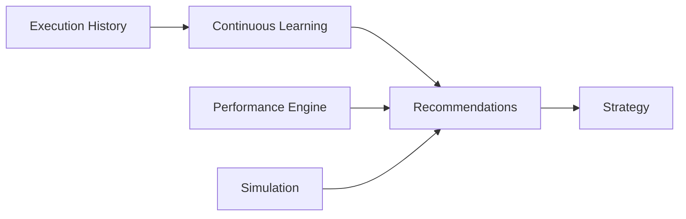

# Continuous Learning & Ecosystem Optimization (Sprint 7.5)

> Analyze performance, learn from execution history, simulate scenarios, and generate strategic recommendations on **AI Platform Core v3.0**.

## Release Summary

| Field | Value |
|-------|-------|
| Ecosystem Version | **1.4.0-alpha** |
| Optimization Layer | **1.0** |
| Continuous Learning | **1.0** |
| Platform Dependency | **AI Platform Core v3.0** |
| Sprint | **7.5** |

---

## Architecture



Package: `ecosystem/optimization/`

| Module | Role |
|--------|------|
| `continuous_learning/` | History analysis, outcomes, feedback, experience replay |
| `performance/` | App/agent/workflow/latency/resource/KPI metrics |
| `feedback/` | Feedback ingestion |
| `simulation/` | What-if, business, agent, workflow, risk, capacity |
| `benchmark/` | Baseline comparison suite |
| `recommendations/` | Optimization & scaling recommendations |
| `strategy/` | Strategy updates from recommendations |
| `engine.py` | OptimizationEngine facade |

---

## Learning Guide

```python
from ecosystem import ecosystem

opt = ecosystem.engine.optimization
opt.learning.record_execution("workforce", "execute_task", duration_ms=120, agent_id="sales")
opt.learning.track_decision("d1", "executive", expected="approve", actual="approve", success=True)
opt.feedback.submit(4.5, "Routing improved", target_type="workflow", target_id="t1")

cycle = await opt.learning.run_learning_cycle()
history = opt.learning.analyze_history()
```

---

## Optimization Guide

```python
result = await ecosystem.engine.optimization.optimize(scope="ecosystem")
# learning_cycle, recommendations, simulation, strategy, benchmarks, integrations

recs = await ecosystem.engine.optimization.recommendations.generate(force=True)
await ecosystem.engine.optimization.performance.collect_ecosystem_metrics()
```

---

## Simulation Guide

```python
from ecosystem.optimization.models import SimulationType

sim = await ecosystem.engine.optimization.simulation.run(
    "Holiday traffic",
    SimulationType.CAPACITY,
    {"load_factor": 1.8, "capacity": 100},
)
risk = await ecosystem.engine.optimization.simulation.run(
    "Outage risk",
    SimulationType.RISK,
    {"failure_rate": 0.08, "load_factor": 1.2},
)
```

Types: `what_if`, `business`, `agent_strategy`, `workflow`, `risk`, `capacity`.

---

## API Reference

| API | Endpoints |
|-----|-----------|
| Optimization | `POST /api/ecosystem/v1/optimization`, `GET /optimization/metrics`, `/benchmarks` |
| Learning | `POST /learning/cycles`, `/executions`, `/decisions`, `/feedback`, `GET /learning/history` |
| Simulation | `POST/GET /simulation` |
| Recommendations | `POST/GET /recommendations` |
| Performance | `POST /performance`, `/performance/collect`, `GET /performance` |
| Strategy | `POST/GET /strategy` |

---

## Events

| Event | When |
|-------|------|
| `OptimizationStarted` | Full optimize run begins |
| `RecommendationGenerated` | New recommendation created |
| `SimulationCompleted` | Simulation finished |
| `LearningCycleCompleted` | Learning cycle done |
| `PerformanceUpdated` | Metric snapshot recorded |
| `StrategyUpdated` | Strategy published |

---

## Developer Guide

```python
from ecosystem import ecosystem

await ecosystem.engine.optimization.optimize()
```

Integrates with Global Knowledge, Executive AI, workforce collaboration, and platform bridge — **without modifying AI Platform Core**.

---

## Tests

```bash
pytest tests/test_optimization.py -q
```

---

## Expected Result

- Sprint 7.5 completed
- Continuous Learning ready
- Optimization Engine ready
- Simulation Engine ready
- Strategic Recommendation Engine ready
