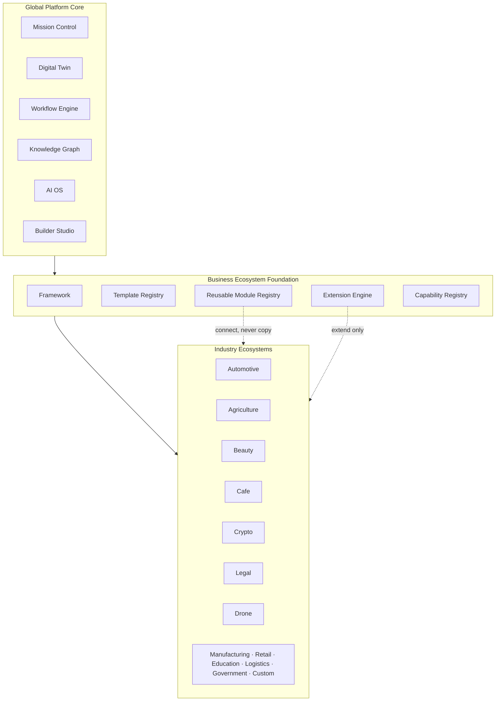
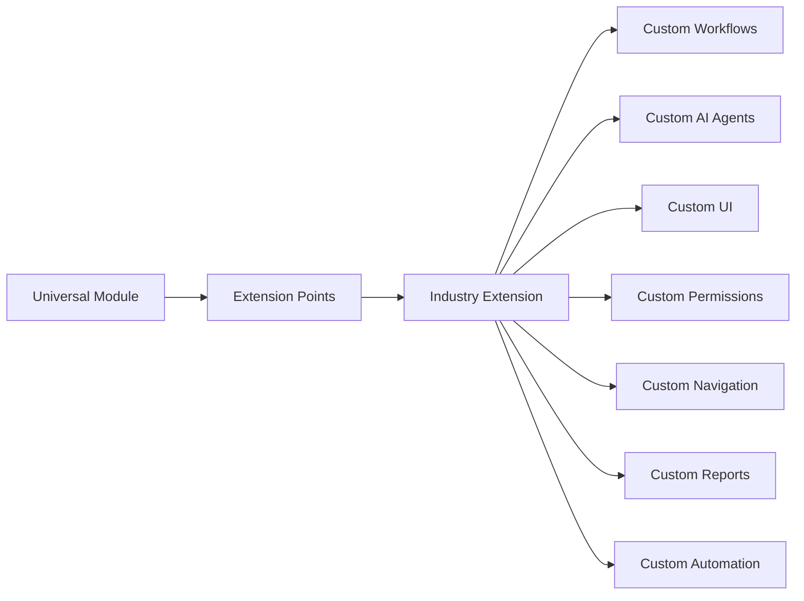
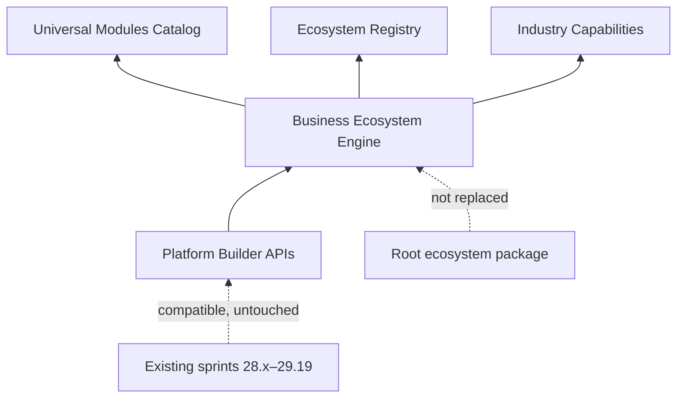

# Enterprise Business Ecosystem Foundation

Sprint **30.2** / Platform Builder **v1.27.0** / Business Ecosystem Framework **1.0**

Architectural foundation for Industry Ecosystems. Reorganizes the platform into reusable Business Ecosystem architecture.

**Does not** remove existing functionality, replace modules, break APIs, or duplicate logic. Industry modules only **extend** the shared platform core.

## Module

Platform Builder → Business Ecosystem Foundation (`/platform-builder/business-ecosystem`)

API: `/api/platform-builder/v1/business-ecosystem/*`

## Framework Components

Business Ecosystem Framework · Business Template Registry · Reusable Module Registry · Industry Extension Engine · Industry Capability Registry · Industry Configuration Layer · Industry Feature Loader · Industry Metadata Registry · Industry Navigation Registry

## Global Cores (immutable)

Mission Control · Digital Twin · Workflow Engine · Knowledge Graph · AI OS · Builder Studio

## Architecture

## Extension Model

## Dependency Diagram

## Create / Register

Business Ecosystem Framework · Business Template Registry · Reusable Module Registry · Industry Extension Engine · Industry Capability Registry

## Roadmap

1. **30.2 (this sprint)** — Foundation, universal modules, capability catalogs  
2. **Next** — Automotive Business Ecosystem implementation on prepared extension points  
3. **Later** — Agriculture, Beauty, Cafe, Crypto, Legal, Drone ecosystems  

## Migration Notes

- No API removals or renames of existing Platform Builder routes  
- No module ownership transfer from Mission Control / Digital Twin / Workflow / Knowledge / AI OS / Builder Studio  
- Industry work must **connect** universal modules and register capabilities — never fork services  
- Existing `ecosystem/` package remains intact; this foundation is additive under Platform Builder  

## Layout

- Backend: `applications/platform_builder/business_ecosystem/`
- Frontend: `src/web/platform-builder/business-ecosystem/`
- Knowledge: `knowledge/business_ecosystem/`
- Related: [BUSINESS_ECOSYSTEM_CAPABILITIES.md](./BUSINESS_ECOSYSTEM_CAPABILITIES.md)
- Tests: `tests/test_business_ecosystem_30_2.py`
