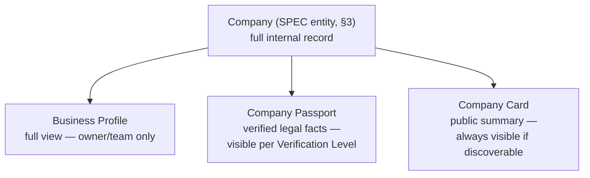
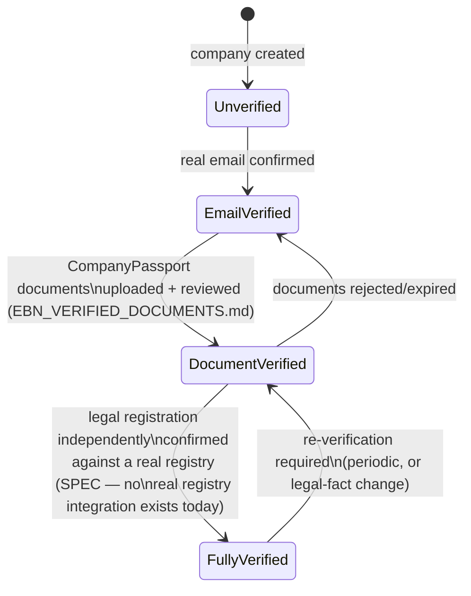

# Enterprise Business Network (EBN) — Architecture Bible

**Sprint:** CQ-10 — Architecture Research + Product Research + UX Research + Game Design Research
(applied as *business* design, not entertainment design — see §0). **Documentation only. `src` was
not modified. No production code was written.** This is the master document for the Enterprise
Business Network layer; companion documents own the deep specification of each subsystem named in §1.

**Do not duplicate:** Enterprise City's real graphics/runtime/navigation/collaboration architecture
(Sprints CG-2 through CG-9) is not re-specified here — EBN is designed throughout as a **consumer** of
that real, already-built engine (scene graph, layer system, camera, effects, theme, event bus,
building states), never a parallel rendering or state system. Where EBN needs something City doesn't
yet have (a business-entity model, a partnership graph, verified documents), this document says so
plainly and marks it SPEC; where City already has the mechanism EBN needs (buildings, districts,
events, permissions), this document cites it and reuses it.

## 0. The governing philosophy (read before anything else)

> **Enterprise City is not a game. It is a living Digital Twin of the real city of Odessa where every
> company is represented by a real business entity. The visual layer reflects real business
> activity.**

Every decision in this document and its companions is checked against this sentence before anything
else. Concretely, this means:

1. **No visual state exists without a real business fact behind it.** This is not a new rule — it is
   the exact same discipline `ENTERPRISE_CITY_ANIMATIONS.md`'s "every animation represents a system
   event" and `CITY_VISUAL_STATES.md` §0's (CG-9) "can this document name the specific real event this
   represents" already established for technical/AI activity. EBN extends that discipline to
   *business* activity — a headquarters growing, a trust badge appearing, a road lighting up between
   two buildings must each trace to a real partnership, transaction, or verification event, never
   decoration.
2. **Nothing disappears.** A company that goes quiet, a partnership that ends, a district that cools
   off — all of these change *how* something is shown, never *whether* it exists. This is the direct
   business-domain analog of `CITY_BUILDING_STATES.md` §4's "why buildings are dimmed, never removed"
   spatial-constancy principle (CG-4) — restated here as a first-class EBN rule, not borrowed quietly.
3. **Business gamification (§8 in the companion doc) is motivation, not entertainment.** Every badge,
   level, or visual upgrade must be earned through verifiable business activity and must remain
   legible as a business signal to a third party glancing at it — never a purely cosmetic reward
   system decoupled from what it represents.
4. **The architecture must generalize beyond Odessa without changing its core.** Odessa is the first
   real map; the entity model, graph model, and district model must not hard-code "Odessa" anywhere a
   second city's data couldn't also satisfy (see `CITY_LIVING_ECONOMY.md` §7).

## 1. EBN subsystem map

| Subsystem | Owned by | Real foundation it builds on |
|---|---|---|
| Business Profile, Company Passport, Company Card, Trust Score, Reputation, Verification Levels, Timeline, Business Status, Public/Private, Permissions, Visibility | This document, §2–§4 | Enterprise City's real `CityBuilding`/district model (`cityCatalog.ts`), real permission layer (`permissionManager`/`roleManager`/`organizationManager`, `CITY_INTEGRATIONS.md` §3) |
| Digital Partnership System (lifecycle, state transitions, notifications, audit) | `EBN_PARTNERSHIP_SYSTEM.md` | Real `WorkflowRuntime`'s human-approval pause (`WORKFLOW_RUNTIME.md` §1), real `enterpriseEventBus`/`PlatformEventBus` |
| Enterprise Communication (chat, meetings, AI assistant, shared workspace/calendar) | `EBN_COMMUNICATION.md` | See §5 below — the honest "mostly absent" finding |
| Verified Business Documents (contracts, OCR, AI analysis) | `EBN_VERIFIED_DOCUMENTS.md` | `platform_contracts/` — see §5 below |
| Business Graph (relationship graph + City visualization) | `EBN_BUSINESS_GRAPH.md` | Real CG-2 scene graph/layer system, real `streetGraph()` road model |
| Living Enterprise City (business activity → visual change) + Digital Odessa (real-map foundation, multi-city future) | `CITY_LIVING_ECONOMY.md` | Real City building/district/animation engine (CG-2–CG-9, in full) |
| Business Gamification + Future Monetization | `EBN_GAMIFICATION_MONETIZATION.md` | §0 items 3–4 above |
| Roadmap, entity model index, API recommendations, Cursor integration notes | `SPRINT_CQ_10_RESULT.md` | — |

## 2. Business Profile, Passport, and Card — three tiers, not one entity

The brief's "Business Profile," "Company Passport," and "Company Card" are three different **views**
over one underlying company record, at three different trust/visibility levels — modeled this way
deliberately, so that "how much of a company's data is shown" is a *rendering* decision, not three
separately-maintained data stores:



- **Business Profile** — the full internal record: everything a company's own team can see and edit
  (financials, internal notes, private timeline entries, draft documents). Never shown to another
  company regardless of partnership status.
- **Company Passport** — the **verified, immutable-once-confirmed** legal identity: registration
  number, tax ID, legal address, incorporation date, verifying authority/document reference. Modeled
  explicitly on a real passport's semantics — a Passport *fact* doesn't change once verified; a company
  that needs to update a legal fact re-submits for re-verification rather than editing the Passport
  directly (mirrors real-world passport renewal, not a form field). Visibility of Passport fields is
  gated by Verification Level (§3.3) and the requesting party's relationship to the company (§4).
- **Company Card** — the public "business card": name, logo, industry, one-line pitch, trust badge,
  headquarters location (real City building binding). This is what renders when a company is
  discoverable in the Business Graph (`EBN_BUSINESS_GRAPH.md`) or City search — the lowest-friction,
  always-current public face.

## 3. Entity model (grounded in real backend models found this sprint — not pure greenfield)

**Correction to this Bible's own first-draft assumption:** Enterprise City itself has no
company/business-entity model, but the wider Python backend does — closer to this brief's needs than
initially assumed. Real, DB-backed models found this sprint:

- **`database/models/partner_engine.py`**'s real `PartnerEnginePartner` (`company_name`, `risk_level`,
  `kyc_status`, `aml_status`, `country`/`city`) plus `PartnerContact`/`PartnerWallet`/`PartnerLimit`/
  `PartnerCommission` — the strongest real analog for `Company` below.
- **`database/models/kyc.py`**'s real `VerificationLevel` enum (`NONE`/`BASIC`/`STANDARD`/`ENHANCED`)
  and `RiskProfile.risk_score` (0–100, real `CheckConstraint`) — a real precursor to §3.1's Trust Score,
  needing only inversion (risk score is a "how risky," Trust Score wants "how confident" — the same
  0–100 scale, opposite framing).
- **`database/models/compliance.py`**'s real `ComplianceVerificationLevel` (`L0`–`L4`) and
  `ComplianceRiskProfile.risk_score`, both FK'd to `partner_engine_partners.id` — a second, richer real
  verification-tier model, not yet reconciled with `kyc.py`'s own four-tier enum (flagged as an open
  question, §3.3).
- **`database/models/partners.py`**'s simpler `Partner.rating` (`Numeric(4,2)`) and
  `PartnerKpi.avg_rating` — a real, literal reputation number (§3.2), for logistics/service partners
  specifically today, not yet general-purpose.
- **No real `Partnership`/relationship-between-two-companies entity exists** — every real FK above is
  one-sided (a deal references one partner, a transaction references one company); `EBN_PARTNERSHIP_SYSTEM.md`'s
  `Partnership` entity remains genuinely new, greenfield work.

**This document's `Company`/`VerificationLevel`/`TrustScore` types below are therefore proposed as an
extension/reconciliation of `PartnerEnginePartner` + `kyc.py`/`compliance.py`'s two real, currently-
unreconciled verification models — not as an invented parallel system.** Whichever sprint implements
this should start by reconciling `kyc.py`'s `VerificationLevel` against `compliance.py`'s
`ComplianceVerificationLevel` (two real four/five-tier enums for what should be one concept) before
adding a third for EBN specifically.

```ts
// SPEC shape below — reconciles, does not duplicate, the two real enums named above.
// Deliberately mirrors the real CityBuilding/CityDistrictId shape where it binds to City (headquartersBuildingId).

type CompanyId = string; // SPEC — should reuse PartnerEnginePartner.id's real ID scheme, not a new one

type VerificationLevel = "unverified" | "email_verified" | "document_verified" | "fully_verified";
// SPEC ladder — see §3.3. Deliberately four tiers, not a boolean, so partial trust is expressible.
// Maps onto (and should reconcile, not duplicate) the two real enums above: kyc.py's NONE/BASIC/
// STANDARD/ENHANCED and compliance.py's L0-L4.

type BusinessStatus = "active" | "dormant" | "suspended" | "dissolved";
// "dormant" (not "inactive") chosen deliberately — see §0 item 2, nothing disappears; a quiet
// company is dormant, not deleted, and its City presence dims (CITY_BUILDING_STATES.md §3.3
// Dimmed pattern, reused) rather than vanishing.

type Visibility = "public" | "network_only" | "partners_only" | "private";
// SPEC — four tiers matching real-world business-disclosure norms, not a single public/private toggle.

interface Company {
  id: CompanyId;
  organizationId: string;        // REAL — binds to the existing organizationManager (CITY_INTEGRATIONS.md §3)
  legalName: string;             // Passport field
  displayName: string;           // Card field
  industry: string;              // Card field
  foundedAt: string;              // Passport field (ISO date)
  headquartersBuildingId?: string; // SPEC — binds to a real CityBuildingId once a company can claim a building
  verificationLevel: VerificationLevel;
  trustScore: number;             // 0-100, computed — §3.1
  reputationScore: number;        // 0-100, computed — §3.2
  status: BusinessStatus;
  visibility: Visibility;
  passport: CompanyPassport;
  card: CompanyCard;
  timeline: CompanyTimelineEvent[]; // §3.4
}

interface CompanyPassport {
  registrationNumber: string;
  taxId: string;
  legalAddress: string;
  verifyingAuthority?: string;     // e.g. which real-world registry confirmed this
  verifiedAt?: string;
  documentRefs: string[];          // SPEC — links into EBN_VERIFIED_DOCUMENTS.md's document model
}

interface CompanyCard {
  logoUrl?: string;
  tagline: string;
  publicContact?: { email?: string; phone?: string; website?: string };
  trustBadge: VerificationLevel;   // renders directly from the company's real verificationLevel
}

interface CompanyTimelineEvent {
  id: string;
  at: string;
  kind: "founded" | "verified" | "partnership_formed" | "partnership_ended" | "document_signed" | "status_changed" | "achievement";
  visibility: Visibility;          // a timeline event can be MORE private than the company's default
  payload: Record<string, unknown>;
}
```

### 3.1 Trust Score (SPEC) — verification-driven, not activity-driven

Trust Score answers "how confident are we this company is who it claims to be." Proposed composition,
weighted toward the real, verifiable inputs:

| Input | Weight | Source |
|---|---|---|
| Verification Level reached | 50% | §3.3's ladder — the single largest, most objective input |
| Document authenticity confirmations | 25% | `EBN_VERIFIED_DOCUMENTS.md`'s real document-validation pipeline, once built |
| Account/company age | 15% | `foundedAt`/registration age — cheap, real, hard to game quickly |
| Platform standing (no suspensions/disputes) | 10% | `BusinessStatus` history |

**Real precursor found this sprint**: `database/models/kyc.py`'s `RiskProfile.risk_score` (real,
0–100, `CheckConstraint`-enforced) and `database/models/compliance.py`'s `ComplianceRiskProfile.risk_score`
already compute a comparable 0–100 signal today — framed as *risk* (higher = worse) rather than *trust*
(higher = better). Trust Score is proposed as `100 - risk_score` blended with the verification/document/
age inputs above, not a second independent scoring pipeline — reusing the real computation, inverting
only its framing.

Deliberately **not** included in Trust Score: partnership count, deal volume, or reviews — those
measure *reputation* (§3.2), a different question ("are they good to work with," not "are they real").
Conflating the two would let a high-activity but unverified company appear more trustworthy than it
should.

### 3.2 Reputation (SPEC) — activity- and relationship-driven

| Input | Source |
|---|---|
| Successful partnerships (reached `active`/`trusted`/`strategic` state, `EBN_PARTNERSHIP_SYSTEM.md`) | Real partnership state transitions once built |
| Partnership longevity | Time-in-state, not just count — a long-standing partnership signals more than a burst of new ones |
| Dispute/termination history | Weighted negatively, never hidden — reputation must reflect real friction, not only successes |
| Peer endorsement (SPEC, lowest priority) | A partner company vouching for another — deferred, not designed in this pass; flagged as a future item requiring its own abuse-resistance design (endorsement trading is a real risk) |

**Real precursor found this sprint**: `database/models/partners.py`'s `Partner.rating`
(`Numeric(4,2)`, real) and `PartnerKpi.avg_rating` are a real, literal reputation number today —
scoped to logistics/service partners specifically, not general businesses. Reputation Score is
proposed as a generalization of this real field's shape (a decimal rating, not a new 0–100 scale
convention) rather than an unrelated new metric.

### 3.3 Verification Levels — reconciling two real, currently-separate tier systems



**Honest gap flagged explicitly**: the `FullyVerified` tier's real-registry confirmation has no real
integration to build on anywhere in this codebase — `kyc_status`/`aml_status` are real *fields* on
`PartnerEnginePartner`, and `VerificationLevel`/`ComplianceVerificationLevel` are real *classification
enums*, but none of this was confirmed to be backed by an actual external registry/KYC-provider
integration — this document does not invent one; it is the single largest piece of net-new backend
work this whole Bible implies, named here rather than glossed over. **A separate, smaller real gap**:
`kyc.py`'s `VerificationLevel` (four tiers: `NONE`/`BASIC`/`STANDARD`/`ENHANCED`) and `compliance.py`'s
`ComplianceVerificationLevel` (five tiers: `L0`–`L4`) are two real, independently-defined tier systems
for what should be one concept — whichever sprint implements EBN's own four-tier ladder above should
reconcile these two first, not add a third un-reconciled system alongside them.

### 3.4 Company Timeline (SPEC)

A per-company append-only log (`CompanyTimelineEvent`), each entry independently visibility-scoped —
the same "every event traces to a real fact" discipline as §0 item 1, applied as a literal audit
record. This is the natural home for everything `EBN_PARTNERSHIP_SYSTEM.md`'s state transitions and
`EBN_VERIFIED_DOCUMENTS.md`'s signing events publish to — one shared timeline model, not a separate
history mechanism per subsystem.

### 3.5 Public vs. Private, Permissions, Visibility — one model, reusing the real one

`Visibility` (§3, four tiers) is deliberately the *same shape* City's real permission-gated
`Disabled`/`Dimmed` visibility axis already uses (`CITY_BUILDING_STATES.md` §3.3, `CITY_INTEGRATIONS.md`
§3.3's proposed `buildingsForTenant()` filter) — a company's data resolves per-viewer through the same
real `permissionManager`/`roleManager`/`organizationManager` chain, extended with one new check
("what is my relationship to this company" — §4's partnership state) rather than a second permission
system built for EBN alone.

## 4. Non-goals of this document

- No new rendering engine, camera, or scene graph — EBN visualizes entirely through the real CG-2–CG-9
  Graphics Engine.
- No new permission system — §3.5 extends the real one.
- No claim that `FullyVerified`/real-registry confirmation exists — explicitly flagged as unbuilt (§3.3).
- No peer-endorsement design — explicitly deferred (§3.2).

## Related documents

`EBN_PARTNERSHIP_SYSTEM.md`, `EBN_COMMUNICATION.md`, `EBN_VERIFIED_DOCUMENTS.md`,
`EBN_BUSINESS_GRAPH.md`, `CITY_LIVING_ECONOMY.md`, `EBN_GAMIFICATION_MONETIZATION.md`,
`SPRINT_CQ_10_RESULT.md` (all Sprint CQ-10). `CITY_BUILDING_STATES.md`/`CITY_INTEGRATIONS.md` §3
(CG-4/CG-6, the real visibility/permission mechanisms this document extends).
