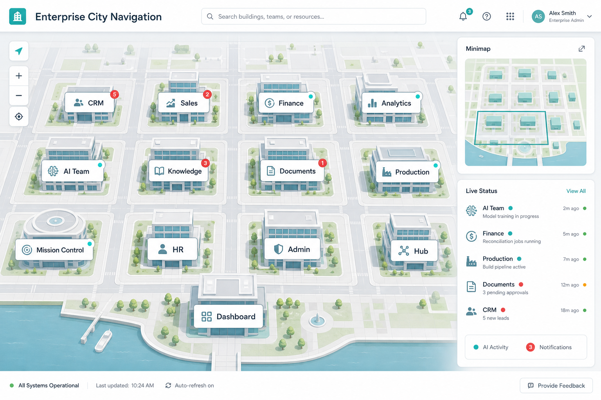
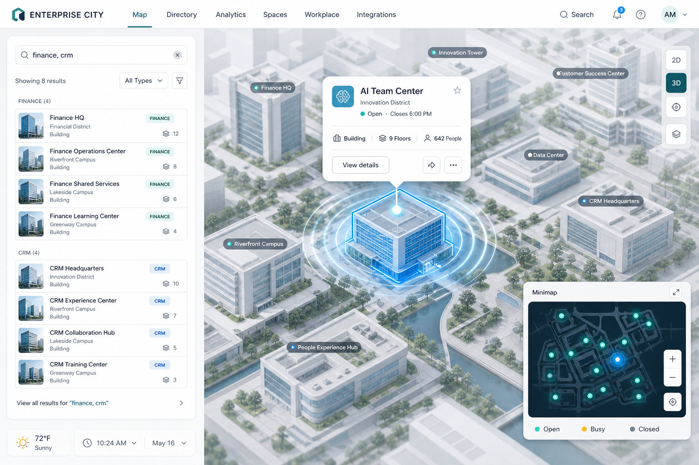

# Enterprise City Navigation — Sprint 32.3.3

## Purpose

Интерактивный 2D **Enterprise City** — альтернативная визуальная навигация между Workspace и бизнес-модулями.

Город **не заменяет** Dashboard / Command Center и **не является** новым Navigation Engine.

## Route

`/enterprise-city`

## Buildings → existing pages

| Building | Route |
|----------|-------|
| Enterprise Hub | `/workspace` |
| CRM Center | `/workspace/crm` |
| Sales | `/workspace/crm` |
| Marketing | `/workspace` |
| Finance | `/workspace/finance` |
| Analytics Center | `/platform-builder/intelligence` |
| AI Team Center | `/platform-builder/ai-team` |
| Knowledge Center | `/platform-builder/knowledge` |
| Documents | `/workspace/docs` |
| Production | `/workspace/drone` |
| Mission Control | `/platform-builder/mission-control` |
| HR | `/workspace/hr` |
| Administration | `/settings` |
| Command Center | `/dashboard` |
| AI Concierge | `/platform-builder/concierge` |

## Status / live

- Seed tones + notification matching (client)
- Light Mission Control status probe (existing API)
- Badges: notifications, tasks, AI pulse

## Search / minimap

- City catalog search + existing `searchProvider` / `searchIndex` upsert
- Minimap quick jump (pan/focus)

## Reuse

Workspace Engine · Dashboard · Mission Control · RBAC shell · notificationStore · Digital Twin (link only) · Business Ecosystem routes

## Extension

- `CITY_BUILDINGS` catalog — add buildings without new engine
- Wire live metrics from module APIs later
- Optional district filters / role-aware building visibility (RBAC)

Platform Builder **v1.45.0**.

## Screenshots

## Performance notes

- DOM/CSS map (no WebGL/canvas) — low GPU cost
- Status refresh interval 12s; MC probe on mount / manual
- Prefer keeping building count modest; virtualize only if districts grow large
