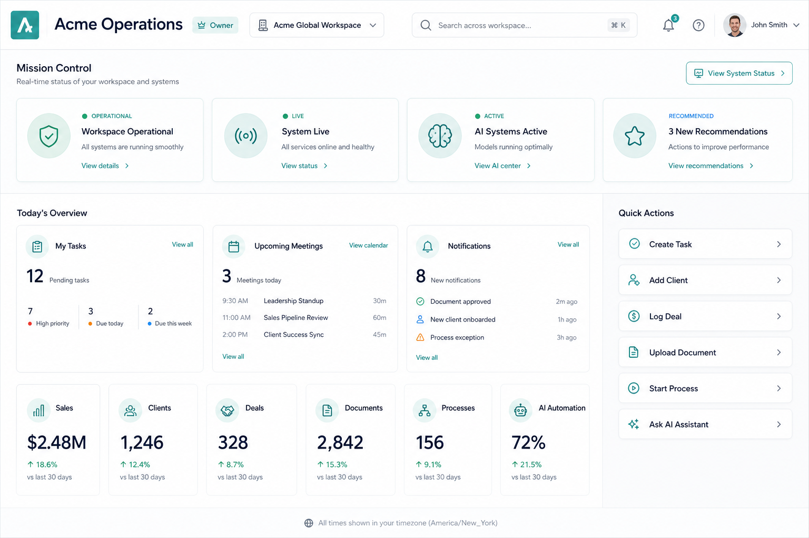
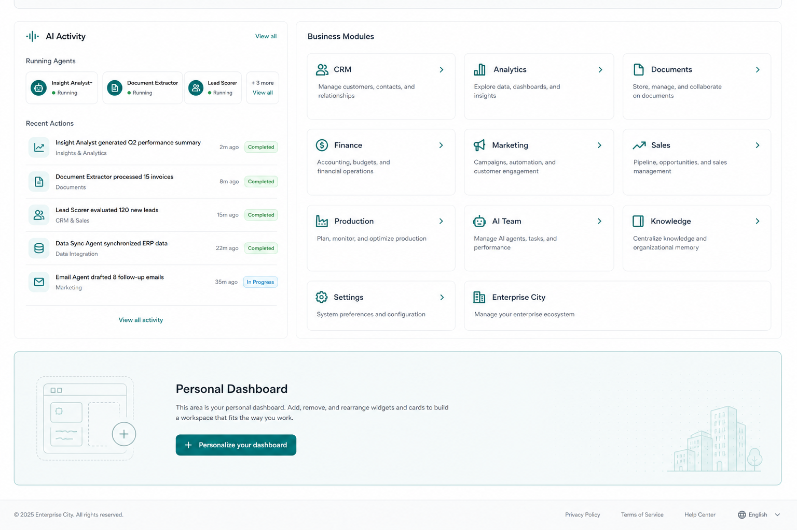

# Enterprise Command Center — Sprint 32.3.2

## Purpose

После First Entry пользователь попадает в `/dashboard` — Enterprise Command Center, отвечающий на:

1. **Где я?** — workspace, роль, организация, логотип  
2. **Что происходит?** — Mission Control strip, Today’s Overview, AI Activity  
3. **Что дальше?** — Quick Actions, рекомендации, Business Modules  

## Architecture (reuse only)

| Concern | Existing component |
|--------|---------------------|
| Shell / layout | `WorkspaceLayout`, `TopNavigation`, EDS |
| Mission Control | Existing MC API + `/platform-builder/mission-control` (strip probes, no fork) |
| Widgets | `widgetManager` |
| Personalization | `personalizationEngine` + `ewp_command_center_layout_v1` |
| Notifications | `NotificationsPanel`, `notificationStore` |
| Search | `searchProvider` + Command Palette |
| AI | AI Team / Concierge routes, first-entry profile |
| First Entry | `loadFirstEntry`, role catalog for header identity |

**No new Dashboard Engine. No new Mission Control engine.**

## Sections

1. Header — company, logo, role, workspace, search, notifications, profile  
2. Mission Control strip  
3. Today’s Overview  
4. Business KPI (independent cards)  
5. Quick Actions  
6. AI Activity  
7. Business Modules  
8. Personal Dashboard scaffold (hide/reset layout)

## Extension points (later sprints)

- `commandCenterCatalog.register*` pattern for KPI / actions / modules  
- `toggleCommandSection` / layout persistence for drag-reorder  
- Wire KPI values to live CRM / Finance APIs  
- Full personal custom dashboards without new engine  

Platform Builder **v1.44.0**.

## Screenshots

