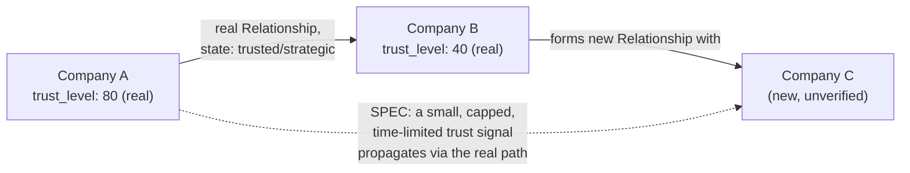

# Enterprise City — Enterprise Economy Architecture

**Sprint:** CQ-13 — Architecture Research + Economic Modeling + UX Research. Documentation only, `src`
not modified.

**Do not duplicate:** `ENTERPRISE_BUSINESS_NETWORK.md` (CQ-10, now **real** as Sprint 29.0's
`BUSINESS_NETWORK.md`/`applications/enterprise_hub/business_network/`) and `DIGITAL_CITIZEN.md`
(CQ-12, now **real** as Sprint 29.1's implementation) already ground Trust/Reputation at the company
and citizen level — this document does not re-derive those, it composes them into one Economy model
and adds the layers neither covered (Service/Knowledge/AI/Digital-Asset economies, Enterprise
Credits).

## 0. Grounding correction — Company and Citizen are now real, not SPEC

Since this engagement's CQ-10/CQ-12 research, Cursor has shipped both as real code — confirmed by
direct read of `applications/enterprise_hub/business_network/facade.py` and
`applications/enterprise_hub/digital_citizen/facade.py`:

```python
# Real, applications/enterprise_hub/business_network/facade.py
@dataclass
class BusinessProfile:
    id: str; company_name: str; category: str = "other"; status: str = "active"
    verification_status: str = "unverified"; trust_level: int = 50  # real, 0-100
    headquarters: str | None = None; visibility: str = "partners"; owner_org_id: str = "org_default"

@dataclass
class Relationship:  # this is EBN_PARTNERSHIP_SYSTEM.md's Partnership, implemented
    id: str; from_profile_id: str; to_profile_id: str; type: str; state: str = "pending"
    history: list[dict] = field(default_factory=list)

# Real, applications/enterprise_hub/digital_citizen/facade.py
@dataclass
class Citizen:
    id: str; display_name: str; email: str; status: str = "active"; presence: str = "offline"
    office_id: str | None = None; city_building_id: str | None = None; primary_org_id: str | None = None

@dataclass
class Membership:  # this is CITIZEN_ORGANIZATION_MEMBERSHIP.md's Membership, implemented
    id: str; citizen_id: str; org_id: str; role: str; active: bool = True
    manager_citizen_id: str | None = None; business_profile_id: str | None = None
```

Every economic layer below is designed as a **consumer** of these real dataclasses — `trust_level`,
`Relationship.type`/`.state`, `Citizen.presence`, `Membership.role` — never a parallel scoring or
relationship system.

## 1. The seven economies (brief's list)

| Economy | Real foundation | Design |
|---|---|---|
| Business Value | `BusinessProfile.trust_level` (real) + real `Membership` count/activity | A company's Business Value is proposed as a read-only *composite view* over already-real fields, not a new stored score — see §2 |
| Trust Economy | `BusinessProfile.trust_level` (real, company) + Citizen `TrustLevel` (CQ-12, still SPEC pending its own real shipment) | The mechanism by which trust *propagates* — e.g. a Trusted-tier `Relationship` lending some confidence to a new counterparty — is this document's one genuinely new contribution, §3 |
| Reputation Economy | Company + Citizen reputation (CQ-10/12) | §7 of the companion `ENTERPRISE_REPUTATION.md` scope — folded into this document's §6 rather than a seventh file |
| Service Economy | **New** — no real "service" entity exists distinct from a company profile | §4 |
| Knowledge Economy | `AI_MEMORY.md`'s real (if fragmented) memory/knowledge layers (CG-8) | Proposed consumer, not a new store — §5 |
| AI Economy | `AI_PROVIDER_LAYER.md`'s real OpenRouter cost path (CG-8) + `PERSONAL_AI.md`'s ownership model (CQ-12) | §5 |
| Digital Asset Economy | **Real, substantial, but narrowly scoped**: `DIGITAL_ASSET_TREASURY.md`/`DIGITAL_ASSET_RISK.md` (Sprint 18.4, `applications/finance_enterprise/digital_assets/`, real crypto/fiat treasury) | See `DIGITAL_ASSETS.md` — this economy is the one with the strongest real foundation of all seven, but scoped to financial instruments only |
| Enterprise Credits (future) | None — explicitly "future" per the brief | §7, deliberately left as a stub, not designed prematurely |

## 2. Business Value — a composite view, not a new score

```ts
// SPEC — read-only, computed from real fields, never independently stored
interface BusinessValueSnapshot {
  companyId: string;              // BusinessProfile.id, real
  trustLevel: number;              // BusinessProfile.trust_level, real, direct read
  activeRelationshipCount: number; // count of real Relationship rows where state != "declined"/"terminated"
  citizenCount: number;            // count of real Membership rows, active: true
  verificationStatus: string;      // BusinessProfile.verification_status, real, direct read
}
```

No new "value" number is invented — Business Value is explicitly a **read model**, computed on demand
from the real Business Network dataclasses, avoiding yet another duplicated scoring pipeline in a
codebase this research has now found already has that exact problem at every other layer (workflows,
CG-7; agents, CG-8; verification tiers, CQ-10; identity, CQ-12).

## 3. Trust Economy — propagation, the one new mechanism



**Design constraint, stated explicitly**: propagated trust must never exceed a small fraction of the
propagating company's own real `trust_level`, must decay over time, and must never substitute for
`BusinessProfile.verification_status` — it is a *discovery aid* ("Company C is two real, trusted hops
from a company you already trust"), never a shortcut around real verification. This is the one
genuinely new economic mechanism in this section; everything else in §1's table is composition of
already-real fields.

## 4. Service Economy (SPEC, new)

No real "Service" entity exists distinct from a company profile. Proposed minimal shape:

```ts
interface ServiceListing {
  id: string;
  providerCompanyId: string;  // real BusinessProfile.id
  providerCitizenId?: string;  // real Citizen.id, for individually-offered professional services
  category: string;
  requiresRelationship?: boolean; // if true, only discoverable/bookable by companies with a real active Relationship
}
```

Ties directly into `BUSINESS_MARKETPLACE.md`'s Services category — not designed further here to avoid
duplicating that document.

## 5. Knowledge Economy and AI Economy

Both are proposed as **consumers**, not new stores: Knowledge Economy reads from whichever memory
surface `AI_MEMORY.md`'s (CG-8) still-open four-way reconciliation resolves to; AI Economy's "cost"
dimension reads directly from the real OpenRouter usage the platform already incurs
(`AI_PROVIDER_LAYER.md` §0, CG-8) rather than inventing a second cost-accounting model. Neither economy
is designed in further depth here — both are correctly scoped as thin composition layers pending
upstream reconciliation work this engagement has already flagged as prerequisites.

## 6. Enterprise Reputation (brief §7 — folded in here, not a seventh document)

`ENTERPRISE_BUSINESS_NETWORK.md` §3.1–3.2 (CQ-10, now real via `BusinessProfile.trust_level`) and
`CITIZEN_REPUTATION_GROWTH.md` §2 (CQ-12) already cover Company Reputation and Citizen Reputation in
depth — not repeated. This document's only addition: **AI Reputation**, genuinely new —

```ts
interface AiReputationSnapshot {
  assistantId: string;          // PERSONAL_AI.md's PersonalAiAssistant.id
  taskCompletionRate: number;    // derived from real AutomationEngine task outcomes (Sprint 28.9)
  ownerSatisfactionSignal?: number; // SPEC, lowest priority — no real feedback mechanism exists to source this from
}
```

**Partner Trust**, **Project Success**, **Verified Deliveries**, and **Business History** are all
already expressible as read models over real `Relationship`/`Membership`/`AutomationEngine` data — no
new fields required. **Recommendation Engine** is `PROFESSIONAL_NETWORK_DISCOVERY.md`'s scope, not
re-designed here.

## 7. Enterprise Credits (future) — deliberately undesigned

Per the brief's own "no financial implementation... architecture only" framing for adjacent sections,
this document goes further for Credits specifically: **no schema, no unit definition, no exchange
mechanism is proposed.** The only real, relevant grounding this sprint found —
`DIGITAL_ASSET_TREASURY.md`'s real fiat/crypto treasury infrastructure (§1, `DIGITAL_ASSETS.md`) —
is named as the *eventual* natural home for a Credits ledger, should one ever be built, precisely so a
future sprint doesn't accidentally build a second treasury system for it.

## 8. Non-goals

- No new scoring pipeline for Business Value — a composite read model only (§2).
- No trust-propagation mechanism that can exceed or substitute for real verification (§3's explicit
  constraint).
- No Enterprise Credits design of any kind (§7) — intentionally deferred in full.

## Related documents

`ENTERPRISE_BUSINESS_NETWORK.md`/`EBN_PARTNERSHIP_SYSTEM.md` (CQ-10, now real, §0's dataclasses),
`DIGITAL_CITIZEN.md`/`CITIZEN_ORGANIZATION_MEMBERSHIP.md`/`CITIZEN_REPUTATION_GROWTH.md` (CQ-12),
`AI_MEMORY.md`/`AI_PROVIDER_LAYER.md` (CG-8), `BUSINESS_MARKETPLACE.md`/`DIGITAL_ASSETS.md`/
`PROFESSIONAL_NETWORK_DISCOVERY.md`/`INVESTMENT_LAYER.md` (CQ-13 siblings),
`DIGITAL_ASSET_TREASURY.md`/`DIGITAL_ASSET_RISK.md` (real, Sprint 18.4).
