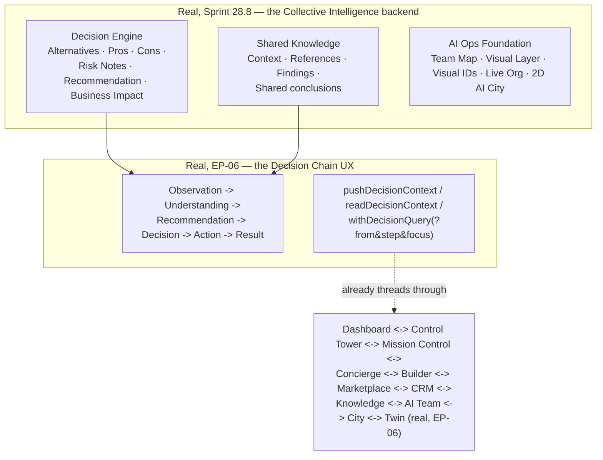

# Enterprise City — Intelligence Core & Knowledge Evolution

**Sprint:** CQ-14 — Architecture Research + AI Orchestration + Decision Modeling. Documentation only,
`src` not modified. Covers the brief's §1 (Intelligence Core) and §7 (Enterprise Knowledge Evolution)
together — both describe the substrate the rest of this Bible's Observatory/Recommendation/
Predictive/Autonomous layers read from and write to.

**Do not duplicate:** This sprint's research found the brief's entire mission substantially
pre-answered by two real, tested systems this engagement had not yet examined:
**`ENTERPRISE_COLLECTIVE_INTELLIGENCE.md`/`COLLABORATIVE_AI.md`** (Sprint 28.8, real backend
`applications/platform_builder/collaborative_ai/`, real frontend `src/web/platform-builder/
collaborative-ai/`, real tests `tests/test_collaborative_ai_28_8.py`) and **`EP_06_ENTERPRISE_
INTELLIGENCE.md`** (a real, 143-line UX/interaction-pattern spec, explicitly scoped "no Engine/Store/
Runtime/AI Core," defining a real `DECISION_CHAIN` and real `pushDecisionContext`/
`withDecisionQuery` functions this engagement's own CG-2/CG-3 City work already imported and used).
This document does not re-describe either — it grounds every requested Intelligence Core capability
against them first.

## 0. The headline finding — a real Decision Engine and a real Decision Chain already exist



**This document's central architectural decision**: the Intelligence Core this brief asks for is not a
new engine — it is the real `applications/platform_builder/collaborative_ai/` Decision Engine, extended
to consume the CQ-9 through CQ-13 entities (City, Business Network, Digital Citizens, Economy) as new
real inputs, surfaced through the real, already-integrated EP-06 Decision Chain. Building a second
decision/reasoning engine would repeat the exact mistake this engagement flagged for workflow engines
(CG-7), agent registries (CG-8), and marketplaces (CQ-13).

## 1. The eight requested contexts, mapped

| Brief context | Real/SPEC source |
|---|---|
| Enterprise Memory | `AI_MEMORY.md`'s four fragmented real surfaces (CG-8) — still unreconciled, restated not re-solved |
| Knowledge Graph | Same fragmentation — `platform_enterprise_knowledge_graph`/`platform_memory`'s `knowledge` layer, per `AI_MEMORY.md` |
| Business Context | Real `BusinessProfile`/`Relationship` (Sprint 29.0, `ENTERPRISE_ECONOMY.md` §0, CQ-13) |
| Relationship Context | Real `Relationship`/`Membership` (Sprint 29.0/29.1) + `EBN_BUSINESS_GRAPH.md` (CQ-10) |
| Historical Context | Real per-citizen `AuditLog`/`PlatformAuditLog` (CG-8 research, cited in `DIGITAL_CITIZEN.md` §0, CQ-12) + `CompanyTimelineEvent`/`CitizenTimelineEvent` (CQ-10/12) |
| Operational Context | Real `AutomationEngine` (Sprint 28.9) task/job state |
| Decision Context | **Real** — the Decision Engine's own Alternatives/Pros/Cons/Risk/Recommendation/Impact shape (§0), plus EP-06's real `DecisionContext` push/read functions |
| Cross-company Context | New this sprint — see §2 |

## 2. Cross-company Context — the one genuinely new context

The real Decision Engine (§0) operates per-team, inside one company's Platform Builder session. Cross-
company context — reasoning that spans two partnered companies' data — has no real precedent. **SPEC**:

```ts
interface CrossCompanyContext {
  companyIds: string[];               // real BusinessProfile.id[]
  sharedRelationshipIds: string[];    // real Relationship.id[] the companies share
  scopedKnowledge: string[];           // references into whichever real knowledge surface AI_MEMORY.md's reconciliation resolves to
  visibility: "partners_only";         // never broader — cross-company reasoning must never leak beyond the real partnership gate (EBN_PARTNERSHIP_SYSTEM.md, CQ-10)
}
```

A cross-company decision session is proposed as the real Decision Engine invoked **twice**, once per
company's own real permission boundary, with `CrossCompanyContext` as the only new shared input —
never a decision session that bypasses either company's own real access control.

## 3. Enterprise Knowledge Evolution (brief §7) — grounded in the real `platform_learning` package

Targeted research this sprint confirmed `platform_learning/learning_engine.py`'s `LearningEngine` is
**real and wired** (called from `platform_enterprise_release_candidate/facade.py`,
`platform_collaboration/integrations.py`, `applications/auto_marketplace/integrations/platform_bridge.py`)
— but its "learning" is **statistical pattern-counting, not model training**:
`pattern_analyzer.py`'s `PatternAnalyzer.analyze()` is pure `Counter`/threshold logic
(`_detect_success_patterns`/`_detect_failure_patterns`, flagging a pattern once it recurs
`>= config.min_pattern_occurrences` times), and `recommendation_engine.py`'s output requires a real,
explicit human `accept()`/`reject()` call — **no automatic model or weight update ever occurs**. This
is an important, precise finding to state honestly rather than assume: "self-improving" here means
"surfaces a recurring pattern for a human to accept," not "adapts its own behavior automatically."

| Brief item | Source |
|---|---|
| Learning from Projects | Real `AutomationEngine` task outcomes (Sprint 28.9) feeding `CompanyTimelineEvent`/`CitizenTimelineEvent`, as `platform_learning`'s real `experience_store` input |
| Learning from Documents | Real `services/storage` + `VerifiedDocument` (`EBN_VERIFIED_DOCUMENTS.md`, CQ-10) |
| Learning from Citizens | Real per-citizen `AuditLog` (CQ-12) |
| Learning from AI | Real Decision Engine's "Team Performance" tracking (`COLLABORATIVE_AI.md` #8) **and** real `platform_learning.PatternAnalyzer`'s success/failure pattern detection — both already real, not proposed new |
| Learning from Business History | Real Timeline models (CQ-10/12) |
| Knowledge Validation | **SPEC, new** — no real validation gate exists on any knowledge surface found this engagement; the real `accept()`/`reject()` human gate (above) is the closest existing analog, worth reusing rather than inventing a second review mechanism |
| Knowledge Versioning | `AI_MEMORY.md`'s implementation-reference stub already names "Memory Version Control" as a real *category* (CG-8's finding) with no confirmed real implementation depth |

**Design principle, now evidence-based rather than assumed**: "self-improving knowledge" is proposed
as accumulation into the real Shared Knowledge Exchange (`COLLABORATIVE_AI.md` #5) **via the real
`platform_learning.PatternAnalyzer`/`RecommendationEngine` pipeline**, with every generated
recommendation routed through the pipeline's own real, already-mandatory human accept/reject step —
never a new learning algorithm, and never an automatic behavior change.

## 4. Non-goals

- No new decision/reasoning engine — the real Collaborative AI Decision Engine is extended, not
  duplicated.
- No new decision-chain UX — EP-06's real `DECISION_CHAIN`/context functions are reused as-is.
- No claim of real ML-based "learning" without independent verification — §3's Learning-from-AI row
  cites only the real, confirmed Team Performance tracking, not a broader learning-algorithm claim.

## Related documents

`ENTERPRISE_COLLECTIVE_INTELLIGENCE.md`/`COLLABORATIVE_AI.md` (real, Sprint 28.8, the Decision Engine
this whole Bible builds on), `EP_06_ENTERPRISE_INTELLIGENCE.md` (real, the Decision Chain UX),
`AI_MEMORY.md` (CG-8, the fragmented knowledge/memory surfaces), `ENTERPRISE_ECONOMY.md`/
`EBN_PARTNERSHIP_SYSTEM.md`/`EBN_BUSINESS_GRAPH.md` (CQ-10/13, Business/Relationship Context),
`DIGITAL_CITIZEN.md` (CQ-12, Historical Context), `AUTOMATION_ENGINE.md` (Sprint 28.9, Operational
Context), `BUSINESS_OBSERVATORY.md`/`RECOMMENDATION_PREDICTIVE_ENGINE.md` (CQ-14 siblings).
