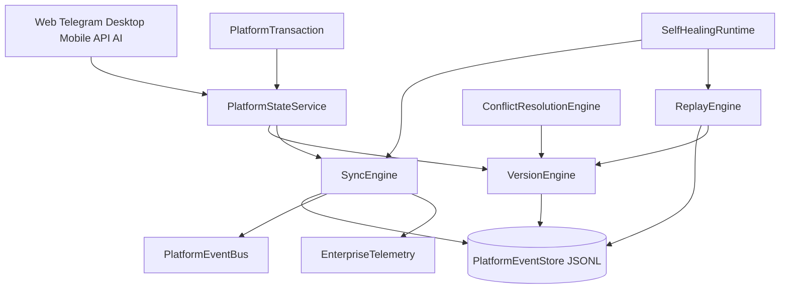

# Sprint 34.2D — Enterprise Runtime, Event Sourcing & Versioning Core

**Status:** Implemented  
**Date:** 2026-08-02  
**Depends on:** 34.2A Identity · 34.2B Registry · 34.2C Platform State  
**Addresses:** TD-54 shared versioning primitive (architecture review)

---

## Objective

Make the platform **deterministic**:

- every client observes the same state
- every modification is versioned
- every event is reproducible
- every conflict is resolvable
- every change is auditable

No second Event Bus. No parallel runtime package. Extends `platform_state/`.

---

## Architecture

---

## Deliverables

| Component | Module |
|-----------|--------|
| Canonical entity | `platform_state/entity.py` |
| Version mixin (TD-54) | `database/models/mixins.py` → `VersionMixin` |
| Version Engine | `platform_state/version_engine.py` |
| Event Store | `platform_state/event_store.py` |
| Replay Engine | `platform_state/replay.py` |
| Conflict Engine | `platform_state/conflict_engine.py` |
| Audit Timeline | `platform_state/audit_timeline.py` |
| PlatformTransaction | `platform_state/transaction.py` |
| Telemetry | `platform_state/telemetry.py` |
| Self-healing | `platform_state/self_healing.py` |
| Caches / batch sync | `platform_state/cache.py` |
| Facade | `platform_state/enterprise.py` |

---

## API (additive)

| Method | Path |
|--------|------|
| GET | `/management/v1/platform-state/enterprise` |
| GET | `/management/v1/platform-state/events` |
| GET | `/management/v1/platform-state/versions/{type}/{id}` |
| GET | `/management/v1/platform-state/timeline/{type}/{id}` |
| GET | `/management/v1/platform-state/telemetry` |
| POST | `/management/v1/platform-state/replay` |
| POST | `/management/v1/platform-state/heal` |

---

## Conflict strategies

`version_reject` · `last_write_wins` · `field_merge` · `business_rule` · `manual_review`

---

## Persistence

- Event Store: JSONL append-only (`ADOS_PLATFORM_EVENT_STORE` path, or memory under pytest / `ADOS_EVENT_STORE_MEMORY=1`)
- Hot sync window remains in SyncEngine deque; durable history is Event Store
- Force durable file even under pytest: `ADOS_EVENT_STORE_DURABLE=1`

---

## Compatibility

- Existing TaskService / CalendarService / CRM paths unchanged
- 34.2C client runtimes unchanged
- Canonical bus remains `PlatformEventBus`
- `entity_versions` now delegates to `VersionEngine`

---

## Tests

`tests/test_platform_state_34_2d.py` — versioning, store, replay, conflicts, transactions, healing, concurrent edits, large datasets, cross-client matrix.

See also: [VERSION_ENGINE.md](./VERSION_ENGINE.md) · [EVENT_STORE.md](./EVENT_STORE.md)
