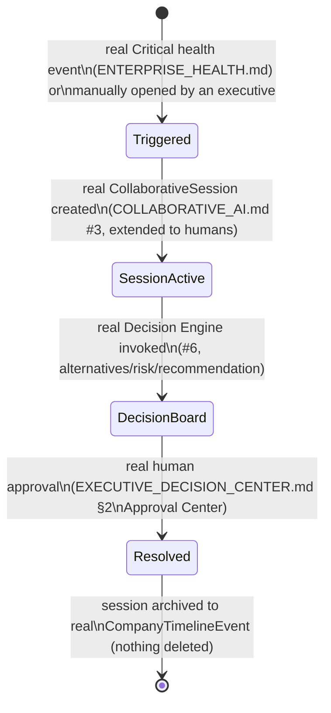

# Enterprise City — Enterprise War Room

**Sprint:** CQ-15 — Architecture Research + UX Research. Documentation only, `src` not modified.

**Do not duplicate:** `COLLABORATIVE_AI.md`/`ENTERPRISE_COLLECTIVE_INTELLIGENCE.md` (real, Sprint 28.8)
already implement a real "Collaborative Session" (participants, current speaker, current task,
discussion progress, consensus status) and a real Decision Engine — the strongest real foundation for
this entire section. `EBN_COMMUNICATION.md` (CQ-10) already confirmed no real Meeting/Video Room
system exists — restated, not re-derived.

## 0. What exists today (verified)

The real Collaborative AI system's "Collaborative Session" capability (`COLLABORATIVE_AI.md` #3) is
architecturally a War Room already — it just coordinates AI Specialists, not yet human executives. This
document proposes extending that **same real session model** to include human participants, rather
than building a separate human-collaboration system alongside it.

## 1. Per-item mapping (brief's eight)

| Brief item | Real/SPEC source |
|---|---|
| Live Meetings | **Blocked** — `EBN_COMMUNICATION.md` §2 (CQ-10), restated |
| Situation Rooms | Proposed as a `CollaborativeSession` (real shape) scoped to a specific `Critical` health event (`ENTERPRISE_HEALTH.md`, this sprint) rather than a generic AI team goal — same real session mechanism, a new triggering context |
| Incident Management | Real `RELIABILITY.md`/`platform_reliability` (fault tolerance, per `CLAUDE.md`'s architecture description) is the closest real precedent found this sprint — not deeply verified in this pass; flagged for confirmation before implementation rather than assumed |
| Decision Boards | Real Decision Engine's Alternatives/Pros/Cons/Risk/Recommendation (`COLLABORATIVE_AI.md` #6, real) — a Decision Board is that same real capability's UI, not a new one |
| Shared Dashboards | `EXECUTIVE_OPERATING_SYSTEM.md` §1 (this sprint) — the real dashboard composites, made multi-viewer |
| Shared AI | Real `PersonalAiAssistant` (`PERSONAL_AI.md`, CQ-12) — a War Room session's shared AI is proposed as one assistant instance visible to every session participant, not a new AI concept |
| Live Documents | **Blocked on the same real gap** `EBN_VERIFIED_DOCUMENTS.md` (CQ-10) already found: real document storage exists, real concurrent-editing does not |
| Executive Collaboration | The real Collaborative Session extended to humans (§0) |

## 2. Situation Room lifecycle (SPEC, extending the real session model)

## 3. The one real infrastructure question this document surfaces

`CITY_DESKTOP.md` §2 (CG-6) already found that Enterprise City can open as a real Desktop window via
an iframe boundary that isolates JS realms — meaning a multi-executive War Room session spanning
several open windows/tabs would need the same real cross-window transport
(`CITY_COLLABORATION.md`/`Socket.IO`, CG-5/CG-6) this engagement has flagged as a prerequisite for
every other multi-user feature since CG-5. This document does not re-solve that; it names War Room as
one more feature that inherits the same real constraint.

## 4. Non-goals

- No new collaboration engine — extends the real `CollaborativeSession`/Decision Engine (Sprint 28.8).
- No new meeting/video/document-concurrency system — both explicitly blocked on already-confirmed
  real gaps (`EBN_COMMUNICATION.md`/`EBN_VERIFIED_DOCUMENTS.md`, CQ-10).
- No new incident-management system design — `RELIABILITY.md` is cited as the real candidate, not
  extended in depth, pending independent verification.

## Related documents

`COLLABORATIVE_AI.md`/`ENTERPRISE_COLLECTIVE_INTELLIGENCE.md` (real, Sprint 28.8),
`EBN_COMMUNICATION.md`/`EBN_VERIFIED_DOCUMENTS.md` (CQ-10, the two confirmed real gaps),
`ENTERPRISE_HEALTH.md`/`EXECUTIVE_DECISION_CENTER.md` (CQ-15 siblings), `CITY_DESKTOP.md` §2 (CG-6,
the cross-window constraint), `CITY_COLLABORATION.md` (CG-5, the presence/transport prerequisite),
`RELIABILITY.md` (real, Incident Management candidate).
