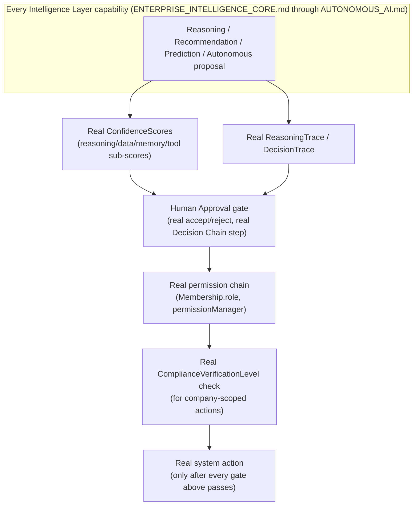

# Enterprise City — Intelligence Ethics & Governance

**Sprint:** CQ-14 — Architecture Research + Governance Design. Documentation only, `src` not modified.

**Do not duplicate:** `AI_AGENT_GOVERNANCE.md` (real, `/api/enterprise-agents/v1/governance` — Agent
Health, Performance Metrics, Execution Audit, Security Monitoring, Permission Validation, Resource
Usage Tracking) already implements real governance controls at the agent level — this document
extends it to the whole Intelligence Layer (§1's Core through §6's City Intelligence) rather than
re-describing it.

## 0. This document's governing finding — the platform's own real code already enforces most of this

Every mechanism the brief's seven governance items ask for was found, this sprint, **already real and
already enforced somewhere in the codebase** — this document's job is consolidating and extending that
real enforcement across the whole Intelligence Layer, not designing governance from a blank page.

| Brief item | Real enforcement found |
|---|---|
| Human Approval | Real `platform_learning.RecommendationEngine`'s mandatory `accept()`/`reject()`; real EP-06 Decision Chain's distinct Decision step; real `platform_predictive_intelligence.bootstrap()`'s `ai_may_act: False` |
| AI Confidence Levels | Real `platform_reasoning.confidence.ConfidenceEstimator`/`ConfidenceScores.overall` (fixed weighted sum, `0.35/0.25/0.20/0.20` across reasoning/data/memory/tool sub-scores) and real `platform_predictive_intelligence.confidence.ConfidenceScore.attach()` |
| Decision Audit Trail | Real `ReasoningTrace`/`ReasoningStep` (`platform_reasoning/models.py`) and real `DecisionTrace` (`platform_decision`) — both already produce a human-readable trace via `ReasoningResult.explanation()` |
| Recommendation Traceability | Same real trace objects, plus real `AI_AGENT_GOVERNANCE.md`'s "Execution Audit" |
| Permission Boundaries | Real `permissionManager`/`roleManager` chain (`CITY_INTEGRATIONS.md` §3, CG-6), real `Membership.role` (CQ-12), real `AI_AGENT_GOVERNANCE.md`'s "Permission Validation" |
| Compliance | Real `database/models/compliance.py`'s `ComplianceVerificationLevel`/`ComplianceRiskProfile` (`ENTERPRISE_BUSINESS_NETWORK.md` §3.3, CQ-10) |
| Transparency | Real `ReasoningResult.explanation()` + real "Explain Decision" capability (`COLLABORATIVE_AI.md` #9 — Why/Benefits/Alternatives/Expected Result, already real) |

## 1. The consolidated governance model

**This is not a new governance pipeline** — it is the real chain already implicit across
`platform_reasoning`/`platform_decision`/`platform_learning`/`permissionManager`/`compliance.py`,
made explicit as one diagram so every future Intelligence Layer feature can be checked against it
directly rather than each feature re-deriving its own governance posture.

## 2. Confidence Levels — real formula, honestly characterized

`ConfidenceScores.overall`'s real weighted sum (`0.35` reasoning, `0.25` data, `0.20` memory, `0.20`
tool) is a **fixed heuristic formula, not a calibrated statistical confidence** — consistent with this
sprint's broader finding that the whole reasoning/planning/decision/prediction stack is deterministic
rule-based logic, not ML. **Design requirement**: any UI surfacing a "confidence: 82%" figure to a
human decision-maker must be labeled honestly (e.g., "heuristic confidence," not "AI certainty") —
this is a governance/transparency requirement (§0's Transparency row), not a cosmetic label choice, and
follows directly from `AI_MEMORY.md`/`RECOMMENDATION_PREDICTIVE_ENGINE.md`'s repeated finding that this
platform's "AI-sounding" numbers are frequently more deterministic than their names imply.

## 3. Permission Boundaries — one addition to the real chain

The only genuinely new element this document adds: **Cross-company reasoning** (`ENTERPRISE_
INTELLIGENCE_CORE.md` §2's `CrossCompanyContext`) must pass **both** companies' real permission checks
independently — a reasoning session spanning two partnered companies is not privileged above what
either company's own real access control already allows its counterpart to see. This is a direct,
literal extension of the real `Visibility`/`Membership.role` chain (CQ-10/12), not a new access-control
concept.

## 4. Non-goals

- No new confidence-scoring algorithm — §2 extends the real, existing formula, with a labeling
  requirement, not a replacement.
- No new audit-log schema — `ReasoningTrace`/`DecisionTrace` are the real, existing mechanism.
- No new permission model — §3's cross-company check is additive to the real chain, not a new one.

## Related documents

`AI_AGENT_GOVERNANCE.md` (real), `ENTERPRISE_INTELLIGENCE_CORE.md` §0/§2 (the real Decision Engine and
`CrossCompanyContext`), `RECOMMENDATION_PREDICTIVE_ENGINE.md`/`AUTONOMOUS_AI.md` (CQ-14 siblings, the
capabilities this governance model constrains), `CITY_INTEGRATIONS.md` §3 (CG-6, the real permission
chain), `ENTERPRISE_BUSINESS_NETWORK.md` §3.3 (CQ-10, real compliance/verification tiers),
`ENTERPRISE_AI_OS.md` §13 (the platform's own stated automation philosophy).
