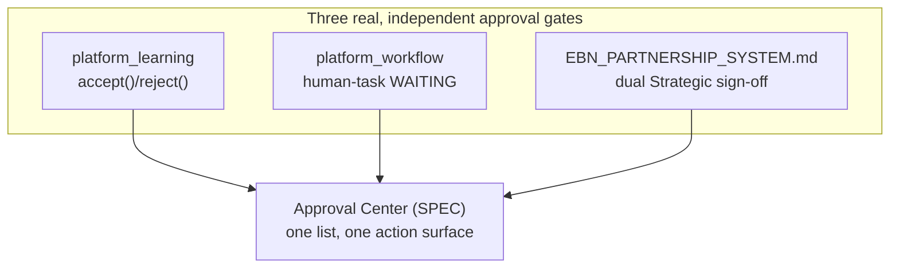

# Enterprise City — Executive Decision Center & Command Timeline

**Sprint:** CQ-15 — Architecture Research + Decision Modeling. Documentation only, `src` not modified.
Covers the brief's §4 (Executive Decision Center) and §7 (Command Timeline) together — timeline
events are the historical input a decision center reasons over.

**Do not duplicate:** `EXECUTIVE_DECISION_INTELLIGENCE.md` (real, Sprint 29.18, Platform Builder
v1.25.0 — "Decision support surfaces for executives — context, alternatives, impact and risk
comparison," explicitly **"analytical and advisory only — never executes business logic or changes
platform state"**) is a real, very recently shipped system directly answering this brief section —
not re-designed here. `ENTERPRISE_INTELLIGENCE_CORE.md` §0 and `RECOMMENDATION_PREDICTIVE_ENGINE.md`
(CQ-14) already ground the real Decision Engine/reasoning chain this document composes.

## 0. A real Executive Decision surface already exists, with the exact right constraint

`EXECUTIVE_DECISION_INTELLIGENCE.md`'s real features — Decision Context, Alternative Options, Impact
Comparison, Risk Comparison, Dependency Overview — plus its explicit "analytical and advisory only"
constraint, are the same governing posture `ETHICS_GOVERNANCE.md` §0 (CQ-14) already found enforced
across `platform_predictive_intelligence`/`platform_learning`. This document does not design a
decision center from scratch — it maps the brief's eight requested surfaces onto this real one plus
CQ-14's real Decision Engine, and adds an explicit Approval Center (the one item without a named real
precedent, though its underlying mechanism is real).

## 1. Per-surface mapping (brief §4)

| Brief surface | Real/SPEC source |
|---|---|
| Strategic Recommendations | Real Decision Engine (`ENTERPRISE_INTELLIGENCE_CORE.md` §0, CQ-14) filtered to strategic-tier alternatives |
| Operational Recommendations | Same real engine, operational-tier filter |
| Business Risks | Real `RiskIntelligence` (`platform_predictive_intelligence`, `RECOMMENDATION_PREDICTIVE_ENGINE.md` §2.1, CQ-14) |
| Growth Opportunities | Real `OpportunityDetector` (same real module) |
| Critical Alerts | Real `healthService`/`RuntimeHealthId` crossing into `Critical` (`CITY_BUILDING_STATES.md` §3.2, CG-4) |
| Investment Opportunities | `INVESTMENT_LAYER.md` (CQ-13) |
| AI Recommendations | Real `platform_learning.RecommendationEngine` (CQ-14) |
| Approval Center | **The one new surface** — see §2 |

## 2. Approval Center — one view over an already-real gate, not a new workflow engine

Every "requires human approval" mechanism this engagement has found is real but scattered: the real
`platform_learning.RecommendationEngine`'s mandatory `accept()`/`reject()` (CQ-14), `platform_workflow`'s
real human-task `WAITING` pause (`WORKFLOW_RUNTIME.md` §1, CG-7), and `EBN_PARTNERSHIP_SYSTEM.md`'s
real dual-signoff Strategic-tier promotion (CQ-10). **Approval Center is proposed as one consolidated
read/action view over these three real gates**, not a fourth approval mechanism:

## 3. Command Timeline (brief §7)

### 3.1 One read-model over real, already-existing timelines

`CompanyTimelineEvent`/`CitizenTimelineEvent` (`ENTERPRISE_BUSINESS_NETWORK.md` §3.4 / `DIGITAL_
CITIZEN.md` §0, CQ-10/12) and `CITY_EVENTS.md`'s real event catalog (CG-4) already cover every brief-
requested item below. Command Timeline is proposed as a **merged, executive-scoped view**, not a
fourth timeline entity:

| Brief item | Source |
|---|---|
| Critical Events | Real health-crossing events (§1) |
| Business Changes | Real `CompanyTimelineEvent` |
| Meetings | Blocked — `EBN_COMMUNICATION.md` (CQ-10) |
| Approvals | §2's Approval Center, same real gates |
| AI Decisions | Real `ReasoningTrace`/`DecisionTrace` (`ETHICS_GOVERNANCE.md` §0, CQ-14) |
| Risk Alerts | Real `RiskIntelligence` |
| Project Milestones | Real `AutomationEngine` task completion |
| City Activity | Real `CityLiveStatus`/`CITY_RUNTIME.md` (CG-4) |

## 4. Non-goals

- No new decision-support engine — extends the real `EXECUTIVE_DECISION_INTELLIGENCE.md` surface and
  CQ-14's real Decision Engine.
- No fourth approval mechanism — Approval Center composes the three real gates.
- No new timeline entity — Command Timeline is a merged read-model over real existing timelines.

## Related documents

`EXECUTIVE_DECISION_INTELLIGENCE.md` (real, Sprint 29.18), `ENTERPRISE_INTELLIGENCE_CORE.md`/
`RECOMMENDATION_PREDICTIVE_ENGINE.md`/`ETHICS_GOVERNANCE.md` (CQ-14), `WORKFLOW_RUNTIME.md` §1 (CG-7),
`EBN_PARTNERSHIP_SYSTEM.md` (CQ-10), `CITY_EVENTS.md` (CG-4), `INVESTMENT_LAYER.md` (CQ-13),
`EXECUTIVE_OPERATING_SYSTEM.md` (CQ-15 sibling).
