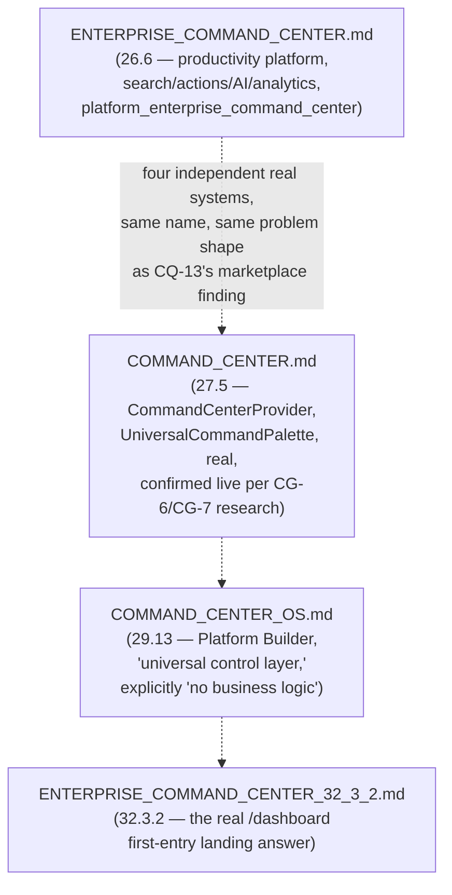

# Enterprise City — Executive Operating System

**Sprint:** CQ-15 — Architecture Research + UX Research + Operational Architecture. Documentation
only, `src` not modified. Covers the brief's §1 (Executive Command Center) and §2 (Live Enterprise
Map) — named "Executive Operating System" rather than reusing the brief's own section title, since
this research found **four real, pre-existing documents already named some variant of "Command
Center."**

**Do not duplicate:** `ENTERPRISE_COMMAND_CENTER.md` (Sprint 26.6), `COMMAND_CENTER.md` (Sprint 27.5),
`COMMAND_CENTER_OS.md` (Sprint 29.13), and `ENTERPRISE_COMMAND_CENTER_32_3_2.md` (Sprint 32.3.2) are
all real, substantial, shipped systems — none re-described here. `STRATEGIC_DASHBOARD.md` (CQ-14)
already covers Owner/CEO/Regional Dashboard grounding — cited, not repeated.

## 0. The headline finding — four real Command Centers already exist, none consolidated

This is the largest instance yet of this engagement's recurring "same concept, several real
implementations" finding (workflow engines, CG-7; marketplaces, CQ-13; intelligence/decision engines,
CQ-14) — now at Command Center scale. **This document does not design a fifth.** It identifies which
real system is the actual live one (`COMMAND_CENTER.md`, Sprint 27.5 — already confirmed in this
engagement's own CG-6/CG-7 research as the one `CommandCenterProvider`/`UniversalCommandPalette`
actually mounted in the app, per `ENTERPRISE_NAVIGATION.md`'s own finding that the *other* palette
implementation is orphaned dead code) and designs this brief's executive-specific asks as an
**executive view layer** on top of it, reusing `COMMAND_CENTER_OS.md`'s own real, correct framing:
"No business logic. The Command Center only orchestrates."

## 1. Executive dashboards (brief §1)

| Brief dashboard | Status |
|---|---|
| Owner Dashboard | `STRATEGIC_DASHBOARD.md` §2 (CQ-14) — already specified |
| CEO Dashboard | `STRATEGIC_DASHBOARD.md` §2, real profile (CG-5) |
| COO Dashboard | **New** — no real "COO" role or profile found anywhere in this survey (not `EngineRoleCode`, not `CITY_USER_JOURNEYS.md`); proposed as the Operations Dashboard (below) scoped to a citizen with a real Director/Manager-tier `Membership.role` (`CITIZEN_ORGANIZATION_MEMBERSHIP.md` §0, CQ-12) rather than inventing a new role code |
| Operations Dashboard | New — composes real `AutomationEngine` task/queue state (Sprint 28.9) + real `CityLiveStatus` per-district aggregation (CG-4/CG-9) |
| Regional Dashboard | `STRATEGIC_DASHBOARD.md` §2 already flagged this SPEC, lowest priority, blocked on real multi-city work (`CITY_LIVING_ECONOMY.md` §2.3, CQ-10) — restated, not resolved |
| Enterprise Overview | Composes `BUSINESS_OBSERVATORY.md`'s real eight-subject aggregation (CQ-14) |
| Strategic View | `ENTERPRISE_INTELLIGENCE_CORE.md`'s real Decision Engine output (CQ-14), filtered to strategic-tier alternatives |
| Operational View | Real `AutomationEngine`/`CityLiveStatus` (same as Operations Dashboard) — the two are proposed as the same underlying data, two different UI groupings, not two data models |

## 2. Live Enterprise Map (brief §2) — the City, already real, now consolidated as one control surface

Every entity the brief lists is already real or already speced across this engagement — this section's
job is confirming that City is architecturally *already* positioned to be this control surface, not
proposing new integration work:

| Brief entity | Real/SPEC source |
|---|---|
| Companies | Real `BusinessProfile` (Sprint 29.0) |
| Citizens | Real `Citizen` (Sprint 29.1) |
| Buildings | Real `CityBuilding` (`cityCatalog.ts`) |
| Projects | Real `AutomationEngine` tasks (Sprint 28.9) |
| Vehicles | `CITY_OBJECT_MODEL.md` §3 `VehicleInstance` (CQ-11) |
| AI Agents | Real `MARKETPLACE.md` registry (Sprint 12.1) + `aiAgentRuntime` (CG-4) |
| Workflows | Real `AutomationEngine`/`WorkflowRuntime` (Sprint 28.9) |
| Meetings | **Absent** — `EBN_COMMUNICATION.md` §2 (CQ-10), restated |
| Assets | `DIGITAL_ASSETS.md`'s `EnterpriseAsset` (CQ-13) |
| Business Network | Real `Relationship`/`EBN_BUSINESS_GRAPH.md` (Sprint 29.0/CQ-10) |
| Realtime activity | Real `CityLiveStatus`/`CITY_RUNTIME.md` three-loop model (CG-4) |

**"The city becomes the primary navigation layer"** is not a new architectural claim — it restates
`CLAUDE.md`'s own already-documented product sequencing ("Enterprise Dashboard is the primary entry
point... Enterprise City is sequenced after platform completion"). This document does not override
that sequencing; it specifies City as the eventual, not immediate, executive control surface,
consistent with the platform's own stated roadmap discipline.

## 3. Non-goals

- No fifth Command Center — §0's entire point is reconciling the real four, primarily around the
  confirmed-live `COMMAND_CENTER.md` (Sprint 27.5).
- No new COO role/permission code — extends real `Membership.role` tiers instead.
- No override of `CLAUDE.md`'s City-after-platform-completion sequencing — §2 explicitly defers to it.

## Related documents

`ENTERPRISE_COMMAND_CENTER.md`/`COMMAND_CENTER.md`/`COMMAND_CENTER_OS.md`/
`ENTERPRISE_COMMAND_CENTER_32_3_2.md` (all real), `ENTERPRISE_NAVIGATION.md` (the orphaned-palette
finding), `STRATEGIC_DASHBOARD.md`/`BUSINESS_OBSERVATORY.md`/`ENTERPRISE_INTELLIGENCE_CORE.md`
(CQ-14), `CITY_LIVING_ECONOMY.md` §2.3 (CQ-10, multi-city gap), `GLOBAL_COMMAND_BAR.md`/
`EXECUTIVE_DECISION_CENTER.md` (CQ-15 siblings).
