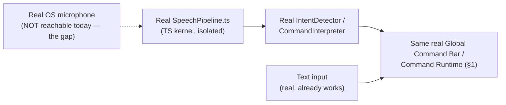

# Enterprise City — Global Command Bar & Voice Operations

**Sprint:** CQ-15 — Architecture Research + UX Research. Documentation only, `src` not modified.
Covers the brief's §3 (Global Command Bar) and §9 (Voice Operations) together — voice is proposed as
one more input modality into the same real command surface, not a separate system.

**Do not duplicate:** `CITY_NAVIGATION_GUIDE.md` §5 (CG-5) and `ACTION_LIBRARY.md` §2 (CG-7) already
cover Command Palette integration and the real Command Runtime (`src/runtime/commandRuntime`, Sprint
28.6) in depth — cited, not re-described. `ARCHITECTURE_MAP.md` §7 (CG-8) already found `src/voice`
(`@ados/voice`) is a real speech→intent pipeline with **no OS microphone integration** — the
foundational honest constraint this document's entire §2 is built around.

## 1. Global Command Bar (brief §3) — one real palette, ten command categories

### 1.1 Real foundation

The real, confirmed-live `UniversalCommandPalette.tsx` (`COMMAND_CENTER.md`, Sprint 27.5) plus the real
Command Runtime (`src/runtime/commandRuntime`, Sprint 28.6 — "Palette/Shell/Desktop execute through
one registry with history, permissions, and `command.*` Event Bus events," `ARCHITECTURE_MAP.md` §3.1)
is the one real surface every brief command below should register into.

### 1.2 Per-command mapping

| Brief command | Real/SPEC target |
|---|---|
| Open Company | Real `BusinessProfile` (Sprint 29.0) — a Command Runtime action navigating to its Company Passport (`ENTERPRISE_BUSINESS_NETWORK.md` §3, CQ-10) |
| Open Citizen | Real `Citizen` (Sprint 29.1) — same pattern, Digital Passport (`DIGITAL_CITIZEN.md` §3, CQ-12) |
| Launch AI | Real `MARKETPLACE.md` agent registry (Sprint 12.1) or `PERSONAL_AI.md`'s `PersonalAiAssistant` (CQ-12) |
| Start Workflow | Real `AutomationEngine.runAutomation()` (Sprint 28.9, `AUTOMATION_ENGINE.md`) |
| Assign Task | Real `AutomationEngine` task assignment, citizen-scoped (`DIGITAL_LIFE.md` §1, CQ-12) |
| Schedule Meeting | **Blocked** — `EBN_COMMUNICATION.md` §2 (CQ-10) confirmed no real meeting system exists; this command has nothing real to target yet |
| Open Building | Real `openBuilding()` (`CITY_NAVIGATION_GUIDE.md` §1, CG-5) |
| Navigate to Asset | `DIGITAL_ASSETS.md`'s `EnterpriseAsset` (CQ-13), resolving to its linked real `CityBuilding`/`VehicleInstance` |
| Search Everything | Real `searchIndex`/`searchProvider` (`CITY_NAVIGATION_GUIDE.md` §4, CG-5), already extended this engagement to citizens/companies (`SPRINT_CQ_12_RESULT.md` §3, `PROFESSIONAL_NETWORK_DISCOVERY.md` §2.1) |
| Voice Command | §2 below |

### 1.3 Design principle — no command bypasses real permissions

Every command in §1.2 that resolves to a real entity (Company, Citizen, Workflow, Building, Asset)
must resolve through the same real permission chain every other document in this engagement has used
since CQ-10 (`Membership.role` → `permissionManager`/`roleManager`) — a Global Command Bar is a faster
path to an action, never a shortcut around whether the citizen issuing it is allowed to take it.

## 2. Voice Operations (brief §9) — honest scoping around a real, limited pipeline

### 2.1 What exists today (verified, CG-8 research restated)

`src/voice` (`@ados/voice`) is real: `SpeechPipeline.ts` (Recorder → Recognizer → IntentDetector →
CommandInterpreter → ChatBridge), session/history/settings/wake-word classes — genuinely non-trivial
code. **`VoiceRecorder` only accepts programmatic PCM/base64 frames — there is no OS microphone
integration.** It is also part of the disconnected TS ADOS kernel ecosystem (`ARCHITECTURE_MAP.md` §7)
— not reachable from `src/web` today at all.

### 2.2 What this means for the brief's six example commands

Every one of the brief's example voice commands ("Show today's critical issues," "Open Odessa
headquarters," "Find the best supplier," "Create a meeting," "Launch AI analysis," "Open project
Alpha") is **architecturally just a natural-language front-end onto §1.2's existing command list** —
this document proposes no new command semantics for voice, only a new *input modality* that resolves
to the exact same Command Runtime actions text input already produces. The one genuinely blocking gap
is not "voice command design," it's that **no real microphone-to-text pipeline reaches `src/web` at
all** — this is an infrastructure integration problem (bridging the isolated TS kernel's real speech
pipeline into the web app, or wiring a real browser Web Speech API path instead), not a design problem
this document can solve by specifying more voice commands.

### 2.3 "Create a meeting" — the one example blocked by a different, already-known gap

Independent of the voice-input gap (§2.2), "Create a meeting" specifically is also blocked by
`EBN_COMMUNICATION.md`'s confirmed-absent Meeting Room system (§1.2's Schedule Meeting row) — two
separate real gaps compounding on the same one example command, worth calling out so neither is
mistaken for the other's fix.

## 3. Non-goals

- No new command palette or command runtime — every command in §1 registers into the real, existing
  one.
- No new voice/speech pipeline design — §2 names the real infrastructure gap (mic-to-web bridging)
  rather than proposing a redundant one.
- No new command semantics for voice — voice is a new input modality onto the existing real command
  set, not a parallel command vocabulary.

## Related documents

`CITY_NAVIGATION_GUIDE.md` §5 (CG-5), `ACTION_LIBRARY.md` §2 (CG-7, Command Runtime), `ARCHITECTURE_
MAP.md` §7 (CG-8, real `src/voice` finding), `EBN_COMMUNICATION.md` (CQ-10, Meeting Room gap),
`ENTERPRISE_BUSINESS_NETWORK.md`/`DIGITAL_CITIZEN.md` (CQ-10/12, Open Company/Citizen targets),
`DIGITAL_ASSETS.md` (CQ-13, Navigate to Asset), `EXECUTIVE_OPERATING_SYSTEM.md` (CQ-15 sibling).
