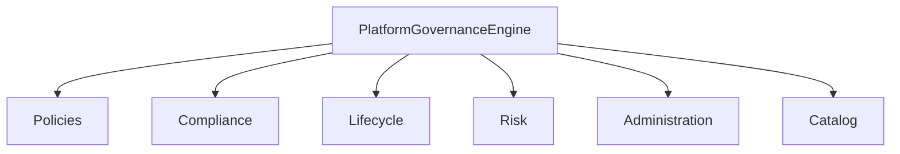

# Platform Governance, Compliance & Lifecycle Management (Sprint 7.6)

> Centralized governance, policy management, compliance auditing, lifecycle management and ecosystem administration across all applications on **AI Platform Core v3.0**.

## Release Summary

| Field | Value |
|-------|-------|
| Ecosystem Version | **1.5.0-alpha** |
| Governance Layer | **1.0** |
| Compliance Layer | **1.0** |
| Platform Dependency | **AI Platform Core v3.0** |
| Sprint | **7.6** |

---

## Architecture



Package: `ecosystem/governance/` (platform-level; distinct from `workforce/governance/`)

| Module | Role |
|--------|------|
| `policies/` | Policy engine across platform/app/agent/workflow/data/knowledge |
| `compliance/` | Rules evaluation, retention, access reviews, continuous audit |
| `audit/` | Immutable-style audit trail |
| `lifecycle/` | Application/agent/plugin/workflow/knowledge lifecycle |
| `administration/` | Platform admin, licenses, feature flags |
| `risk/` | Risk assessment, continuity & DR policies |
| `catalog/` | Governed asset catalog |
| `engine.py` | PlatformGovernanceEngine facade |

---

## Governance Guide

```python
from ecosystem import ecosystem
from ecosystem.governance.models import GovernanceDomain

gov = ecosystem.engine.governance
policies = gov.policies.list_policies(domain=GovernanceDomain.APPLICATION)
await gov.policies.create("Custom Data Policy", GovernanceDomain.DATA, rules=["retain_365d"])
result = await gov.run_governance_cycle()
```

Domains: platform, application, agent, workflow, data, knowledge.

---

## Compliance Guide

```python
check = await gov.compliance.evaluate(
    policy_id,
    "application",
    "auto_marketplace",
    context={"authenticated": True, "rbac": True, "versioned": True},
)
audit = await gov.compliance.continuous_audit()
review = gov.compliance.access_review("user-1")
```

---

## Lifecycle Guide

```python
from ecosystem.governance.models import LifecycleKind, LifecycleState

record = await gov.lifecycle.register(LifecycleKind.APPLICATION, "auto_marketplace", version="2.0.0")
await gov.lifecycle.transition(record.record_id, LifecycleState.ACTIVE)
await gov.lifecycle.set_version(record.record_id, "2.1.0")
```

Kinds: application, agent, plugin, workflow, knowledge.

---

## Administration & Risk

```python
gov.administration.create_license("org-1", plan="enterprise", seats=100)
gov.administration.set_feature_flag("beta_plugins", True)
risk = await gov.risk.assess("Unapproved prod change", category=RiskCategory.SECURITY, severity=RiskSeverity.HIGH)
```

---

## API Reference

| API | Endpoints |
|-----|-----------|
| Governance | `GET /governance/metrics`, `POST /governance/cycle`, `/policies`, `/audit`, `/catalog` |
| Compliance | `POST /compliance/evaluate`, `/audit`, `/access-reviews`, `GET /compliance` |
| Lifecycle | `POST/GET /lifecycle`, `POST /lifecycle/{id}/transition` |
| Administration | `GET /administration`, `POST /licenses`, `GET/POST /flags` |
| Risk | `POST/GET /risk` |

> Note: exact `GET /governance` remains the workforce governance audit endpoint.

---

## Events

| Event | When |
|-------|------|
| `PolicyCreated` / `PolicyUpdated` | Policy changes |
| `CompliancePassed` / `ComplianceFailed` | Check results |
| `LifecycleChanged` | Lifecycle transition/version |
| `RiskDetected` | New risk assessed |
| `GovernanceActionExecuted` | Governance action logged |

---

## Developer Guide

```python
from ecosystem import ecosystem

await ecosystem.engine.governance.run_governance_cycle()
```

Integrates Executive AI, optimization recommendations, and policy-aware planning — **without modifying AI Platform Core**.

---

## Tests

```bash
pytest tests/test_platform_governance.py -q
```

---

## Expected Result

- Sprint 7.6 completed
- Platform Governance ready
- Compliance Engine ready
- Lifecycle Management ready
- Enterprise Administration ready
