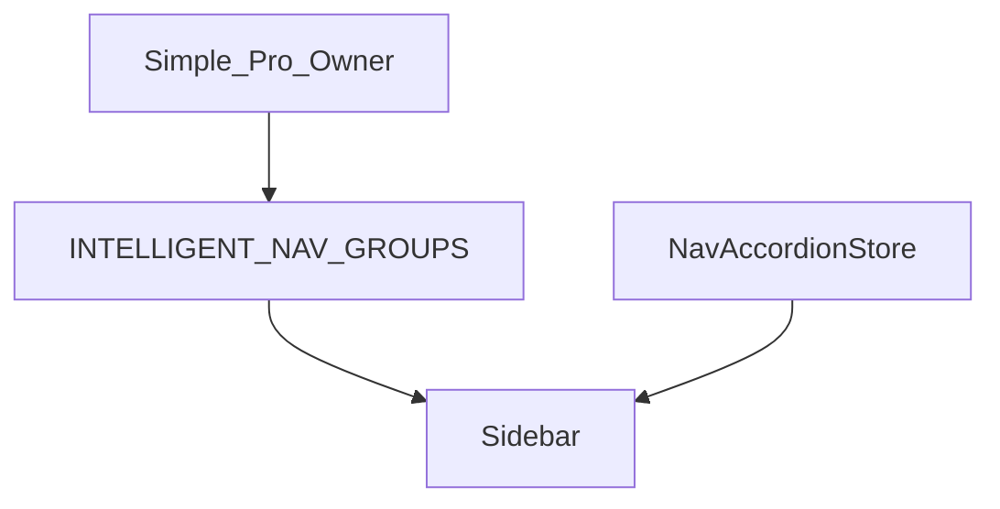

# Intelligent Navigation — Sprint 33.2

Accordion left sidebar over existing ADOS routes.

```mermaid
flowchart TB
  Mode[Simple_Pro_Owner]
  Accordion[NavAccordionStore]
  Groups[INTELLIGENT_NAV_GROUPS]
  Sidebar[Sidebar]
  Mode --> Groups
  Groups --> Sidebar
  Accordion --> Sidebar
```

Context navigation from Sprint 33.1 remains above the accordion when inside a module (e.g. CRM subtree).
