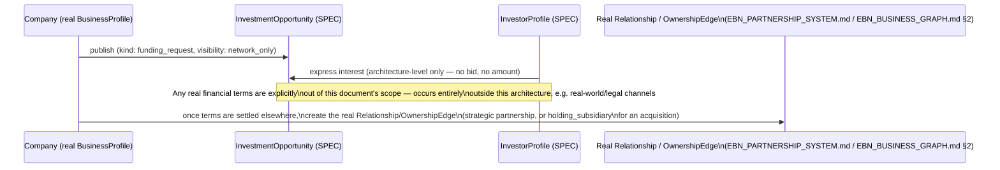

# Enterprise City — Investment Layer (Future Architecture)

**Sprint:** CQ-13 — Architecture Research. Documentation only, `src` not modified. Per the brief's own
explicit instruction, this document is **architecture only — no financial implementation, no
transaction mechanics, no money movement of any kind is designed here.**

**Do not duplicate:** `EBN_BUSINESS_GRAPH.md` §1 (CQ-10) already has a real `investor`
`RelationshipType`. `DIGITAL_ASSET_TREASURY.md` (real, Sprint 18.4) is the platform's actual financial
infrastructure — cited as the eventual rail, never extended or touched by this document.

## 1. Entity model (architecture only — no monetary mechanics)

```ts
type InvestmentOpportunityStatus = "draft" | "open" | "under_review" | "funded" | "closed";

interface InvestmentOpportunity {
  id: string;
  companyId: string;              // real BusinessProfile.id (Sprint 29.0)
  kind: "expansion" | "strategic_partnership" | "joint_venture" | "acquisition" | "funding_request";
  status: InvestmentOpportunityStatus;
  summaryDocRef?: string;          // real services/storage (EBN_VERIFIED_DOCUMENTS.md §0, CQ-10)
  visibility: "network_only" | "invite_only"; // never fully public — investment interest is sensitive by nature
}

interface InvestorProfile {
  citizenId?: string;              // real Citizen.id, for an individual investor
  companyId?: string;              // real BusinessProfile.id, for an investing entity
  interestCategories: string[];
  verifiedFundsIndicator?: boolean; // architecture placeholder only — no real verification mechanism designed
}
```

**No amount, currency, equity percentage, or transaction field appears anywhere in this model** —
deliberately, per the brief's constraint. `InvestmentOpportunity`/`InvestorProfile` describe *intent
and interest*, not capital movement.

## 2. The five brief examples, mapped

| Brief example | Maps to |
|---|---|
| Investment Opportunities | `InvestmentOpportunity` (§1) |
| Business Expansion | `InvestmentOpportunity.kind: "expansion"` |
| Strategic Partnerships | Already real at the company-relationship level — `EBN_PARTNERSHIP_SYSTEM.md`'s `trustTier: "strategic"` (CQ-10, now real via `Relationship.state`) is the actual mechanism; an `InvestmentOpportunity` of this kind is a *proposal* that, if accepted, becomes a real `Relationship` |
| Joint Ventures | `InvestmentOpportunity.kind: "joint_venture"` — proposed as creating a real `OwnershipEdge`-adjacent structure once accepted (`EBN_BUSINESS_GRAPH.md` §2, CQ-10), not a new relationship type |
| Business Acquisition | `InvestmentOpportunity.kind: "acquisition"` — the clearest future tie to `EBN_BUSINESS_GRAPH.md` §2's real `holding_subsidiary` ownership edge, once acquisition completes |
| Funding Requests | `InvestmentOpportunity.kind: "funding_request"` |
| Investor Profiles | `InvestorProfile` (§1) |

## 3. Sequence — interest to real relationship, no money in between



The sequence's honest gap, stated explicitly: **this architecture deliberately stops at "interest
expressed"** — anything resembling a real financial transaction is out of scope by the brief's own
instruction, and this document does not gesture at a future mechanism for it beyond noting that
`DIGITAL_ASSET_TREASURY.md`'s real treasury infrastructure (§4 below) would be the eventual natural
home if that scope is ever expanded.

## 4. Relationship to the real Digital Asset Treasury

`DIGITAL_ASSET_TREASURY.md` (real, Sprint 18.4, `applications/finance_enterprise/digital_assets/`) is
a genuine, substantial fiat/crypto treasury system (wallets, blockchain registries, PnL, portfolio
valuation) — **this document does not extend it, call it, or design any integration with it.** It is
named only so a future sprint that does design real investment *transactions* knows where the
platform's real financial rails already live, rather than building a second treasury system
(`ENTERPRISE_ECONOMY.md` §7 already flags this same risk for Enterprise Credits).

## 5. Non-goals

- No financial transaction, currency, or equity mechanism of any kind.
- No integration with `DIGITAL_ASSET_TREASURY.md` — named as a future landmark only.
- No due-diligence, valuation, or legal-compliance workflow — all explicitly out of scope for an
  "architecture only" investment layer.

## Related documents

`EBN_BUSINESS_GRAPH.md` §1–2 (CQ-10, real `investor` `RelationshipType`, `OwnershipEdge`),
`EBN_PARTNERSHIP_SYSTEM.md` (CQ-10, real Strategic tier), `DIGITAL_ASSET_TREASURY.md`/
`DIGITAL_ASSET_RISK.md` (real, Sprint 18.4, the eventual financial rail), `DIGITAL_CITIZEN.md`
(CQ-12, `InvestorProfile.citizenId`).
