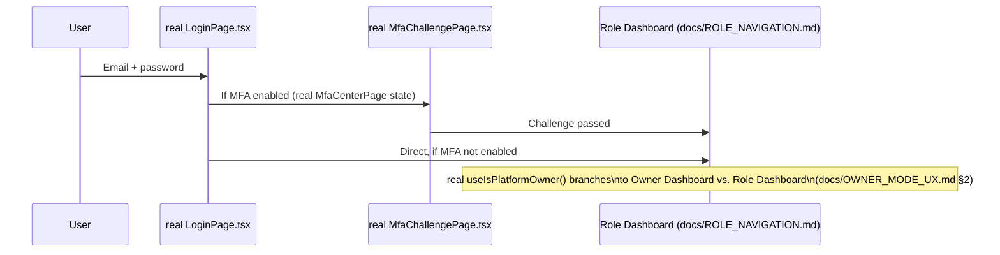

# Sprint CQ-30.1 — Login & Authentication User Flow

**Sprint:** CQ-30.1 — UX Design. Documentation only, `src` not modified.

**Do not duplicate:** a real, substantial, already-shipped set of auth pages exists in `src/web/auth/
pages/`: `LoginPage.tsx`, `ForgotPasswordPage.tsx`, `ResetPasswordPage.tsx`, `ChangePasswordPage.tsx`,
`MfaCenterPage.tsx`, `MfaChallengePage.tsx`, `SessionsPage.tsx`, `SessionExpiredPage.tsx`,
`AccountLockedPage.tsx`, `IdentityCenterPage.tsx`, `OrganizationsPage.tsx`, `UsersPage.tsx`,
`RolesPage.tsx`, `PermissionsPage.tsx`, `ActivityCenterPage.tsx`, `ProfileCenterPage.tsx`,
`AccessDeniedPage.tsx`, `SecurityCenterPage.tsx`, `LogoutPage.tsx`. This is a genuinely mature real
surface — most of this brief's ask is **sequencing** these real pages into one coherent Beta flow, not
building new ones.

## 1. Per-flow mapping (brief's eight)

| Brief flow | Real foundation | Beta design |
|---|---|---|
| Google Sign-In | **Not found — genuinely absent.** No OAuth/Google-specific code confirmed in `src/web/auth` this sprint | Flagged as a real gap, not designed further — the login page needs a new provider integration, out of scope for a UX-architecture pass |
| Email Login | Real `LoginPage.tsx` | Reused as-is |
| Registration | **Not found — genuinely absent.** No `Register*`/`Onboard*` page exists | Flagged as a real gap — Beta needs either a real registration page or an invitation-only model (see Invitation, below) as the actual v1 entry path |
| Password Recovery | Real `ForgotPasswordPage.tsx` + `ResetPasswordPage.tsx` | Reused as-is, two-step flow already real |
| Optional MFA | Real `MfaCenterPage.tsx` (setup/management) + `MfaChallengePage.tsx` (real challenge-response) | Reused as-is — "optional" per the brief means Beta UX should not force MFA setup on first login, gating it as a Security Center action instead |
| Invitation | **Not found — genuinely absent as a dedicated page**, though `IdentityCenterPage.tsx`/`UsersPage.tsx` (real) suggest the admin-side "add a user" capability may partially exist | Flagged as needing confirmation — if Registration stays absent (row above), Invitation becomes the Beta's only real user-onboarding path and should be prioritized accordingly |
| Organization Join | Real `OrganizationsPage.tsx` | Composition target for the Invitation flow once real, not designed further as a standalone page |
| First Login | No dedicated real "first login" page found | SPEC: a one-time overlay on top of the real Owner/Role dashboard (`docs/OWNER_MODE_UX.md`/`docs/ROLE_NAVIGATION.md`) — the Command Palette shortcut tooltip (`docs/UI_NAVIGATION.md` §6) is the one concrete First Login UX element this sprint specifies |

## 2. The real, working flow (Login → MFA → Session)

## 3. The two genuine gaps, prioritized

`docs/ENTERPRISE_V1_READINESS.md`'s (CQ-30 sibling) "small companies: ready" verdict assumed *some*
real onboarding path exists. This sprint's research found the two most fundamental ones —
Registration and Invitation — are **both** unconfirmed as real, dedicated pages. This is a
Beta-blocking gap, not a polish item: without one of the two, no new user can join a Beta organization
through the UI at all (only `IdentityCenterPage.tsx`/`UsersPage.tsx`'s admin-side capabilities, whose
actual invite-creation flow was not confirmed this sprint). Recommend this be the first item validated
against the actual running app, ahead of any of this sprint's other UX recommendations.

## 4. Session/lockout edge cases (already real)

`SessionExpiredPage.tsx` and `AccountLockedPage.tsx` are both real — Beta UX for these is "reuse as-is,"
not a new design. `AccessDeniedPage.tsx` is the real page every hidden-menu gate in `docs/ROLE_
NAVIGATION.md` §2 routes to if a role-mismatched deep link is followed directly (rather than a blank
page or a silent redirect).

## Non-goals

- No new OAuth provider integration designed (Google Sign-In flagged, not built).
- No new registration/invitation page designed in depth — flagged as the Beta's single highest-priority
  UX gap to verify against the real app before anything else in this sprint's output.

## Related documents

`docs/OWNER_MODE_UX.md`/`docs/ROLE_NAVIGATION.md`/`docs/UI_NAVIGATION.md` (CQ-30.1 siblings),
`docs/ENTERPRISE_V1_READINESS.md` (CQ-30, the readiness verdict this sprint's finding qualifies).
