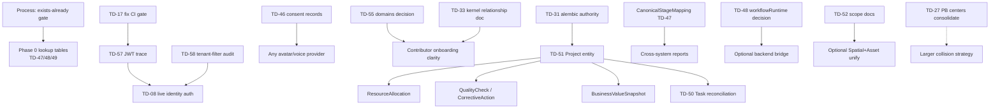

# Master Implementation Roadmap — Post Overnight Architecture Audit

**Sprint:** 29.10 · Audit Consolidation & Roadmap Planning  
**Mode:** Documentation only — **no production code modified**  
**Sources:** Overnight architecture audit corpus + living `TECH_DEBT.md` (TD-01–TD-58)

| Source document | Role |
|---|---|
| [`FINAL_AUDIT_RESULT.md`](./FINAL_AUDIT_RESULT.md) | Closing assessment · document index |
| [`EXECUTIVE_SUMMARY.md`](./EXECUTIVE_SUMMARY.md) | CTO framing · what to change / simplify / postpone |
| [`ENTERPRISE_V1_READINESS.md`](./ENTERPRISE_V1_READINESS.md) | Readiness by deployment shape · v1 gaps |
| [`TOP_20_CRITICAL_FIXES.md`](./TOP_20_CRITICAL_FIXES.md) | Ranked P0/P1 implementation targets |
| [`TOP_100_RECOMMENDATIONS.md`](./TOP_100_RECOMMENDATIONS.md) | Broader backlog (#21–#100) |
| [`TECH_DEBT.md`](./TECH_DEBT.md) | Canonical registry (incl. TD-47–TD-58) |
| [`ARCHITECTURE_SMELLS.md`](./ARCHITECTURE_SMELLS.md) | Recurring failure patterns |
| [`ENTERPRISE_FULL_AUDIT.md`](./ENTERPRISE_FULL_AUDIT.md) | Global architecture · organization |
| [`ARCHITECTURE_IMPROVEMENTS.md`](./ARCHITECTURE_IMPROVEMENTS.md) | Structured fix designs |
| [`SECURITY_REVIEW.md`](./SECURITY_REVIEW.md) | Trust boundaries · pending verifications |
| [`SCALABILITY_REVIEW.md`](./SCALABILITY_REVIEW.md) | Structural scale risks (unmeasured) |
| [`DOCUMENTATION_REVIEW.md`](./DOCUMENTATION_REVIEW.md) | Docs corpus health |

**Numbering note:** Sprints **30–34** below are the *next implementation sequence after 29.10*. They are **not** the historical Platform Builder pilot series (30.2–34.0) catalogued in [`ARCHITECTURE_AUDIT_INDEX.md`](./ARCHITECTURE_AUDIT_INDEX.md). Historical work is treated as already shipped context; this roadmap is forward-looking consolidation.

**Policy (inherited, non-negotiable):**

- Prefer extension over replacement; do not rush-merge six-way / seven-way / four-way collisions.
- Additive APIs; frozen `/api/v1` / `/management/v1` discipline stays.
- Keep `scripts/validate_architecture.py` as a hard CI gate.
- Re-verify stale product-gap TDs (e.g. TD-09 / TD-15 / TD-16) against current pilots before treating them as open P0 work.

---

## 1. Executive summary

### Current platform maturity

The platform is **architecturally stronger than its debt registry implies**, and **less production-ready than its documentation tone suggests**. Core governance (CI architecture validation, frozen API contracts with security tests, an honestly maintained `TECH_DEBT.md`) is real. Recurring failure mode is parallel good engineering without a mandatory “does this already exist?” check: six deal systems, seven workflow engines, five Digital Twin lineages, four Command Centers, four Knowledge Graph systems.

| Deployment shape | Verdict ([`ENTERPRISE_V1_READINESS.md`](./ENTERPRISE_V1_READINESS.md)) |
|---|---|
| Small companies | Ready |
| Medium businesses | Mostly ready |
| Large enterprises / holdings / international | Partially ready |
| Multi-city / multi-country | Designed, not seeded beyond Odessa |
| Government | Not ready |

### Strengths

1. CI-enforced architecture gate (`validate_architecture.py`) — highest-value infra asset.
2. Living four-document set + `TECH_DEBT.md` self-supersession pattern (correct collision handling).
3. Mature `deal_pipeline_engine.py` (tenant-configurable stages, SLA, audit trail).
4. Fail-closed JWT validation on the primary IAM path (`platform_identity/jwt_service.py`).
5. City Graphics Engine LOD / performance-budget discipline.
6. Recent Kernel / Orchestrator / City runtime stack in `src/web` (29.4–29.9) as an ordered ecosystem.
7. `00_MASTER_PRODUCT_BIBLE.md` as a real documentation entry point.

### Weaknesses

1. Collision pattern itself (process), not any single duplicate system.
2. `src/domains` — 141 files, near-zero usage (`TD-55`).
3. No real backend `Project` entity (`TD-51`) — blocks value-chain execution designs.
4. “Real-shaped data, simulated execution” smell (`ARCHITECTURE_SMELLS.md` §1; `TD-48` frontend workflow).
5. Discoverability tax from ~100 top-level directories (`TD-56`).
6. Three unreconciled permission-scope vocabularies (`TD-52`).
7. UI ahead of safety for AI Production Center consent (`TD-46`).

### Critical risks

| Risk | ID / ref | Status |
|---|---|---|
| CI architecture gate currently failing (`os.environ` bypass) | TD-17 | Confirmed P0 |
| Unvalidated second JWT-secret read path | TD-57 | Pending verification |
| Platform Builder header-only auth | TD-08 | Confirmed trust-boundary gap |
| Avatar/voice work before consent records | TD-46 | Sequencing / legal risk |
| Tenant-filter completeness across `repositories/` | TD-58 | Unverified |
| Silent client-only workflow execution vs backend truth | TD-48 | Trust gap |
| Permission composition bugs (`company` rank differs) | TD-52 | Confirmed footgun |

---

## 2. Prioritized backlog

### Critical (P0 — do first)

| Item | Source | Effort |
|---|---|---|
| Fix TD-17 ConfigurationCenter bypass (restore clean CI) | Top 20 #1 | S |
| Trace / guard TD-57 JWT-secret second path | Top 20 #2 | S |
| Build AI Production Center consent-record gate before any avatar/voice provider | Top 20 #3 · TD-46 | M |
| Extend Platform Builder / management header-only auth with live identity | Top 20 #4 · TD-08 | L |
| Process: mandatory “exists already?” check before new `platform_*` / entity / API prefix | Executive Summary | S (process) |

### High (P1)

| Item | Source | Effort |
|---|---|---|
| Exhaustive tenant-filter verification across `repositories/` | Top 20 #5 · TD-58 | M |
| Add `Project` table + `Deal.project_id` FK | Top 20 #6 · TD-51 | M |
| Wire or retire `platform_console` unrouted pages / unused `ProtectedRoute` | Top 20 #7 · TD-28 | S |
| Confirm authoritative Alembic migrations directory | Top 20 #8 · TD-31 | S |
| Document permission-scope rank semantics (Spatial vs Asset vs Visibility) | Top 20 #9 · TD-52 | L (docs) / L (unify later) |
| Confirm `src/domains` unused → document or delete | Top 20 #10 · TD-55 | S |
| Document `src/kernel` ↔ Python backend relationship decision | Top 20 #11 · TD-33 | S |
| Publish `CanonicalStageMapping` for six deal systems | Top 20 #12 · TD-47 | S |
| Document frontend `workflowRuntime` vs backend engines intent | Top 20 #13 · TD-48 | M |
| Retire orphaned Command Palette copy | Top 20 #14 · TD-40 | M |
| Unify favorites/history + real persistence | Top 20 #15 · TD-41 | M |
| Publish KG four-system disambiguation in onboarding | Top 20 #16 · TD-49 | S |
| Fix `database/__init__.py` → `database_legacy` import | Top 100 #28 · TD-19 | M |
| Route legacy `pg_*` through canonical EventBus | Top 100 #33 · TD-39 | M |
| Reconcile Task / DealTask / assignments | Top 100 #91 · TD-50 | M–L |
| Bridge asset/membership changes into Life Engine | Top 100 #79 | M |
| Enforce cross-org visibility composition | Top 100 #80 | L |
| Re-verify City frontend permission gating | Security Review §3 | S (verify) |
| Shrink 29 `reverse_layer_dependency` warnings | TD-24 | L |

### Medium (P2)

| Item | Source |
|---|---|
| DealStageHistory index/partition review | Top 20 #17 |
| Disambiguate `./platform` / `./workflow` bare dirs | Top 20 #18 · TD-56 |
| Consolidate PB four center directories (proof-of-concept) | Top 20 #19 · TD-27 |
| Alias maps: ecosystem / Mission / Command Center / Digital Twin / recommendation_engine | Top 100 #21–#25 |
| Legacy CRM `/api/*` deprecation schedule (docs only) | TD-06 |
| Subpath ownership for shared `/api/ai-os/v1` | TD-07 |
| Cap unbounded frontend runtime memory growth | Scalability #49 |
| PgBouncer / pooler before traffic growth | Scalability #56 |
| Confirm `VITE_DEMO_AUTH` absent in prod builds | Security #44 |
| Notification vocabulary composition tag | Top 100 #77 |
| Generalize Supplier/Contractor beyond automotive | Top 100 #81 |
| `CustomerFeedback` entity | Top 100 #84 |
| ResourceAllocation / QualityCheck designs (after Project) | Top 100 #82–#83 |
| Territory-scoped events ahead of multi-city | Top 100 #92 |
| Embed chrome (`?embed=1`) beyond two pages | TD-44 |
| Load-test management_router / dashboard_service fan-out | TD-32 |

### Low (P3 / nice-to-have)

| Item | Source |
|---|---|
| Dead links in `src/web/README.md` | TD-34 |
| CODEOWNERS for root infra | TD-35 |
| Confirm/delete root `memory.db` | TD-30 |
| Refresh Master Bible TD range + pointer to FINAL_AUDIT | Top 100 #57–#58 |
| Full broken-link sweep across docs | Top 100 #61 |
| Decide container.py wire-or-retire | TD-18 |
| OpenAPI index per vertical | TD-13 |
| Shared DnD / context-menu primitives | TD-42 |
| Real vector/search backend decision | Scalability #50 |
| Distributed job queue for workflows | Scalability #51 |
| Broader `platform_*` namespace grouping | TD-56 XL — deferred |

### Explicit non-actions (do not schedule as “merge everything”)

Per `TECHNICAL_DEBT_REPORT.md` explicit non-actions + overnight audit:

- Do **not** delete legacy CRM API in one pass.
- Do **not** merge six deal systems or seven workflow engines in a single sprint.
- Do **not** replace God Mode / Mission Control / Twin engines wholesale.
- Do **not** rewrite Telegram handlers into web.
- Do **not** start government-integration work without a dedicated compliance review.

---

## 3. Dependency graph

### Must happen first

1. **TD-17** (CI signal integrity) — unblocks trustworthy governance.
2. **TD-57 trace** + **TD-58 audit** — security unknowns before “production ready” claims.
3. **Process gate** + **Phase 0 lookup tables** (deals / workflows / KG) — prevents a fifth collision while fixing the first four.
4. **TD-46 consent** — hard prerequisite before AI Production Center provider work.
5. **TD-51 Project** — prerequisite for Resource / Quality / Value / Task reconciliation work.
6. **TD-31 migrations clarity** — before any new schema (including Project).

### Depend on others

| Work | Depends on |
|---|---|
| Avatar/voice providers | TD-46 |
| ResourceAllocation / Quality / Value Metrics | TD-51 Project |
| Task entity reconciliation (TD-50) | Project decision + Stage mapping |
| Optional workflow backend bridge | TD-48 product decision |
| Spatial+Asset permission unify | TD-52 documentation of semantics |
| Multi-city event scoping | Second TerritoryProfile seed (product signal) |
| Real vector search | Explicit v1 scope decision |
| Distributed workflow queue | Multi-process need confirmed |

### Independent (can parallelize)

- Orphan Command Palette retirement (TD-40)
- Favorites/history persistence (TD-41)
- `src/domains` confirm/delete (TD-55)
- Kernel relationship one-pager (TD-33)
- KG / Digital Twin / Command Center alias docs
- `src/web/README.md` dead links (TD-34)
- CODEOWNERS (TD-35)
- `memory.db` confirmation (TD-30)
- platform_console route/auth wire-up (TD-28) — parallel to but coordinated with TD-08 themes
- PB four-center consolidation PoC (TD-27)

---

## 4. Technical debt roadmap (by category)

### Architecture

| Focus | IDs / items | Next action |
|---|---|---|
| Collision process | Executive #1 | Enforce exists-already checklist |
| Deal / workflow / KG / Twin / CC | TD-47–49, TD-03–04 | Phase 0 lookup tables only |
| `src/domains` | TD-55 | Confirm → delete or document |
| Layer violations | TD-17, TD-19, TD-24 | Fix P0 then shrink warnings |
| Kernel split | TD-33 | Written decision in Architecture Map |
| Root sprawl | TD-56 | Disambiguate bare dirs; defer XL restructure |

### Security

| Focus | IDs | Next action |
|---|---|---|
| JWT second path | TD-57 | Consumer trace + same validation |
| Header-only auth | TD-08 | Live identity round-trip |
| Tenant filters | TD-58 | Systematic repository audit |
| Permission scopes | TD-52 | Document ranks; avoid silent composition |
| Demo auth in prod | Security #44 | Build-time guard confirmation |
| City FE gating | Security §3 | Re-verify post CG-6 |

### Performance

| Focus | IDs | Next action |
|---|---|---|
| Fan-out services | TD-32 | Profile before “optimize” |
| DealStageHistory | Top 20 #17 | Index/partition plan |
| Runtime memory caps | Scalability #49 | Audit all 11 FE runtimes |
| Connection pooling | Scalability #56 | PgBouncer for prod |
| OpenRouter backpressure | Scalability #52 | Error/circuit review |
| City LOD protect | Top 100 #99 | Guard in review checklist |

### Documentation

| Focus | IDs | Next action |
|---|---|---|
| Canonical vocabularies | TD-47–49, #86 | Publish lookup tables |
| Master Bible refresh | #57–#58 | TD-47–58 + FINAL_AUDIT pointer |
| Readiness footer convention | #62 | Foundation vs production language |
| Dead links | TD-34, #61 | Fix known; later full sweep |
| OpenAPI unevenness | TD-13 | Tracked gap per vertical |

### Testing

| Focus | IDs | Next action |
|---|---|---|
| Zero `.test.tsx` | TD-23 | Route-render smoke for critical paths |
| PB page coverage | TD-12 | Vitest for high-risk builders |
| Tenant-filter tests | TD-58 | Regression suite after audit |
| Freeze suites | Security §5 | Keep; document coverage boundary (#48) |

### Developer Experience

| Focus | IDs | Next action |
|---|---|---|
| Orphan trees | TD-55, TD-29, TD-18 | Decide keep/delete |
| Naming aliases | TD-01–05, TD-56 | Docs first |
| CODEOWNERS | TD-35 | Cover root infra |
| Top-level dir CI check | #69 | Flag new roots |

### Infrastructure

| Focus | IDs | Next action |
|---|---|---|
| Dual migrations | TD-31 | Single authoritative path |
| Dual runtime deploy story | TD-14 | Unified compose/app service story |
| `memory.db` | TD-30 | Confirm unused → delete |
| Pooler / replicas | Scalability §1 | Before real load |

### AI

| Focus | IDs | Next action |
|---|---|---|
| Consent before providers | TD-46 | Gate first |
| Production Center empty studios | TD-45 | Sequence per Bible §10 |
| Fake embeddings | Scalability §3 | Decide real vector need for v1 |
| Single OpenRouter path | Scalability §6 | Backpressure + failover plan |
| Memory stack duplication | TD-21 | Docs alias; no hasty merge |

### Runtime

| Focus | IDs | Next action |
|---|---|---|
| FE workflow vs BE | TD-48 | Product decision + doc |
| City viz fan-in | #96–#97 | Elevated review care |
| Orchestrator / Kernel | 29.8–29.9 | Preserve orchestration-only boundaries |
| EventBus bypasses | TD-39, TD-20 | Route through canonical bus |

### UI

| Focus | IDs | Next action |
|---|---|---|
| Dead Command Palette | TD-40 | Retire orphan |
| Favorites/history | TD-41 | Unify + persist |
| Embed double-chrome | TD-44 | Extend `?embed=1` |
| City route aliases | TD-43 | Canonical route |
| Frame-only builders | TD-10 | Fill via Universal Builder Framework |

### API

| Focus | IDs | Next action |
|---|---|---|
| Legacy unversioned CRM | TD-06 | Deprecation schedule (keep live) |
| Shared `/api/ai-os/v1` | TD-07 | Subpath ownership map |
| KG prefix confusion | TD-49 | Disambiguation table |
| Frozen contracts | — | Never break; additive only |

---

## 5. Estimated implementation effort

### Quick wins (< 1 day each)

- TD-17 ConfigurationCenter bypass fix  
- TD-57 consumer trace (+ guard if needed)  
- TD-31 authoritative migrations confirmation (document)  
- TD-55 usage confirmation  
- TD-33 / TD-49 / TD-47 Phase 0 **doc** drafts  
- TD-34 README links · TD-35 CODEOWNERS · TD-30 memory.db check  
- Exists-already checklist in contributor docs  
- Security #44 demo-auth build guard check  

### ~1 day packages

- TD-40 retire orphan Command Palette  
- TD-28 wire or clearly quarantine console routes  
- CanonicalStageMapping + KG disambiguation publish  
- Permission-scope rank documentation (TD-52 docs-only)  
- City FE permission re-verification  

### ~1 week packages

- TD-46 consent-record model + hard gate  
- TD-51 Project table + nullable Deal FK  
- TD-58 systematic tenant-filter audit + fixes for findings  
- TD-41 favorites/history unify + persistence  
- TD-48 workflowRuntime decision + documentation (bridge optional follow-on)  
- TD-19 database_legacy import cut  
- TD-08 design spike for live identity (full L may span 2 weeks)  

### ~1 month packages

- TD-08 full Platform Builder / management live auth  
- TD-24 reverse_layer_dependency shrink wave  
- TD-27 PB centers consolidation PoC  
- TD-52 Spatial+Asset permission composition work (after docs)  
- Frontend route-render test foundation (TD-23)  
- ResourceAllocation / Quality / Feedback entities (after Project)  

### Large initiatives (multi-sprint — do not start as one ticket)

| Initiative | Why deferred / phased |
|---|---|
| Merge six deal systems | XL · Phase 0 lookup first · wait for production load signal |
| Merge seven workflow engines | XL · decide FE role first |
| Real vector / semantic search platform | XL · product need for v1? |
| Distributed job queue / multi-process workflows | XL · single-process OK today |
| Root `platform_*` namespace regroup | XL · blast radius on imports |
| Full `database_legacy` retirement | XL · incremental only |
| Government / compliance integrations | Undesigned · needs dedicated review |
| Multi-country territory seeding | Architecture ready · no product signal yet |
| Full AI Production Center generation backend | After TD-46 · per Bible sequencing |

---

## 6. Architecture score (0–10)

Scores reflect **current evidence from the overnight audit**, not aspirational targets.  
**Scale:** 0 broken / absent · 5 usable with known gaps · 8 strong with tracked debt · 10 exemplary.

| Subsystem | Score | Explanation |
|---|---:|---|
| Documentation | **7** | Living four-doc set + Master Bible + TECH_DEBT are real strengths; 1,190-file corpus is uneven; some readiness footers blur foundation vs production; Master Bible TD range already drifts. |
| Runtime (`src/web` City/Kernel stack) | **7** | Ordered Kernel→Orchestrator→runtimes (29.4–29.9) is coherent; in-process-only state; FE workflow disconnected from BE (`TD-48`); cityVisualization wide fan-in. |
| Infrastructure | **5** | Postgres-only discipline good; dual migrations (`TD-31`); thin prod compose; no pooler/replicas; CI gate valuable but currently failing (`TD-17`). |
| Shell (web UX shell) | **7** | Mature auth/workspace/nav/command surfaces; embed chrome incomplete (`TD-44`); favorites/history duplication (`TD-41`); orphan palette (`TD-40`). |
| AI | **5** | Real OpenRouter path; most providers mock; fake embeddings; Production Center UI ahead of consent/providers (`TD-45`/`TD-46`); memory stacks duplicated (`TD-21`). |
| Automation / Workflow | **4** | Seven engines, no shared queue, FE executor not bridged — high capability surface, low coherence. |
| Marketplace | **6** | Shipped as product surface in later EP/32.x lineage; not a focus of overnight collision findings; treat as usable, not load-tested enterprise commerce. |
| Knowledge Graph | **5** | Four self-aware “unifying” systems (`TD-49`); semantic search not real; persistence backend not confirmed for all four. |
| Security | **5** | Strong IAM JWT fail-closed + frozen API tests; undermined by TD-08, TD-17, unverified TD-57/TD-58, TD-52 composition risk. |
| API | **6** | Frozen `/api/v1`/`/management/v1` discipline is excellent; legacy unversioned CRM + shared prefixes + KG prefix confusion remain. |
| Frontend | **7** | Broad, production-shaped `src/web`; zero `.test.tsx`; TanStack Query unused; demo-auth needs prod discipline. |
| Backend | **6** | Rich real engines (deal pipeline, Life, Spatial concepts); layer violations; legacy monolith gravity (`database_legacy`); orphan `src/domains`. |
| Scalability | **4** | Structural risks identified, **not load-tested**; single Postgres; in-memory FE runtimes; no distributed queue; City LOD is the bright spot. |
| Maintainability | **5** | Good individual modules; discoverability and collisions dominate cost; TECH_DEBT honesty helps. |
| Extensibility | **7** | Additive extension model works when followed; process gap causes parallel systems; Kernel/Orchestrator preserve extension points. |

**Composite (unweighted mean): ~5.7 / 10** — consistent with “sound core, concentrated gaps, tractable path” (`FINAL_AUDIT_RESULT.md`).

---

## 7. Roadmap — Sprints 30–34

### Sprint 30 — Security & Governance Hardening

**Theme:** Restore trustworthy gates; close unverified auth risks; start consent foundation.

| Deliverable | Refs |
|---|---|
| Fix TD-17; green architecture CI | Top 20 #1 |
| Trace + harden TD-57 | Top 20 #2 |
| Tenant-filter audit plan + first-pass findings (TD-58) | Top 20 #5 |
| Consent-record data model + hard validation gate (TD-46) | Top 20 #3 |
| Exists-already process checklist published | Executive Summary |
| Confirm Alembic authority (TD-31) | Top 20 #8 |
| Demo-auth prod build guard confirmation | Security #44 |

**Exit:** CI architecture gate green; JWT path traced; consent gate exists before any provider work; TD-58 status known (clean or ticketed fixes).

### Sprint 31 — Schema Spine & Collision Vocabulary (Phase 0)

**Theme:** Highest-leverage schema + documentation that unblocks value chain without merging systems.

| Deliverable | Refs |
|---|---|
| `Project` entity + `Deal.project_id` (TD-51) | Top 20 #6 |
| `CanonicalStageMapping` for deals (TD-47) | Top 20 #12 |
| Workflow FE vs BE decision documented (TD-48) | Top 20 #13 |
| KG four-system onboarding disambiguation (TD-49) | Top 20 #16 |
| Permission-scope rank documentation (TD-52) | Top 20 #9 |
| `src/domains` keep-or-delete decision executed (TD-55) | Top 20 #10 |
| Kernel↔Python relationship written (TD-33) | Top 20 #11 |
| Architecture Map decision log for Project link | Top 20 #20 |

**Exit:** Project exists; Phase 0 lookup tables published; major forks documented; no system merges attempted.

### Sprint 32 — Auth Surfaces, Trust UX & Dead Weight

**Theme:** Close trust-boundary gaps users can see; remove confirmed dead code.

| Deliverable | Refs |
|---|---|
| Platform Builder / management live identity (TD-08) — primary slice | Top 20 #4 |
| platform_console routes + ProtectedRoute (TD-28) | Top 20 #7 |
| Retire orphan Command Palette (TD-40) | Top 20 #14 |
| Favorites/history unify + persistence (TD-41) | Top 20 #15 |
| City FE permission gating re-verify / fix | Security §3 |
| TD-19 database_legacy import cut | Top 100 #28 |
| Quick DX: TD-34, TD-35, TD-30 | Low backlog |

**Exit:** Header-only auth no longer load-bearing on PB surface; console auth enforceable; dead palette gone; favorites persist.

### Sprint 33 — Runtime Truth, Layer Health & Product Bridges

**Theme:** Align UI truth with backend; shrink governance warnings; attach Process designs to Project.

| Deliverable | Refs |
|---|---|
| workflowRuntime bridge **or** explicit UI-only contract + audit logging | TD-48 follow-on |
| Life Engine bridges (asset move / membership / approvals) | Top 100 #79, #88 |
| Task reconciliation design + first additive model (TD-50) | Top 100 #91 |
| CustomerFeedback + generalized Supplier (minimal) | Top 100 #81, #84 |
| Reverse-layer dependency shrink wave (TD-24) | Top 100 #29 |
| EventBus routing for legacy pg_* (TD-39) | Top 100 #33 |
| FE runtime memory-cap audit | Scalability #49 |
| Route-render smoke tests for critical shells (TD-23 start) | Testing |

**Exit:** No silent “fake execution” on primary workflow path; Project has at least one real downstream consumer; layer warnings trending down.

### Sprint 34 — Enterprise V1 Hardening & Scale Prep

**Theme:** Make “Enterprise v1” defensible for target deployment shapes; prepare scale without overbuilding.

| Deliverable | Refs |
|---|---|
| Finish TD-08 remaining surfaces if any | Security |
| TD-58 residual fixes + automated regression tests | Security |
| PB four-center consolidation PoC (TD-27) — bounded | Top 20 #19 |
| Index/partition plan for DealStageHistory | Top 20 #17 |
| Prod compose: pooler decision + dual-runtime deploy story (TD-14) | Infra |
| OpenAPI coverage tracker for critical verticals (TD-13) | Docs/API |
| Bare `./platform`/`./workflow` disambiguation (TD-56 S-step) | DX |
| V1 readiness re-score vs [`ENTERPRISE_V1_READINESS.md`](./ENTERPRISE_V1_READINESS.md) | Gate |
| Update Master Bible + Architecture Map “last verified” | Docs |

**Exit:** Meet §8 success criteria below for the chosen v1 deployment shapes (at minimum: small + medium business).

### Beyond 34 (parked)

- Real vector DB · distributed workflow queue · multi-country seeding · government integrations · full deal/workflow merges · XL `platform_*` regroup.

---

## 8. Success criteria — Enterprise V1

Objective completion criteria. A label of **Enterprise V1** is earned only when **all Must** items are true for the declared target shapes (default: **Small + Medium business**; Large/Holdings optional stretch).

### Must (blocking)

1. **Architecture CI green** — `validate_architecture.py` no longer failing on TD-17-class violations.
2. **JWT signing paths validated** — TD-57 resolved (guarded or proven unused).
3. **Tenant isolation verified** — TD-58 audit completed; any findings fixed or explicitly accepted with owner + ticket; regression tests cover the tenant middleware + sampled repositories.
4. **No header-only load-bearing auth** on Platform Builder / management surfaces intended for external pilots (TD-08 closed or those surfaces not exposed).
5. **Consent gate live** before any avatar/voice-likeness generation path is reachable (TD-46).
6. **`Project` entity exists** with nullable deal link; at least one documented consumer path (execution or metrics) (TD-51).
7. **Phase 0 vocabularies published** — Canonical deal-stage mapping + KG system disambiguation + workflow FE/BE decision on record (TD-47/48/49).
8. **Permission-scope semantics documented** for Spatial vs Asset vs Visibility (TD-52) — composition rules written even if code unify is deferred.
9. **`src/domains` disposition complete** — deleted or documented as intentional (TD-55).
10. **Kernel relationship documented** in Architecture Map (TD-33).
11. **Migrations authority unambiguous** (TD-31).
12. **Demo auth cannot ship in production frontend builds** (verified in CI/CD).
13. **Pilot path** — documented login → dashboard → one operational journey → logout still works (inherits EP-08 / GA checklists where applicable).
14. **No rushed collision merges** — v1 explicitly uses lookup/documentation strategy, not a big-bang consolidation.

### Should (strong v1 quality bar)

15. Favorites/history persist across reload (TD-41).  
16. Orphan Command Palette removed (TD-40).  
17. platform_console either enforces auth on routed pages or is clearly internal-only (TD-28).  
18. At least one Life Engine bridge from asset/membership events (Top 100 #79).  
19. Critical-route `.test.tsx` smoke coverage started (TD-23).  
20. Production deploy story documents bot+API dual runtime (TD-14).

### Nice (post-v1 acceptable)

21. PB centers consolidation PoC (TD-27).  
22. Real vector search.  
23. Distributed job queue.  
24. Second city TerritoryProfile seed.  
25. Full OpenAPI index.

### Explicit non-criteria for v1

- Merging all deal / workflow / twin / KG systems into one.  
- Government-ready compliance.  
- Multi-country production seeding.  
- Perfect 10/10 architecture scores across the board.

### Readiness re-score target (post Sprint 34)

| Shape | Target verdict |
|---|---|
| Small companies | **Ready** (maintain) |
| Medium businesses | **Ready** (upgrade from Mostly) |
| Large enterprises | **Mostly ready** (from Partially) — stretch |
| Holdings / International / Multi-city | Partially OK if documented limitations |
| Government | Still **Not ready** unless a dedicated compliance sprint is added |

---

## Related documents

All overnight audit deliverables listed in the header table; [`ARCHITECTURE_MAP.md`](./ARCHITECTURE_MAP.md); [`TECH_DEBT.md`](./TECH_DEBT.md); [`00_MASTER_PRODUCT_BIBLE.md`](./00_MASTER_PRODUCT_BIBLE.md); historical index [`ARCHITECTURE_AUDIT_INDEX.md`](./ARCHITECTURE_AUDIT_INDEX.md) (context only).

---

*Sprint 29.10 — consolidation only. Implementation begins at Sprint 30 per this roadmap.*
