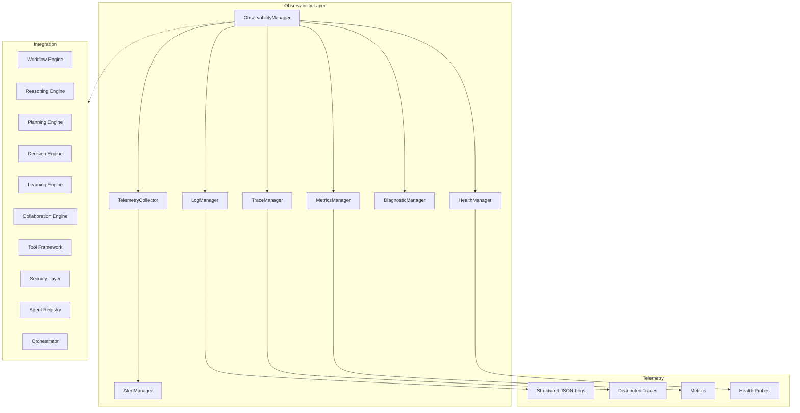

# Platform Observability Layer

> Sprint 5.2 — centralized logging, tracing, metrics, health monitoring, and diagnostics

## Overview

The Platform Observability Layer provides **complete visibility into platform behavior** through structured logging, distributed tracing, metrics collection, health monitoring, alerts, and diagnostics.

**Extends existing `platform_observability` services without modifying Sprint 1–5.1 architecture.**

---

## Architecture



---

## Core Components

| Component | Role |
|-----------|------|
| `ObservabilityManager` | Unified observability entry point |
| `LogManager` | Structured JSON logging with correlation IDs |
| `TraceManager` | End-to-end distributed tracing |
| `MetricsManager` | Platform + engine metrics collection |
| `HealthManager` | Platform, agent, workflow, tool, memory health |
| `DiagnosticManager` | Timelines, performance reports, failure analysis |
| `AlertManager` | Alert routing, deduplication, rate limiting |
| `TelemetryCollector` | Unified collection + threshold evaluation |
| `MonitoringContext` | Correlation context (request, workflow, agent, task) |

---

## Telemetry Model

### Logging

- Structured JSON format
- Log levels: INFO, WARNING, ERROR
- Correlation IDs, request IDs, workflow IDs, agent IDs, task IDs
- Component tagging and filtering
- Retention via `RetentionManager`

### Tracing

- Request/workflow/task/agent/tool spans
- Cross-service correlation via trace ID
- Trace export interface
- Slowest span analysis

### Metrics

| Metric | Description |
|--------|-------------|
| `system.cpu.percent` | CPU usage |
| `system.memory.percent` | Memory usage |
| `workflow.duration_ms` | Workflow execution time |
| `workflow.success_rate` | Workflow success rate |
| `tool.latency_ms` | Tool execution latency |
| `agent.latency_ms` | Agent execution latency |
| `jobs.queue.size` | Queue depth |
| `eventbus.events_per_second` | Event throughput |
| `platform.active_sessions` | Active agent sessions |

---

## Health Monitoring

| Check | Scope |
|-------|-------|
| Platform | Database, Redis, jobs, integrations, event bus |
| Workflow | Success rate and execution count |
| Agents | Registry enabled/total counts |
| Tools | Error rate and executions |
| Memory | Memory engine availability |
| Dependencies | All infrastructure components |

---

## Alert Thresholds

| Alert | Trigger |
|-------|---------|
| High error rate | Error rate > 10% |
| Slow workflows | Duration > 5000ms |
| Agent failures | Failure rate > 20% |
| Tool failures | Failure rate > 20% |
| Memory pressure | Memory > 90% |
| Queue overflow | Queue size > 1000 |

Configure custom thresholds via `observability_manager.configure_alert()`.

---

## Usage

### Bind monitoring context

```python
from platform_observability import observability_manager, MonitoringContext

ctx = observability_manager.create_context(
    request_id="req-123",
    workflow_id="wf-456",
    agent_id="auto_agent",
)
observability_manager.bind_context(ctx)
observability_manager._logs.info("Processing started", component="workflow")
```

### Distributed tracing

```python
trace_id = observability_manager._traces.start_request_trace("buy_car", ctx)
span = observability_manager._traces.trace_agent("auto_agent", "reason")
observability_manager._traces.end_span(span)
traces = observability_manager.export_traces()
```

### Collect telemetry & health

```python
telemetry = await observability_manager.collect_telemetry()
health = await observability_manager.check_health()
report = await observability_manager.diagnose(title="Daily Report")
```

### Alerts

```python
from platform_observability import AlertThreshold

observability_manager.configure_alert(
    AlertThreshold("custom_slow", "workflow.duration_ms", "gt", 3000.0, "warning")
)
await observability_manager.raise_alert(
    name="manual_alert",
    severity="warning",
    source="ops",
    message="Investigate latency spike",
)
```

---

## Integration Bridges

| Layer | Bridge |
|-------|--------|
| Workflow | `trace_workflow_execution()` |
| All AI engines | `collect_platform_engines()` |
| Security | `bridge_security_audit()` |
| Orchestrator | `orchestrator_context()` |

---

## Developer Guide

1. Create a `MonitoringContext` at request/workflow entry
2. Bind context before logging or tracing
3. End spans when operations complete
4. Run `collect_telemetry()` on a schedule for metrics + alerts
5. Use `diagnose()` for incident investigation
6. Configure alert thresholds for your environment
7. Use Management API `/management/observability/*` for dashboard access

Package location: `platform_observability/`

Tests: `tests/test_observability_layer.py`, `tests/test_observability.py`
