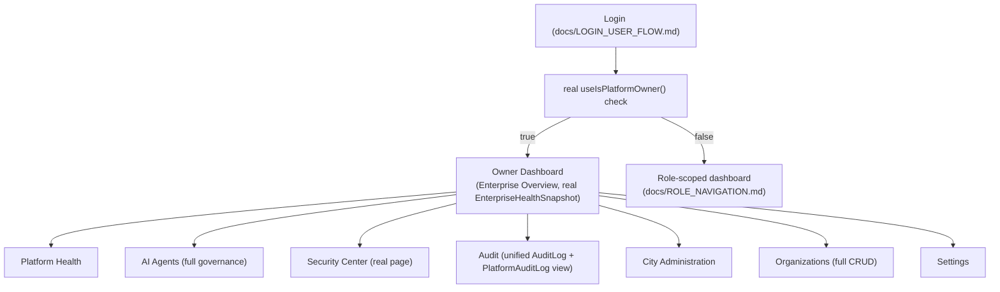

# Sprint CQ-30.1 — Owner Mode UX

**Sprint:** CQ-30.1 — UX Design. Documentation only, `src` not modified.

**Do not duplicate:** real `SecurityCenterPage.tsx` (`src/web/auth/pages/`), real `EXECUTIVE_OPERATING_
SYSTEM.md` (CQ-15, `MissionControlStrip`/`ExecutiveMorningBrief`), real `AI_AGENT_GOVERNANCE.md`
(Agent Health/Performance/Audit), and real `TERRITORIAL_GOVERNANCE.md` (CQ-16) already implement most
of Owner Mode's eleven brief items individually. This document composes them into one coherent Owner
shell — it adds no new backend capability.

## 1. Per-item mapping (brief's eleven)

| Brief item | Real foundation | Owner Mode UX |
|---|---|---|
| Platform Health | Real `healthService`/`RuntimeHealthId` (CG-4/CG-6) + real `orchestrator`/`RuntimeHealth.ts` (Sprint 29.8, `docs/RUNTIME_CONSISTENCY.md`, CQ-30) | A composite health strip across all real runtimes — reuses `orchestrator`'s real health registry rather than a new health engine |
| Enterprise Overview | Real `EnterpriseHealthSnapshot` (`docs/ENTERPRISE_HEALTH.md`, CQ-15) | The composite snapshot, rendered as the Owner's landing view |
| AI Agents | Real `AITeamCenterPage.tsx` + real `AI_AGENT_GOVERNANCE.md` (Agent Health/Performance/Execution Audit/Security Monitoring) | Owner sees the full governance surface; other roles (§`ROLE_NAVIGATION.md`) see only their own agents |
| Security Center | Real `SecurityCenterPage.tsx` (`src/web/auth/pages/`) | Reused directly — Owner Mode links to the existing real page, no redesign |
| Audit | Real `AuditLog`/`PlatformAuditLog` (CQ-12) | A searchable audit view over both real tables — presented as one unified view even though the backend has two tables, per the same "compose, don't merge" discipline used throughout this engagement |
| Analytics | Real `TERRITORIAL_ANALYTICS.md`/`BUSINESS_VALUE_METRICS.md` (CQ-16/CQ-18) composite snapshots | Owner-scoped, unfiltered version of the same real composites other roles see filtered |
| Architecture | **No committed real artifact confirmed this sprint** — `docs/ARCHITECTURE_REPORT.md` (referenced repeatedly in `docs/TECH_DEBT.md`) does not currently exist as a file; it is presumably generated on demand by `scripts/generate_architecture_baseline.py` | Owner Mode surfaces a "regenerate & view" action rather than a static page — flagged as needing confirmation of the real generation flow before implementation |
| Developer Tools | No dedicated real UI surface confirmed this sprint | Flagged as open design space — likely a link out to `platform_console` (the real, separate TS-kernel-facing admin console) rather than a duplicate tool built into the main Owner shell |
| City Administration | Real `TERRITORIAL_GOVERNANCE.md` (CQ-16) — Regional/City Administrator/District Manager scope tiers | Owner Mode is the one place these SPEC governance roles would actually be assignable, once implemented |
| Organizations | Real `organizationManager`/`multi_company.Company`/`Branch` (CQ-15) | A real org list/switcher, elevated to full CRUD for Owner (vs. the read-only switcher other roles get, `UX_ARCHITECTURE.md` §1) |
| Settings | Real `platform_configuration`/`ConfigurationCenter` | Owner-only — includes the real JWT/security settings this engagement's audit work (`docs/TECH_DEBT.md` TD-57) found need careful UI treatment (e.g., a production warning banner if `fail_fast` is off) |

## 2. Owner Mode navigation flow

## 3. The one Beta-critical caveat

Owner Mode's Settings surface should not expose the raw `fail_fast`/JWT-secret configuration as a
freeform text field — given `docs/TECH_DEBT.md` TD-57's finding that the real production-safety check
is currently non-blocking by explicit configuration, an Owner-facing Settings UI is exactly where a
misconfiguration would either get caught (a clear warning) or made worse (a UI implying safety that
isn't enforced). This is a UX-and-security intersection worth flagging to whoever implements this
screen, not just the backend team.

## Non-goals

- No new health/audit/analytics engine — every item composes a real, already-cited system.
- No Architecture/Developer Tools implementation designed — both flagged as needing confirmation of
  the real underlying artifact/flow before UX work proceeds.

## Related documents

`docs/EXECUTIVE_OPERATING_SYSTEM.md` (CQ-15), `docs/TERRITORIAL_GOVERNANCE.md` (CQ-16), `docs/TECH_
DEBT.md` (TD-57), `docs/ROLE_NAVIGATION.md`/`docs/UX_ARCHITECTURE.md` (CQ-30.1 siblings).
