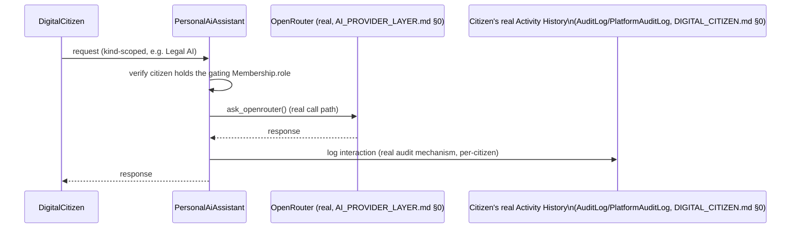

# Enterprise Digital Citizens — Personal AI

**Sprint:** CQ-12 — Architecture Research + Product Research. Documentation only, `src` not modified.

**Do not duplicate:** `AI_AGENT_LIFECYCLE.md` §0 (CG-8) already catalogued three-plus disconnected
agent registries (`platform_agents`, `platform_orchestrator.agent_registry`, `platform_ai_os`'s Agent
Registry 2.0). This document does not re-derive that finding — it adds the one dimension none of them
have: **ownership by an individual citizen**, confirmed absent this sprint.

## 0. The headline finding — no AI agent is owned by a person anywhere in this codebase

Targeted research confirmed: no real agent record (`platform_agents.AgentMetadata`,
`platform_orchestrator.AgentMetadata`, frontend `AiAgentRuntime`) has a `userId`/`ownerId` field. Every
real agent is scoped to a **workflow** (`AiAgentRuntime.workflow`) or exists as a **tenant/company-wide
configured capability** (`ai_conversation_skills.py`'s `AiSkill`, scoped to `tenant_id`/`company_id`,
not a person). "Personal AI" — an assistant belonging to *you specifically* — is genuinely new
architecture, not a reframing of something that already exists.

## 1. Ownership model (SPEC)

```ts
interface PersonalAiAssistant {
  id: string;
  ownerCitizenId: string;         // DIGITAL_CITIZEN.md — the new field no real agent record has today
  kind: "personal" | "work" | "legal" | "financial" | "sales" | "developer" | "executive";
  underlyingAgentId?: string;     // SPEC — once the CG-8 registry consolidation (AI_OS.md §0) resolves,
                                   // this references whichever real registry becomes canonical
  scopedToMembership?: string;    // CITIZEN_ORGANIZATION_MEMBERSHIP.md — e.g. a "Legal AI" scoped
                                   // to the citizen's Lawyer Membership at a specific company
  provider: "openrouter";          // AI_PROVIDER_LAYER.md §0 (CG-8) — the one real, wired LLM provider
}
```

**Design decision**: `PersonalAiAssistant` is proposed as a **thin ownership wrapper**, not a new agent
implementation — `underlyingAgentId` points at whatever real agent registry ends up canonical
(`AI_OS.md` §0, CG-8's still-open consolidation question), and every assistant's actual LLM calls route
through the one real, wired provider (`AI_PROVIDER_LAYER.md` §0, CG-8: OpenRouter, `openrouter.py`) —
this document adds ownership, not a fourth agent execution path.

## 2. The seven kinds — scoped by Membership, not a new capability system

| Kind | Scoping |
|---|---|
| Personal AI | Unscoped — belongs to the citizen regardless of which company context they're in |
| Work AI | Scoped to the citizen's `primaryMembership` (`DIGITAL_CITIZEN.md` §1) |
| Legal AI | Scoped to a Lawyer/Consultant `Membership` specifically — reuses the real `EngineRoleCode.LAWYER` (`CITIZEN_ORGANIZATION_MEMBERSHIP.md` §0) as the gating condition, not a new capability flag |
| Financial AI | Scoped to an Accountant `Membership` (`EngineRoleCode.ACCOUNTANT`, same real gating pattern) |
| Sales AI | Scoped to a Sales `Membership` |
| Developer AI | Scoped to a Developer `Membership` — the real Command Runtime/Command Center (`CITY_USER_JOURNEYS.md` §4, CG-5) is this kind's most natural real integration point, since Developer's journey already exits City into that surface |
| Executive AI | Scoped to Owner/CEO/Director `Membership`s — the closest real analog is the Executive Advisor persona already documented platform-wide (`ENTERPRISE_AI_OS.md`, `08_AI_PERSONALITY.md`) |

No new capability/permission system is proposed for any of the seven — each kind's availability gates
on the citizen already holding the relevant real `Membership.role`, reusing
`CITIZEN_ORGANIZATION_MEMBERSHIP.md` §4's real permission chain.

## 3. Human ↔ AI interaction (brief's explicit ask)



Every interaction logs to the citizen's **real** per-user audit trail (`DIGITAL_CITIZEN.md` §0's
strongest-grounded finding) rather than a new AI-interaction-specific log — one activity history per
citizen, not a separate one for AI usage.

## 4. Non-goals

- No new agent execution engine — every `PersonalAiAssistant` delegates to whichever real agent
  registry/provider this engagement's prior research already found.
- No new permission/capability system for the seven kinds — all gate on real `Membership.role`.
- No resolution of `AI_OS.md` §0's registry-consolidation question — `underlyingAgentId` is designed to
  point at whichever answer that question eventually gets, not to force an answer here.

## Related documents

`AI_AGENT_LIFECYCLE.md`/`AI_OS.md` §0 (CG-8, the registry fragmentation this document's
`underlyingAgentId` defers to), `AI_PROVIDER_LAYER.md` §0 (CG-8, the real OpenRouter call path),
`CITIZEN_ORGANIZATION_MEMBERSHIP.md` (the real `Membership.role` gating mechanism), `DIGITAL_CITIZEN.md`
§0/§4 (the real per-citizen audit trail, the `ai_assistant` citizen kind).
