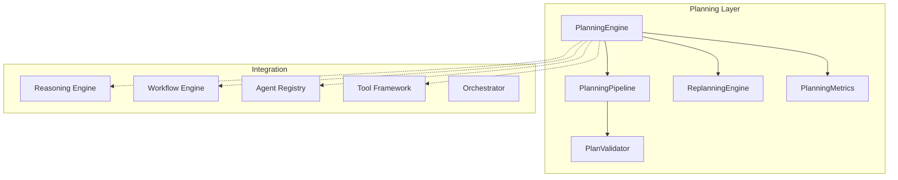

# Platform Planning Engine

> Sprint 4.2 — goal-oriented execution planning for AI agents

## Overview

The Platform Planning Engine transforms **goals into executable multi-step plans** integrated with the Workflow Engine. Agents plan before acting, with support for adaptive replanning and recovery.

**No LLM dependency. No modifications to Sprint 1–4.1 architecture.**

---

## Architecture



---

## Core Components

| Component | Role |
|-----------|------|
| `PlanningEngine` | Central planning entry |
| `PlanningContext` | Goal + resources + reasoning |
| `ExecutionPlan` | Multi-step executable plan |
| `PlanStep` | Individual plan step |
| `PlanCandidate` | Alternative plan option |
| `PlanningStrategy` | Strategy enum |
| `PlanningResult` | Plan + workflow definition |
| `PlanValidator` | Dependency & resource validation |

---

## Planning Strategies

| Strategy | Description |
|----------|-------------|
| Sequential | Linear step chain |
| Parallel | Parallel sub-steps + finalize |
| Hierarchical | Parent goal + child steps |
| Goal decomposition | Decompose → prioritize → execute |
| Dependency-aware | Sequential + agent/tool assignment (default) |
| Adaptive replanning | Dependency-aware + monitor step |

---

## Planning Pipeline

1. Receive goal
2. Analyze available resources (agents, tools, capabilities)
3. Determine required agents and tools
4. Estimate execution cost
5. Generate execution plan via strategy
6. Validate dependencies, permissions, resources
7. Produce executable workflow definition

---

## Usage

```python
from platform_planning import PlanningContext, PlanningStrategy, planning_engine

ctx = PlanningContext(
    goal="Buy a Toyota SUV under $30,000",
    agent_id="auto_agent",
    intent="buy_car",
    capabilities=["buy_car", "vehicle_inspection", "auto_financing"],
    available_tools=["crm_lookup"],
    permissions=["execute"],
)

result = await planning_engine.plan(ctx, strategy=PlanningStrategy.DEPENDENCY_AWARE)
print(result.plan.step_count, result.plan.estimated_cost)
print(result.workflow_definition)

# With reasoning integration
result = await planning_engine.plan_for_agent("auto_agent", "Buy SUV", use_reasoning=True)

# Execute via workflow engine
exec_result = await planning_engine.execute_plan(result)
```

---

## Replanning

```python
# Mark progress
planning_engine.mark_step_completed(result.plan.plan_id, "step_search", {"vehicles": 5})

# Replan after failure
new_plan = await planning_engine.replan(
    result.plan.plan_id,
    failed_step_id="step_inspect",
    context=ctx,
    error="inspection timeout",
)
# Completed steps reused, alternative path generated
```

---

## Plan Validation

| Check | Description |
|-------|-------------|
| Circular dependencies | DFS cycle detection |
| Missing capabilities | Step capability vs available |
| Permissions | Execute/admin required |
| Resources | Tools and agents availability |

---

## Integration

| Layer | Bridge |
|-------|--------|
| Reasoning | `context_from_reasoning()` — auto intent + confidence |
| Workflow | `execute_plan()` — runs generated workflow |
| Tools | Tool assignment on dependency-aware steps |
| Agents | Capability and agent validation |
| Orchestrator | `orchestrator_routing()` — first capability + cost |

---

## Metrics

```python
planning_engine.metrics_summary()
# plans, avg_planning_latency_ms, avg_plan_size,
# plan_success_rate, replanning_count, execution_efficiency
```

---

## Examples

### Auto purchase plan

```python
result = await planning_engine.plan_for_agent("auto_agent", "Buy diesel SUV")
# steps: search → inspect → finance
```

### Legal review plan

```python
result = await planning_engine.plan(
    PlanningContext(goal="Review NDA", intent="legal_contract", capabilities=["legal_contract"]),
)
# steps: review → compliance
```

### Replan after failure

```python
await planning_engine.mark_step_completed(plan_id, "step_search", {"found": 3})
new_plan = await planning_engine.replan(plan_id, "step_inspect", ctx, error="timeout")
```

---

## Developer Guide

1. Build `PlanningContext` with goal, capabilities, tools, permissions
2. Choose strategy based on parallelism vs depth needs
3. Validate with `PlanValidator` before execution
4. Execute via `planning_engine.execute_plan(result)`
5. Use replanning on step failures — completed steps are preserved
6. Subscribe to `PlanningStartedEvent`, `PlanningCompletedEvent`, `ReplanningTriggeredEvent`

---

## Compatibility

All Sprint 1–4.1 packages remain unmodified. Integration via bridges only.
