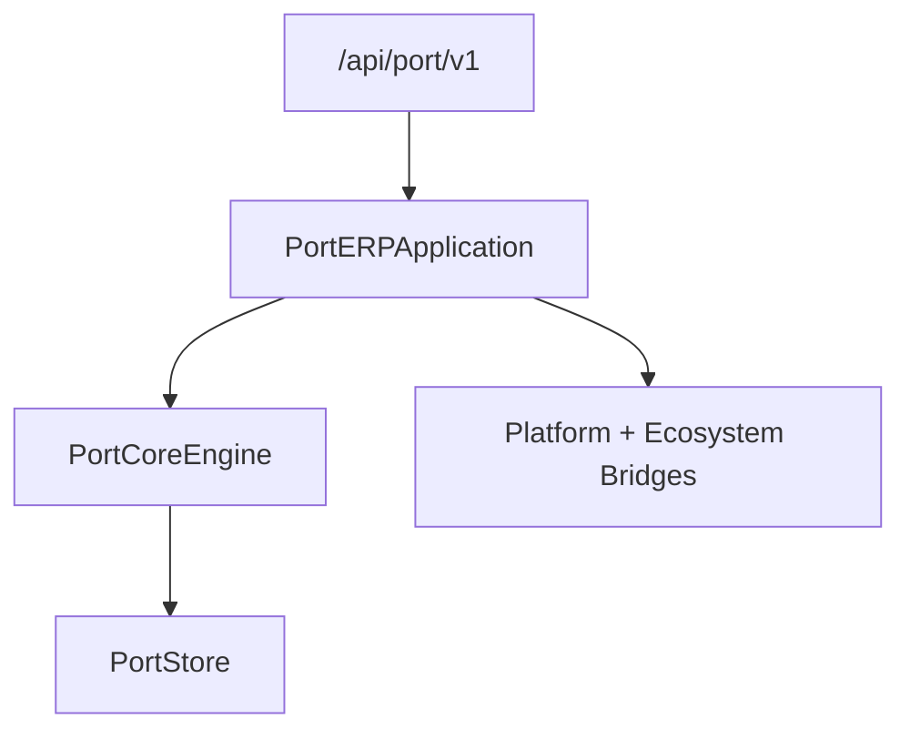

# Port ERP — Sprint 9.1 Foundation

Port operations ERP for **Port ERP 1.0.0-alpha**.

| Field | Value |
|-------|-------|
| Application name | Port ERP |
| Application version | `1.0.0-alpha` |
| Platform | AI Platform Core v3 (bridge only) |
| Ecosystem | AI Ecosystem v1.5 (bridge only) |
| API | `/api/port/v1` |

**Hard constraint:** AI Platform Core and AI Ecosystem are not modified. Integration is only via `integrations/platform_bridge.py` and `integrations/ecosystem_bridge.py`.

## Architecture



## Modules

`port_core/` · `port_management/` · `terminals/` · `berths/` · `vessels/` · `containers/` · `cargo/` · `customers/` · `companies/` · `operations/` · `documents/` · `billing/` · `shared/`

## Domain models

Port · Terminal · Berth · Vessel · Voyage · Container · Cargo · Warehouse · Gate · Carrier · ShippingLine · Customer · Forwarder · CustomsBroker · PortOperator

## Registries / services

| Service | Role |
|---------|------|
| Port Registry | Ports |
| Terminal Registry | Terminals |
| Berth Manager | Berths + assignment |
| Vessel Registry | Vessels / voyages / arrive / depart |
| Container Registry | Receive / release |
| Cargo Registry | Load / unload |
| Company Registry | Lines, forwarders, brokers, carriers, operators |
| Customer Registry | Customers |

## RBAC roles

Port Director · Terminal Manager · Dispatcher · Warehouse Manager · Container Operator · Crane Operator · Forwarder · Shipping Line · Broker · Customer · Administrator · AI Executive

## REST API

| Area | Prefix |
|------|--------|
| Health / roles | `/api/port/v1/health`, `/roles` |
| Ports | `/ports` |
| Terminals | `/terminals` |
| Berths | `/berths` |
| Vessels / voyages | `/vessels`, `/voyages` |
| Containers | `/containers` |
| Cargo | `/cargo` |
| Customers | `/customers` |
| Companies | `/companies/*` |
| Operations | `/operations/*` |

## Events

`VesselArrived` · `VesselDeparted` · `ContainerReceived` · `ContainerReleased` · `CargoLoaded` · `CargoUnloaded` · `BerthAssigned` · `GateOpened` · `GateClosed`

## Developer guide

```python
from applications.port_erp import port_erp
from applications.port_erp.shared.models import Port, Terminal, Vessel

port = port_erp.core.ports.register(Port(name="Mombasa", code="KEMBA", country="KE"))
terminal = port_erp.core.terminals.register(
    Terminal(port_id=port.port_id, name="CT1", capacity_teu=50000)
)
vessel = port_erp.core.vessels.register(Vessel(name="Pacific Star", imo="1234567"))
health = port_erp.health()
```
