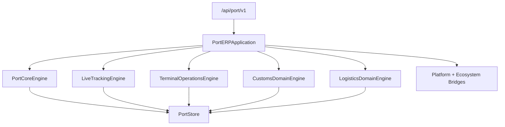

# Port ERP — Foundation through Logistics (Sprint 9.5)

Port operations ERP for **Port ERP 1.4.0-alpha**.

| Field | Value |
|-------|-------|
| Application name | Port ERP |
| Application version | `1.4.0-alpha` |
| Tracking engine | `1.0` |
| Terminal engine | `1.0` |
| Customs engine | `1.0` |
| Logistics engine | `1.0` |
| Platform | AI Platform Core v3 (bridge only) |
| Ecosystem | AI Ecosystem v1.5 (bridge only) |
| API | `/api/port/v1` |

**Hard constraint:** AI Platform Core and AI Ecosystem are not modified. Integration is only via bridges.

## Architecture



## Modules

Foundation · Tracking (9.2) · Terminal (9.3) · Customs (9.4) · **Logistics (9.5):** `shipping_lines/` · `forwarders/` · `carriers/` · `multimodal/` · `routes/` · `booking/` · `transport_orders/` · `rail/` · `road/` · `air/` · `fleet/`

## REST API

| Area | Prefix |
|------|--------|
| Core | `/ports`, `/terminals`, `/vessels`, … |
| Tracking | `/tracking`, `/gps`, `/maps`, `/timeline` |
| Terminal | `/terminal`, `/warehouse`, `/yard`, `/gate`, `/equipment`, `/planning` |
| Customs | `/customs`, `/documents`, `/certificates`, `/trade`, `/broker`, `/compliance` |
| Logistics | `/shipping`, `/forwarders`, `/carriers`, `/routes`, `/bookings`, `/transport` |

## Docs

- [PORT_TRACKING.md](PORT_TRACKING.md)
- [PORT_TERMINAL.md](PORT_TERMINAL.md)
- [PORT_CUSTOMS.md](PORT_CUSTOMS.md)
- [PORT_LOGISTICS.md](PORT_LOGISTICS.md)

```python
from applications.port_erp import port_erp

health = port_erp.health()
assert health["application_version"] == "1.4.0-alpha"
assert health["logistics_engine"] == "1.0"
```
