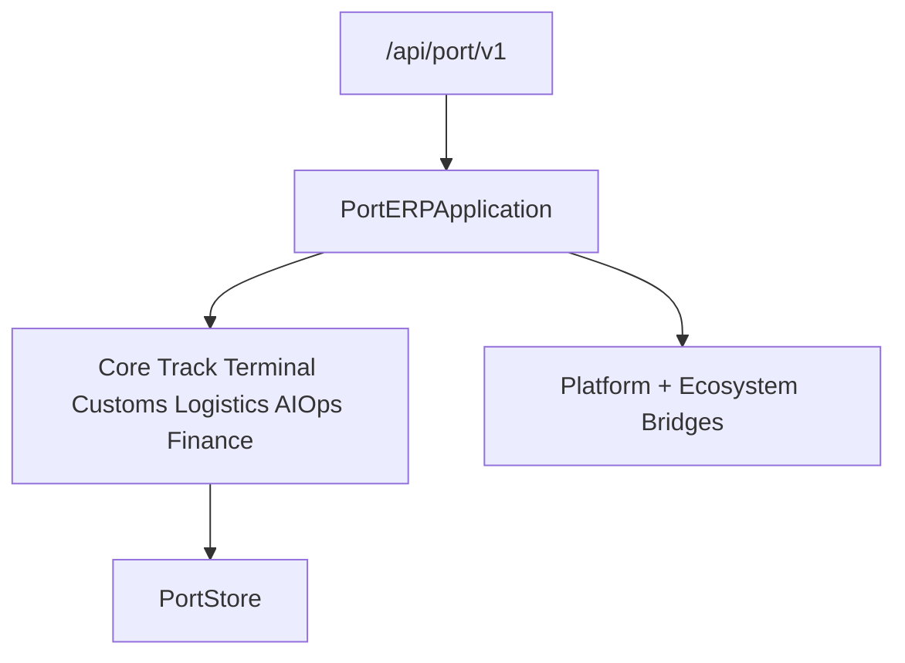

# Port ERP — Foundation through Finance (Sprint 9.7)

Port operations ERP for **Port ERP 1.6.0-alpha**.

| Field | Value |
|-------|-------|
| Application name | Port ERP |
| Application version | `1.6.0-alpha` |
| Tracking / Terminal / Customs / Logistics / AI Ops | `1.0` each |
| Finance engine | `1.0` |
| Platform | AI Platform Core v3 (bridge only) |
| Ecosystem | AI Ecosystem v1.5 (bridge only) |
| API | `/api/port/v1` |

**Hard constraint:** AI Platform Core and AI Ecosystem are not modified. Integration is only via bridges.

## Architecture



## Modules (9.7)

`finance/` · `billing/` · `contracts/` · `tariffs/` · `invoices/` · `payments/` · `accounting/` · `customers/` · `suppliers/` · `currencies/` · `taxes/` · `budget/` · `profitability/`

## REST API (Finance)

`/finance` · `/billing` · `/contracts` · `/tariffs` · `/invoices` · `/payments` · `/accounting`

## Docs

- [PORT_TRACKING.md](PORT_TRACKING.md)
- [PORT_TERMINAL.md](PORT_TERMINAL.md)
- [PORT_CUSTOMS.md](PORT_CUSTOMS.md)
- [PORT_LOGISTICS.md](PORT_LOGISTICS.md)
- [PORT_AI.md](PORT_AI.md)
- [PORT_FINANCE.md](PORT_FINANCE.md)

```python
from applications.port_erp import port_erp

health = port_erp.health()
assert health["application_version"] == "1.6.0-alpha"
assert health["finance_engine"] == "1.0"
```
