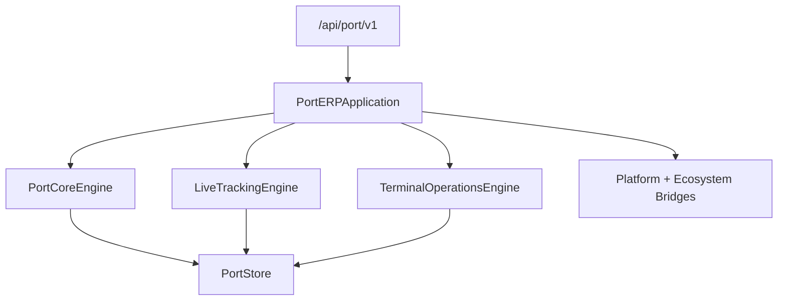

# Port ERP — Foundation, Tracking & Terminal Operations

Port operations ERP for **Port ERP 1.2.0-alpha**.

| Field | Value |
|-------|-------|
| Application name | Port ERP |
| Application version | `1.2.0-alpha` |
| Tracking engine | `1.0` |
| Terminal engine | `1.0` |
| Platform | AI Platform Core v3 (bridge only) |
| Ecosystem | AI Ecosystem v1.5 (bridge only) |
| API | `/api/port/v1` |

**Hard constraint:** AI Platform Core and AI Ecosystem are not modified. Integration is only via `integrations/platform_bridge.py` and `integrations/ecosystem_bridge.py`.

## Architecture



## Modules

Foundation: `port_core/` · `port_management/` · `terminals/` · `berths/` · `vessels/` · `containers/` · `cargo/` · `customers/` · `companies/` · `operations/` · `documents/` · `billing/` · `shared/`

Tracking (9.2): `tracking/` · `ais/` · `gps/` · `fleet/` · `geofence/` · `maps/` · `timeline/`

Terminal (9.3): `terminal_operations/` · `yard_management/` · `warehouse_management/` · `gate_management/` · `equipment/` · `cranes/` · `dispatch/` · `planning/` · `storage/` · `inventory/`

## REST API

| Area | Prefix |
|------|--------|
| Health / roles | `/health`, `/roles` |
| Ports / terminals / berths | `/ports`, `/terminals`, `/berths` |
| Vessels / containers / cargo | `/vessels`, `/containers`, `/cargo` |
| Tracking | `/tracking`, `/gps`, `/maps`, `/timeline` |
| Terminal ops | `/terminal`, `/warehouse`, `/yard`, `/gate`, `/equipment`, `/planning` |

## Events

Foundation + Tracking + Terminal: `TruckArrived` · `TruckDeparted` · `ContainerStored` · `ContainerMoved` · `ContainerReleased` · `CraneAssigned` · `CraneFinished` · `WarehouseUpdated` · `GateApproved` · `GateRejected`

## Developer guide

```python
from applications.port_erp import port_erp

health = port_erp.health()
assert health["application_version"] == "1.2.0-alpha"
assert health["terminal_engine"] == "1.0"
```

## Docs

- [PORT_TRACKING.md](PORT_TRACKING.md) — live tracking
- [PORT_TERMINAL.md](PORT_TERMINAL.md) — terminal / yard / warehouse / gate
