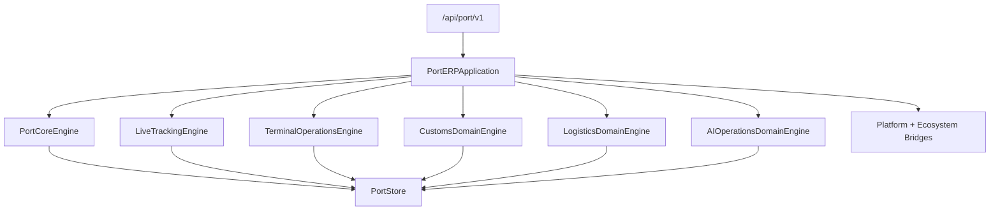

# Port ERP — Foundation through AI Operations (Sprint 9.6)

Port operations ERP for **Port ERP 1.5.0-alpha**.

| Field | Value |
|-------|-------|
| Application name | Port ERP |
| Application version | `1.5.0-alpha` |
| Tracking engine | `1.0` |
| Terminal engine | `1.0` |
| Customs engine | `1.0` |
| Logistics engine | `1.0` |
| AI operations engine | `1.0` |
| Platform | AI Platform Core v3 (bridge only) |
| Ecosystem | AI Ecosystem v1.5 (bridge only) |
| API | `/api/port/v1` |

**Hard constraint:** AI Platform Core and AI Ecosystem are not modified. Integration is only via bridges.

## Architecture



## Modules

Foundation · Tracking (9.2) · Terminal (9.3) · Customs (9.4) · Logistics (9.5) · **AI Ops (9.6):** `digital_twin/` · `executive_ai/` · `operations_center/` · `optimization/` · `berth_scheduler/` · `yard_optimizer/` · `resource_manager/` · `prediction/` · `simulation/` · `dashboard/` · `alerts/`

## REST API (AI Ops)

`/digital-twin` · `/dashboard` · `/operations/center` · `/simulation` · `/optimization` · `/executive`

## Docs

- [PORT_TRACKING.md](PORT_TRACKING.md)
- [PORT_TERMINAL.md](PORT_TERMINAL.md)
- [PORT_CUSTOMS.md](PORT_CUSTOMS.md)
- [PORT_LOGISTICS.md](PORT_LOGISTICS.md)
- [PORT_AI.md](PORT_AI.md)

```python
from applications.port_erp import port_erp

health = port_erp.health()
assert health["application_version"] == "1.5.0-alpha"
assert health["ai_operations_engine"] == "1.0"
```
