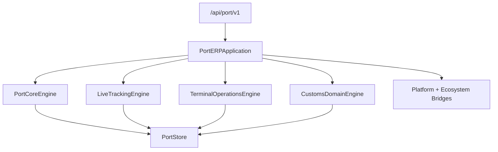

# Port ERP — Foundation through Customs (Sprint 9.4)

Port operations ERP for **Port ERP 1.3.0-alpha**.

| Field | Value |
|-------|-------|
| Application name | Port ERP |
| Application version | `1.3.0-alpha` |
| Tracking engine | `1.0` |
| Terminal engine | `1.0` |
| Customs engine | `1.0` |
| Platform | AI Platform Core v3 (bridge only) |
| Ecosystem | AI Ecosystem v1.5 (bridge only) |
| API | `/api/port/v1` |

**Hard constraint:** AI Platform Core and AI Ecosystem are not modified. Integration is only via bridges.

## Architecture



## Modules

Foundation · Tracking (9.2) · Terminal (9.3) · **Customs (9.4):** `customs/` · `documents/` · `compliance/` · `certificates/` · `cargo_flow/` · `inspection/` · `international_trade/` · `incoterms/` · `tariffs/` · `broker/`

## REST API

| Area | Prefix |
|------|--------|
| Core | `/ports`, `/terminals`, `/vessels`, `/containers`, … |
| Tracking | `/tracking`, `/gps`, `/maps`, `/timeline` |
| Terminal | `/terminal`, `/warehouse`, `/yard`, `/gate`, `/equipment`, `/planning` |
| Customs | `/customs`, `/documents`, `/certificates`, `/trade`, `/broker`, `/compliance` |

## Docs

- [PORT_TRACKING.md](PORT_TRACKING.md)
- [PORT_TERMINAL.md](PORT_TERMINAL.md)
- [PORT_CUSTOMS.md](PORT_CUSTOMS.md)

```python
from applications.port_erp import port_erp

health = port_erp.health()
assert health["application_version"] == "1.3.0-alpha"
assert health["customs_engine"] == "1.0"
```
