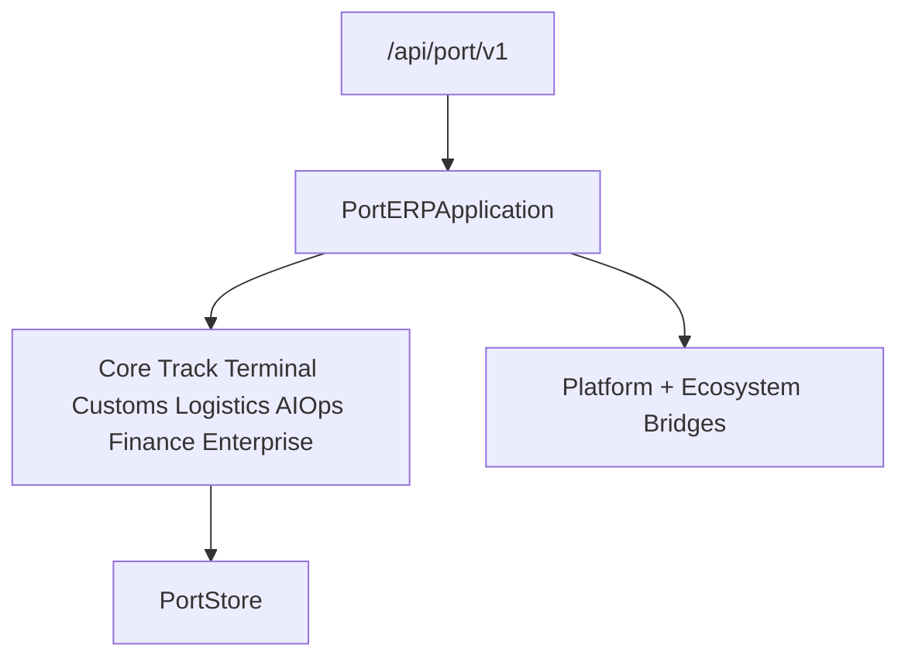

# Port ERP — Foundation through Production Release (Sprint 9.8)

Port operations ERP for **Port ERP 2.0.0**.

| Field | Value |
|-------|-------|
| Application name | Port ERP |
| Application version | `2.0.0` |
| Tracking / Terminal / Customs / Logistics / AI Ops / Finance | `1.0` each |
| Enterprise engine | `1.0` |
| Global network | `1.0` |
| Platform | AI Platform Core v3 (bridge only) |
| Ecosystem | AI Ecosystem v1.5 (bridge only) |
| API | `/api/port/v1` |

**Hard constraint:** AI Platform Core and AI Ecosystem are not modified. Integration is only via bridges.

## Architecture



## Modules (9.8)

`enterprise/` · `integration/` · `network/` · `digital_exchange/` · `global_registry/` · `partners/` · `analytics_global/` · `production/` · `deployment/` · `health/`

## REST API (Enterprise / Network / Production)

`/network` · `/integration` · `/global` · `/production` · `/enterprise`

## Docs

- [PORT_TRACKING.md](PORT_TRACKING.md)
- [PORT_TERMINAL.md](PORT_TERMINAL.md)
- [PORT_CUSTOMS.md](PORT_CUSTOMS.md)
- [PORT_LOGISTICS.md](PORT_LOGISTICS.md)
- [PORT_AI.md](PORT_AI.md)
- [PORT_FINANCE.md](PORT_FINANCE.md)
- [PORT_NETWORK.md](PORT_NETWORK.md)
- [PORT_ENTERPRISE.md](PORT_ENTERPRISE.md)
- [PORT_RELEASE.md](PORT_RELEASE.md)

```python
from applications.port_erp import port_erp

health = port_erp.health()
assert health["application_version"] == "2.0.0"
assert health["enterprise_engine"] == "1.0"
assert health["global_network"] == "1.0"
```
