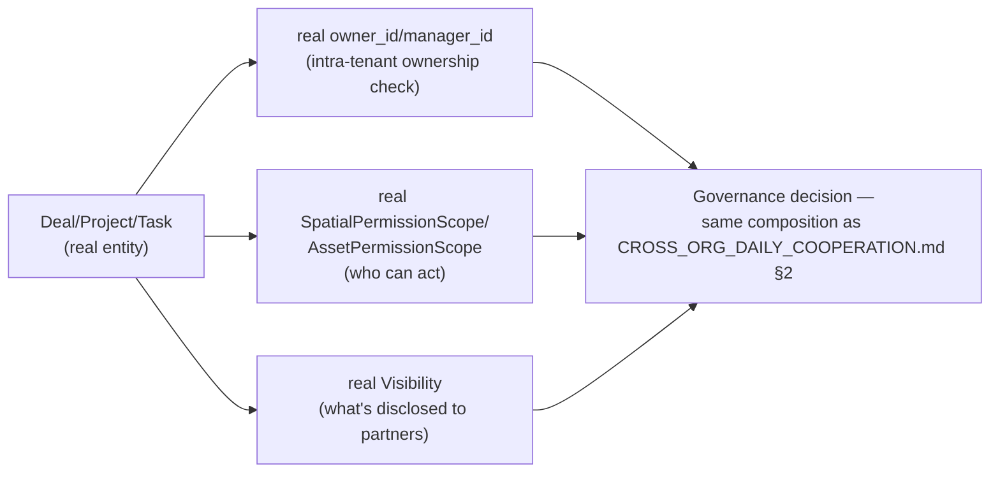

# Enterprise Process Canon — Governance

**Sprint:** CQ-19 — Architecture Research + Governance Design. Documentation only, `src` not modified.

**Do not duplicate:** No new permission, ownership, audit, or compliance engine is proposed. This
document composes real mechanisms already established across this engagement; its one new finding is
that **History/Versioning has no generic real precedent at all** — confirmed this sprint by a full
read of `database/models/mixins.py` (four mixins: `UUIDPrimaryKeyMixin`, `TimestampMixin`,
`CreatedAtMixin`, `SoftDeleteMixin` — no `HistoryMixin`/`VersionedMixin` exists).

## 1. Per-item mapping (brief's six)

| Brief item | Real/SPEC source |
|---|---|
| Permissions | Real composed `SpatialPermissionScope`/`AssetPermissionScope`/`Visibility` (`DIGITAL_TWIN_STANDARDS.md` §3, CQ-16) — reused unchanged |
| Ownership | Real `Deal.owner_id`/`.manager_id` (`ENTERPRISE_VALUE_CHAIN.md`, CQ-18), real `Membership` (CQ-12) |
| Audit | Real `AuditLog`/`PlatformAuditLog` (per-user, CQ-12) + real `DealStageHistory` (per-deal, CQ-18) — two real, independent audit mechanisms, at different granularity (user action vs. entity transition), correctly kept separate rather than merged |
| Compliance | Real `ComplianceRiskProfile`/`ComplianceVerificationLevel` (`ENTERPRISE_BUSINESS_NETWORK.md` §3.3, CQ-10) |
| History | **No generic real precedent** — every entity that tracks history reinvents its own table (`DealStageHistory` for deals, `AuditLog` for users). Confirmed this sprint via a full read of `mixins.py` |
| Versioning | **Absent entirely** — no real version-number field or optimistic-concurrency pattern found anywhere in `database/models/` |

## 2. `ProcessHistoryMixin` (SPEC) — generalizing `DealStageHistory`'s real shape, not inventing a new one

```ts
// SPEC — the shape every real per-entity history table already independently arrives at
// (DealStageHistory, and this sprint's own ProjectQualityCheck design, QUALITY_ASSURANCE_
// ARCHITECTURE.md, CQ-18). Proposed as a shared pattern future entities should follow,
// not a retrofit of existing tables.
interface ProcessHistoryEntry {
  id: string;
  entityType: string;        // "deal" | "project" | "task" | ... — same discriminator role as Deal.module
  entityId: string;
  fromState?: string;
  toState: string;
  changedBy: string;          // real Membership/citizen id
  validationPassed?: boolean; // mirrors real DealStageHistory.validation_passed, optional elsewhere
  version: number;             // SPEC — the versioning field no real entity has today
  at: string;
  notes?: string;
}
```

This is deliberately proposed as a **pattern to apply to new entities** (`Project`, `ProcessHistoryEntry`
itself) rather than a migration of `DealStageHistory` — per this engagement's standing discipline
(`CROSS_COMPANY_OPERATIONS.md`, CQ-15) of not merging real, independently-tuned systems reflexively.

## 3. Ownership composition (SPEC) — reuses the real CQ-16 permission composition exactly

A canonical-process entity's governance check composes the same three real vocabularies
`DIGITAL_TWIN_STANDARDS.md` §3 (CQ-16) already established for Public/Private Layers — no fourth
vocabulary, no new composition rule:



## Non-goals

- No merge of `AuditLog`/`PlatformAuditLog`/`DealStageHistory` into one table — kept separate, per
  their genuinely different granularity.
- No retrofit of `version` onto existing real tables — `ProcessHistoryMixin` is proposed for new
  entities only.
- No new permission/visibility vocabulary — §3 reuses the real CQ-16 composition exactly.

## Related documents

`docs/DIGITAL_TWIN_STANDARDS.md` §3 (CQ-16, the permission composition reused in §3),
`docs/ENTERPRISE_VALUE_CHAIN.md` §1 (CQ-18, real `DealStageHistory`), `docs/QUALITY_ASSURANCE_
ARCHITECTURE.md` (CQ-18, `ProjectQualityCheck`'s parallel real-history generalization),
`docs/CITIZEN_ORGANIZATION_MEMBERSHIP.md` (CQ-12, real `AuditLog`), `docs/ENTERPRISE_BUSINESS_
NETWORK.md` §3.3 (CQ-10, real `ComplianceRiskProfile`), `docs/CROSS_ORG_DAILY_COOPERATION.md` §2
(CQ-17, the composition discipline this mirrors), `docs/ENTITY_RECONCILIATION.md`/`docs/PROCESS_
STATE_MACHINE.md` (CQ-19 siblings).
