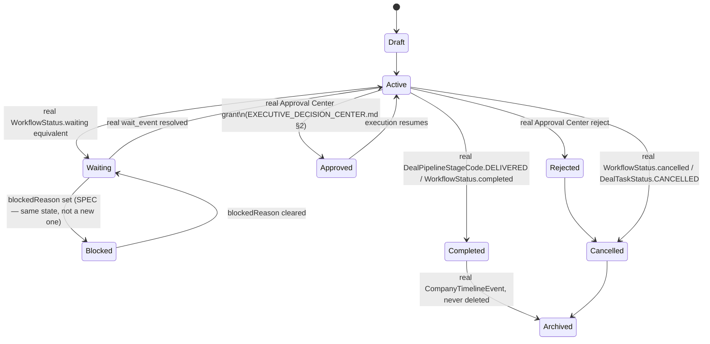

# Enterprise Process Canon — Process State Machine

**Sprint:** CQ-19 — Architecture Research + Canonical Design. Documentation only, `src` not modified.

**Do not duplicate:** No real system has all nine of the brief's states today. This document maps each
onto the closest real status enum and names the gaps plainly rather than fabricating full coverage.

## 1. Per-state mapping (brief's nine)

| Brief state | Closest real precedent |
|---|---|
| Draft | `tasks.Task.status` default `"NEW"` (free string, no enum, `database/models/tasks.py`) |
| Active | Real `DealStatus.ACTIVE` (`deal_pipeline_engine.py`) / frontend `WorkflowStatus.running` (`workflowRuntime`) |
| Waiting | Real frontend `WorkflowStatus.waiting`/`WorkflowSession.waitEventType` — the single richest real precedent for this state in the whole platform |
| Blocked | **Absent** — no real status enum anywhere distinguishes "blocked" from "waiting." SPEC: `blocked` is `waiting` with a non-empty `blockedReason`, not a fourth wait-shaped state |
| Approved | Real Approval Center outcome (`EXECUTIVE_DECISION_CENTER.md` §2, CQ-15) — not itself a stored enum value anywhere, but the real decision outcome that would set it |
| Rejected | Same real Approval Center, the other outcome |
| Completed | Real `DealStatus`-adjacent `DealPipelineStageCode.DELIVERED` (terminal) / real `WorkflowStatus.completed` |
| Cancelled | Real `WorkflowStatus.cancelled` / real `DealTaskStatus.CANCELLED` |
| Archived | Real "nothing disappears" principle (`CITY_LIVING_ECONOMY.md`, CQ-10) — not a real column value, a real *behavior* (record persists in `CompanyTimelineEvent`, never hard-deleted) |

## 2. `ProcessState` (SPEC) — one enum, mapped from every real status column

```ts
// SPEC — canonical process state. Every real status enum in ENTITY_RECONCILIATION.md maps onto
// exactly one of these nine via a lookup table, never a column rename.
type ProcessState =
  | "draft" | "active" | "waiting" | "blocked" | "approved"
  | "rejected" | "completed" | "cancelled" | "archived";
```

## 3. State machine (SPEC, transitions gated by the real Approval Center where applicable)



## 4. The one real gap worth flagging: no system distinguishes Blocked from Waiting

Every real status enum found this engagement (`WorkflowStatus`, `DealStatus`, `DealTaskStatus`) treats
"paused for an external reason" as one state. This document deliberately does **not** propose a new
`blocked` column anywhere — it models Blocked as Waiting-with-a-reason, keeping the canonical model
additive over real enums rather than asking every real system to grow a state none of them has ever
needed.

## Non-goals

- No new status column on any real entity — `ProcessState` is a canonical read-projection.
- No fourth wait-shaped state — Blocked is Waiting with a reason field, not a new enum value real
  systems would need to adopt.

## Related documents

`docs/ENTITY_RECONCILIATION.md` (CQ-19 sibling, the real status enums this maps), `docs/CANONICAL_
PROCESS_MODEL.md` (CQ-19 sibling), `docs/EXECUTIVE_DECISION_CENTER.md` §2 (CQ-15, Approval Center),
`docs/CITY_LIVING_ECONOMY.md` (CQ-10, the archive-never-delete principle).
