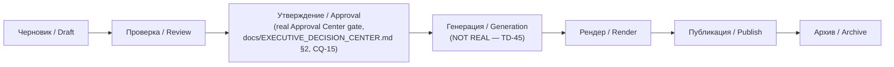

# Sprint CQ-30.1 — Production Studio UX

**Sprint:** CQ-30.1 — UX Design. Documentation only, `src` not modified.

**Do not duplicate:** a real, substantial UI shell already exists — `AIProductionCenterPage.tsx`
(tabs: Studios/Pipeline/Prompts/Media/Automation), a real `productionCatalog.ts` with 17 studio cards
(15 confirmed by id this sprint: `image, video, audio, voice, avatar, reels, ads, creative, prompt,
brand, assets, templates, media, render, publishing`) and a real 7-stage pipeline (`draft → review →
approval → generation → render → publish → archive`). Real routes: `/production-studio` (canonical),
alias `/production`, both embed-ready (`?embed=1`). **Critical grounding, restated from `docs/TECH_
DEBT.md` TD-45/TD-46**: this real UI shell has **no real generation backend** behind any studio, and
**no consent-record infrastructure** for avatar/voice-likeness generation — the single highest-risk
sequencing item this engagement has found. Any Beta UX work on this surface must not imply real
generation capability the backend doesn't have.

## 1. Per-item mapping (brief's ten)

| Brief item | Real studio | Beta UX note |
|---|---|---|
| Video | Real `video` studio | UI real, generation not real (`TD-45`) |
| Reels | Real `reels` studio (Reels Factory) | Same |
| TikTok | **No dedicated real studio** — closest is `reels`, platform-agnostic in the real catalog | Beta: TikTok is a publish-target within `reels`/`publishing`, not a separate studio card — avoids an 18th studio for a distribution-channel distinction |
| Instagram | Same as TikTok — a publish target, not a studio | Same reasoning |
| YouTube | Same — a publish target, likely composing the real `video`/`publishing` studios | Same reasoning |
| Image Generation | Real `image` studio | UI real, generation not real |
| Presentations | **No dedicated real studio found** | Flagged as a genuine gap — closest real precedent is `creative`/`templates`, not a confirmed presentation-specific studio |
| Voice | Real `voice` studio | UI real, generation not real — **this is the studio `TD-46`'s consent-gate risk applies to most directly** |
| Brand Assets | Real `brand` studio + real `assets` (Asset Library) | UI real |
| Prompt Library | Real `prompt` studio (Prompt Studio) | UI real — correctly distinguished from AI Builder Studio's separate prompt library per `docs/AI_PRODUCTION_CENTER_BIBLE.md`'s own non-duplication note (restated, not re-derived) |

## 2. TikTok/Instagram/YouTube as publish targets, not studios (design decision)

The brief lists three platform names alongside content-type studios (Video, Image, Voice). This
document recommends **not** creating three more studio cards — the real catalog's shape (content-type
studios feeding a real `publish` pipeline stage) already anticipates multi-platform distribution
without per-platform studios. A `reels` or `video` studio's output should target a platform picker at
the `publish` stage, reusing the real pipeline rather than tripling the studio count.

## 3. Beta-critical UX requirement: label reality accurately

Per `TD-45`/`TD-46`, every studio card in Beta must visibly communicate its real status — not as a
disclaimer buried in settings, but as part of the card itself (e.g., a real "Generation: not yet
available" state distinct from the card simply looking functional). This is a direct UX consequence of
`docs/ARCHITECTURE_SMELLS.md` §2's "readiness flags asserting capability the runtime doesn't have"
finding (CQ-30) — the Production Studio is the single clearest instance of that smell in the whole
platform, and Beta UX is the layer that either compounds it (by looking fully functional) or corrects
it (by being honest in the card state).

## 4. Pipeline UX (reuses the real 7-stage pipeline exactly)

No new pipeline stage is proposed — the real seven stages already map cleanly onto standard content
production, including a real Approval gate that composes the same Approval Center every other Beta
surface uses (`docs/OWNER_MODE_UX.md` §1's Audit/Approval consistency).

## Non-goals

- No new studio cards for TikTok/Instagram/YouTube — designed as publish targets instead (§2).
- No generation backend designed — explicitly out of scope, `TD-45`'s domain.
- No consent-record system designed — explicitly out of scope, `TD-46`'s domain, and the single
  highest-priority prerequisite before any studio's "Generation: not yet available" state changes.

## Related documents

`docs/AI_PRODUCTION_CENTER_BIBLE.md`/`docs/AI_PRODUCTION_STUDIO.md` (real), `docs/TECH_DEBT.md`
(TD-45, TD-46), `docs/ARCHITECTURE_SMELLS.md` §2 (CQ-30, the readiness-flag smell this studio
exemplifies), `docs/EXECUTIVE_DECISION_CENTER.md` §2 (CQ-15, the real Approval Center), `docs/
RUSSIAN_UI_DICTIONARY.md` (CQ-30.1 sibling, `production.*` namespace).
