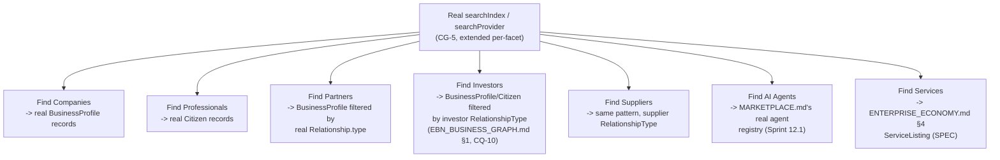

# Enterprise City — Professional Network & Business Discovery

**Sprint:** CQ-13 — Architecture Research + UX Research. Documentation only, `src` not modified.
Covers the brief's §4 (Professional Network) and §9 (Business Discovery) together — both answer "how
do citizens/companies find and connect with each other," one from the relationship side, one from the
search side.

**Do not duplicate:** `CITIZEN_REPUTATION_GROWTH.md` §1 (CQ-12) already designed the
`CitizenRelationship` model (Colleague, Trusted Colleague, Partner, Mentor, Investor, Client,
Supplier) and explicitly declined a generic "Communities"/"Professional Networks" primitive as
undisciplined scope creep. This document does not reopen that decision.

## 1. Professional Network (brief §4) — full reconciliation against CQ-12

| Brief item | Status |
|---|---|
| Recommendations | `CITIZEN_REPUTATION_GROWTH.md` §2 (CQ-12) — already specified, `TrustedColleague`-gated to resist abuse |
| Trusted Colleagues | `CITIZEN_REPUTATION_GROWTH.md` §1.1/§1.2 (CQ-12) — already specified, the real "Friends" replacement |
| Verified Experts | New this sprint — see §2 |
| Mentors | `CITIZEN_REPUTATION_GROWTH.md` §1.2 (CQ-12) — already flagged lowest-priority, no real precedent |
| Consultants | `CITIZEN_ORGANIZATION_MEMBERSHIP.md` §1 (CQ-12) — already a real `Membership.role` value (ties to `PartnerContact`) |
| Business Communities | **Explicitly declined** by `CITIZEN_REPUTATION_GROWTH.md` §1.3 (CQ-12) — restated, not reopened |
| Industry Associations | Same posture as Business Communities — not recommended as a new primitive; if ever built, should attach to a real `CityDistrict` specialization (`CITY_DISTRICTS.md` D17–D19, CQ-11), never exist freestanding |
| Knowledge Sharing | `ENTERPRISE_ECONOMY.md` §5's Knowledge Economy — a consumer of whichever memory surface `AI_MEMORY.md` (CG-8) resolves to |

### 1.1 Verified Experts — the one new item

```ts
interface VerifiedExpertStatus {
  citizenId: string;               // real Citizen.id (Sprint 29.1)
  domain: string;
  verifiedByDocumentRef: string;    // real services/storage — a real CitizenCertification (DIGITAL_CITIZEN.md §1, CQ-12)
  grantedAt: string;
}
```

"Verified Expert" is proposed as a **rendering flag** on the Digital Passport (`DIGITAL_CITIZEN.md`
§3, CQ-12) once a citizen has at least one real, document-backed `CitizenCertification` — not a
separately-awarded status. This keeps the same "renders from real data, never independently granted"
discipline every reputation/badge mechanism in this engagement has followed since CG-9.

## 2. Business Discovery (brief §9) — one search index, seven query facets

### 2.1 Real foundation

`CITY_NAVIGATION_GUIDE.md` §4 (CG-5) already established the real, working search infrastructure
(`searchIndex`/`searchProvider`, City buildings/districts already registered via
`registerCitySearchDocs()`) — `SPRINT_CQ_12_RESULT.md` §3 already proposed registering citizens into
this same real index. This document extends that one more step: **every brief-requested discovery
facet is a filtered query over the same real index**, never a separate discovery engine per facet.



### 2.2 Recommendation Engine — composition, not a new model

The brief lists "Recommendation Engine" under both §4 and §9 — this document treats it as **one real
mechanism**, not two: a ranked query over the same real search index, boosted by real signals already
established elsewhere in this Bible — `BusinessProfile.trust_level`, `Relationship` proximity (§3 of
`ENTERPRISE_ECONOMY.md`'s Trust Economy propagation), and `CitizenRelationship` proximity
(`CITIZEN_REPUTATION_GROWTH.md` §1.2, CQ-12's "Recommended Contacts" derivation). No new ranking
algorithm is designed in this documentation-only pass — the ranking *inputs* are fully specified, the
formula combining them is left to implementation.

## 3. Non-goals

- No new social/community primitive — §1 restates CQ-12's explicit decline.
- No second search/discovery engine — §2.1's entire point is one real index, filtered per facet.
- No ranking formula for the Recommendation Engine — inputs specified, weighting left to
  implementation.

## Related documents

`CITIZEN_REPUTATION_GROWTH.md` (CQ-12, the relationship/recommendation model this document extends),
`CITY_NAVIGATION_GUIDE.md` §4 (CG-5, the real search infrastructure), `EBN_BUSINESS_GRAPH.md` §1
(CQ-10, company-level `RelationshipType`), `ENTERPRISE_ECONOMY.md` §3–4 (Trust propagation,
ServiceListing), `MARKETPLACE.md` (real AI agent registry), `DIGITAL_CITIZEN.md` §1/§3 (CQ-12,
`CitizenCertification`, Digital Passport rendering).
