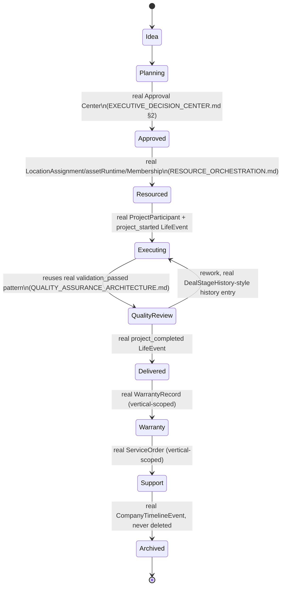

# Enterprise Value Chain — Project Lifecycle & Cross-Module Integration

**Sprint:** CQ-18 — Architecture Research + Lifecycle Design. Documentation only, `src` not modified.

**Do not duplicate:** Confirmed this sprint by direct search — **no real backend `Project` entity
exists anywhere in the repo** (`grep "class Project" database/models/*.py` returns nothing). The only
real project-adjacent code is the frontend `ProjectParticipant`/`projectParticipation`
(`DAILY_OPERATIONS_MODEL.md`, Sprint 29.2) — participation tracking only (citizen/role/attendance), no
status, budget, or milestone fields. This document is therefore the most SPEC-heavy of this sprint's
outputs, and states that plainly rather than implying a project engine exists.

## 1. Project Lifecycle — brief's ten stages (SPEC, built from real fragments)

| Brief stage | Real fragment reused | Gap |
|---|---|---|
| Idea | None | Fully new — no real "idea intake" concept anywhere |
| Planning | None | Fully new |
| Approval | Real Approval Center (three real gates, `EXECUTIVE_DECISION_CENTER.md` §2, CQ-15) | Reused as-is — a project approval is one more thing routed through the existing composition, not a fourth gate |
| Resource Allocation | Real `LocationAssignment`/`assetRuntime` (CQ-16), real `Membership` (CQ-12) | Assignment mechanisms exist per-resource-type; no unifying "project resource allocation" record ties them together — see `RESOURCE_ORCHESTRATION.md` (this sprint) |
| Execution | Real `ProjectParticipant`/`project_started`/`project_updated` `LifeEvent`s (Sprint 29.2) | Real, but thin — no status/budget field |
| Quality Control | Real `DealStageHistory.validation_passed` (`ENTERPRISE_VALUE_CHAIN.md` §1, this sprint) is the one real per-transition quality-gate primitive in the codebase | Only exists on the sales pipeline, not projects — see `QUALITY_ASSURANCE_ARCHITECTURE.md` (this sprint) for the reuse design |
| Delivery | Real `project_completed` `LifeEvent`, real `DealPipelineStageCode.DELIVERED` | Reused |
| Warranty | Real `WarrantyRecord`/`WarrantyStatus` (`automotive_service.py`, `ENTERPRISE_VALUE_CHAIN.md` §1) | Automotive-vertical-only, not generalized |
| Support | Real `ServiceOrder` (automotive-only) | Same gap |
| Archive | Real "nothing disappears" principle (`CITY_LIVING_ECONOMY.md`, CQ-10) — a project archives by staying in `CompanyTimelineEvent`/`activityTimeline`, never deleted | Reused directly |

## 2. `Project` (SPEC) — the one new entity this sprint proposes

```ts
// SPEC — the missing link between the real sales pipeline (Deal) and real execution tracking
// (ProjectParticipant). Deliberately minimal: composes real entities, stores no duplicate data.
interface Project {
  id: string;
  dealId?: string;              // real Deal.id, when the project originated from a won sales deal
  companyId: string;             // real BusinessProfile.id
  status: "idea" | "planning" | "approved" | "resourced" | "executing"
        | "quality_review" | "delivered" | "warranty" | "support" | "archived";
  budgetAmount?: number;         // mirrors real Deal.amount, not duplicated storage — copied once at project creation
  approvalRef?: string;          // real Approval Center decision id (EXECUTIVE_DECISION_CENTER.md §2)
  createdAt: string;
  archivedAt?: string;
}
```

`Project.dealId` is the additive field `ENTERPRISE_VALUE_CHAIN.md` §3 already flagged as the real gap
between sales and execution — this is the entity that field would point to.

## 3. State machine (SPEC)



## 4. Cross-Module Integration (brief §9) — the project as an integration point, not a new hub

| Module | Real integration |
|---|---|
| Enterprise Runtime / Life Engine | `project_started`/`project_updated`/`project_completed` `LifeEvent`s (Sprint 29.2) |
| Business Network | `Project.companyId` → real `BusinessProfile` |
| Asset Runtime | Resource Allocation stage → real `assetRuntime.move()`/`AssetOwnership` (`RESOURCE_ORCHESTRATION.md`) |
| Spatial Runtime | Project location → real `LocationAssignment` (`REGIONAL_DIGITAL_TWIN.md`, CQ-16) |
| Automation Engine / Workflow Runtime | Execution stage tasks → real `workflow_executed`/`workflow_completed` bridge (`AUTOMATION_ENGINE.md`, Sprint 28.9) |
| Executive Command Center | Project status feeds the real domain dashboards (`OPERATIONAL_DASHBOARDS.md`, CQ-17) |
| Enterprise Intelligence | Project outcomes feed `BUSINESS_VALUE_METRICS.md` (this sprint), routed through the real reasoning/planning/decision/learning chain (CQ-14) |

No new integration bus is proposed — every row above is a real, already-documented channel.

## Non-goals

- No new `Project` backend table implemented — this document specifies the shape only, per the
  sprint's documentation-only constraint.
- No duplication of `ProjectParticipant`'s real participation-tracking role — `Project` is the
  status/budget/lifecycle wrapper; participation stays exactly where it is.
- No new integration bus for Cross-Module Integration — every channel in §4 already exists.

## Related documents

`docs/ENTERPRISE_VALUE_CHAIN.md` (CQ-18 sibling, the sales-to-project gap this document closes),
`docs/RESOURCE_ORCHESTRATION.md`/`docs/QUALITY_ASSURANCE_ARCHITECTURE.md`/`docs/BUSINESS_VALUE_
METRICS.md` (CQ-18 siblings), `docs/DAILY_OPERATIONS_MODEL.md` (CQ-17, real `ProjectParticipant`/
`LifeEvent`s), `docs/EXECUTIVE_DECISION_CENTER.md` §2 (CQ-15, Approval Center reuse), `docs/CITY_
LIVING_ECONOMY.md` (CQ-10, the "nothing disappears" archive principle).
